# PsUi

[](https://www.powershellgallery.com/packages/PsUi)


For building UIs in PowerShell without the misery.

<p align="center">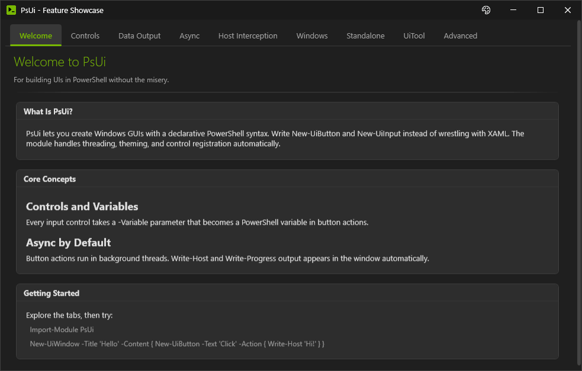</p>

Turn existing scripts into interactive tools, or easily build custom forms from scratch. Define layouts with PsUi functions, write standard PowerShell in attached scriptblocks. The framework handles threading - async execution, output routing, UI responsiveness.

```powershell
Import-Module PsUi

New-UiWindow -Title 'PsUi Demo' -Width 500 -Height 250 -Content {
    New-UiInput -Label 'Server' -Variable 'server' -Placeholder 'web-prod-01'
    New-UiDropdown -Label 'Action' -Variable 'action' -Items @('Health Check', 'Restart', 'Deploy')
    New-UiToggle -Label 'Verbose logging' -Variable 'verbose'
    New-UiButton -Text 'Run' -Icon 'Play' -Accent -Action {
        Write-Host "Connecting to $server..." -ForegroundColor Cyan
        Write-Progress -Activity $action -Status 'Starting...' -PercentComplete 25
        Start-Sleep -Milliseconds 500
        
        if ($action -eq 'Restart') {
            $confirm = Read-Host "Type YES to restart $server"
            if ($confirm -ne 'YES') { Write-Host 'Cancelled.' -ForegroundColor Yellow; return }
        }
        
        Write-Progress -Activity $action -PercentComplete 75
        Start-Sleep -Milliseconds 500
        Write-Host "$action complete on $server" -ForegroundColor Green
        Write-Warning "Latency: 42ms"
        Write-Progress -Activity $action -Completed
    }
}
```

<p align="center">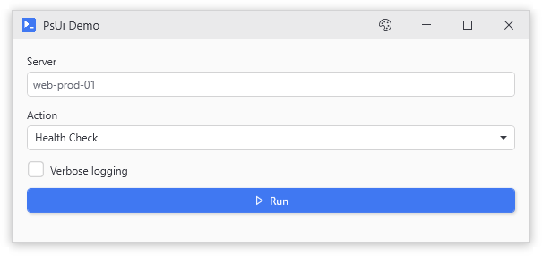</p>

The window stays responsive while code runs in background runspaces. Results land in a sortable grid. Console output goes to its own panel. No threading code required.

---

## The Problem

Building GUIs in PowerShell is difficult. Your options:

**Single-threaded.** Run everything on the UI thread. Works until you hit a network call or slow disk read. Then the window freezes and the title bar says "(Not Responding)".

**Roll your own threading.** Spin up a `RunspacePool`, sync state with `[HashTable]::Synchronized`, marshal updates via `$Window.Dispatcher.Invoke`, debug race conditions when controls get disposed mid-update. The boilerplate-to-actual-code ratio is high.

**WinForms and prayers.** Some people try this. The forms look like they escaped from Windows 2000 and the threading problems don't go away, they just move around.

PsUi is an attempt at another option. The C# backend handles runspace lifecycle and thread marshalling. Errors include stack traces and context for debugging - when something breaks, the error usually tells you why.

---

## Features

### Stream Interception

Existing console scripts work without modification in most cases.

PsUi hooks the PowerShell host and redirects `Write-Host`, `Write-Warning`, `Write-Progress`, and `Write-Error` to UI panels. Progress calls become actual progress bars. Text keeps its colors - DarkYellow stays DarkYellow, not some weird approximation. The script runs the same way it always did, except now there's a window instead of a terminal.

`Read-Host` and `Get-Credential` pop themed dialogs instead of blocking the console. Same with `$host.UI.Prompt()` and `-Confirm` prompts.

Background thread errors include full stack traces for debugging.

### PowerShell DSL

XAML is verbose. PsUi uses functions instead. Nested scriptblocks define the hierarchy - `New-UiWindow { New-UiCard { New-UiButton } }` - so code structure mirrors visual layout. IntelliSense works. Tab completion works. Around 30 control types: inputs, dropdowns, date pickers, sliders, toggles, tabs, cards, file pickers, and more.

Normally background threads can't see parent scope variables because they run in separate runspaces. PsUi parses your scriptblocks, figures out what you reference, and injects those values into the runspace before execution. Two-way binding comes free with the `-Variable` parameter - write back to the variable in your action and the control updates when the action completes. No event handlers, no `$script:` workarounds, no synchronized hashtable gymnastics.

### Themes

Eleven themes: Light, Dark, LightModern, OceanBlue, Bespin, SolarizedDark, Charcoal, DeepRed, Monokai, Azure, Pearl.

Set the theme with `New-UiWindow -Theme Dark` or use the palette button in the titlebar to switch at runtime. Semantic styles handle accent buttons and validation states automatically.

### Form Generation

`New-UiTool` reads parameter metadata from any command and builds a complete form. This is the main reason the module exists - parameterized scripts parse directly into UI elements.

Types map to controls: `[string]` becomes a text box, `[switch]` a toggle, `[datetime]` a date picker, `[ValidateSet()]` a dropdown, `[ValidateRange()]` a slider. Parameters named `-Path` include file browsers. `-ComputerName` on domain-joined machines hooks the Windows object picker so you can search AD.

Multiple parameter sets produce a selector that rebuilds the form when you switch. Complex dynamic validation may require building the form manually.

### Window Isolation

Each window runs in its own session with its own runspace pool and dispatcher thread. Child windows inherit theme but maintain separate state. You can open as many windows as memory allows and they won't step on each other. The debug tab shows session IDs so you can verify windows are actually isolated.

---

## Quick Start

Three ways to try it, from fastest to most involved:

**Run the demo** (recommended first step)
```powershell
# From the repo root
Import-Module .\PsUi\PsUi.psd1
.\Start-PSUiDemo.ps1
```
This opens a window with tabs demoing every feature - controls, host interception, async, grids, child windows, and `New-UiTool`. Click around. Break things. Check the Console tab to see what's happening.

**Wrap an existing command**
```powershell
Import-Module .\PsUi\PsUi.psd1
New-UiTool -Command 'Get-ChildItem' -Title 'File Browser' -FolderPickerParameters 'Path'
```

<p align="center">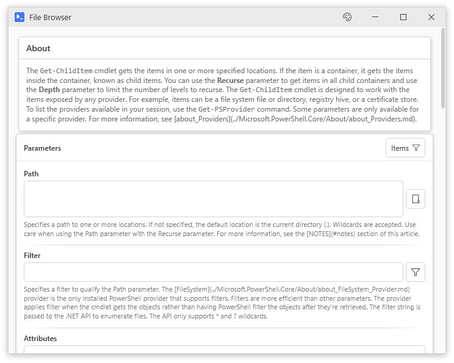</p>

**Build something custom**
```powershell
Import-Module .\PsUi\PsUi.psd1
New-UiWindow -Title 'My First Tool' -Content {
    New-UiInput -Label 'Name' -Variable 'userName'
    New-UiButton -Text 'Greet' -Action {
        Write-Host "Hello, $userName!"
    }
}
```
Type a name, click the button, check the Console tab.

---

## Use Cases

Sysadmin utilities. Onboarding wizards. Data browsers. Log parsers. Internal tools where users need a form instead of a command line.

---

## How It Works

### Async Execution

Button actions run in background runspaces by default. The UI thread stays free to repaint, handle clicks, respond to resizing - all the things a frozen window can't do.

```powershell
Import-Module PsUi

New-UiWindow -Title 'Data Fetcher' -Content {
    New-UiButtonCard -Header 'Fetch Data' -Icon 'CloudDownload' -Action {
        # This runs in background - UI stays responsive
        $data = Invoke-RestMethod 'https://jsonplaceholder.typicode.com/posts'
        Write-Host "Fetched $($data.Count) posts"
        
        Write-Progress -Activity 'Processing' -PercentComplete 50
        Start-Sleep -Seconds 1
        Write-Progress -Activity 'Processing' -Completed
        
        $data  # Appears in Results tab
    }
}
```

Control values can be read and written from background threads without any `Dispatcher.Invoke` nonsense. The framework handles it. `AsyncExecutor` manages the runspace pool and routes streams to the right panels.

The async system has backpressure handling to prevent dispatcher saturation. Without it, rapid output (like a log parser emitting thousands of lines) can peg CPU trying to update the UI.

### Control Hierarchy

PowerShell functions create WPF controls. Nesting builds the visual tree.

```powershell
Import-Module PsUi

New-UiWindow -Title 'User Form' -Theme Dark -Content {
    New-UiCard -Header 'Account Details' -Content {
        New-UiInput -Label 'Username' -Variable 'user' -Placeholder 'jsmith'
        New-UiInput -Label 'Password' -Variable 'pass' -Password
        New-UiDropdown -Label 'Role' -Variable 'role' -Items @('Admin', 'User', 'Guest')
    }
    
    New-UiButton -Text 'Submit' -Icon 'Accept' -Accent -Action {
        # $user, $pass, $role are injected from -Variable names
        Write-Host "Creating $user with role $role"
    }
}
```

<p align="center">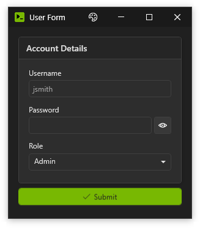</p>

The `-Variable` parameter names the control and creates the binding. Those names become PowerShell variables inside `-Action` blocks. Change the variable, the control updates. Change the control, the variable updates. It's not true reactive binding (no immediate propagation) but it's close enough for form work.

### Auto-Generated Forms

`New-UiTool` inspects command parameters and creates matching controls.

```powershell
Import-Module PsUi

# Wrap a built-in cmdlet
New-UiTool -Command 'Get-Process'

# Works on any command with CmdletBinding
New-UiTool -Command 'Get-ChildItem' -Title 'File Browser'
```

```powershell
Import-Module PsUi

# Or your own function with proper parameter decorations
function Search-Logs {
    param(
        [Parameter(Mandatory)]
        [string]$Path,
        
        [ValidateSet('Error', 'Warning', 'Info')]
        [string]$Level = 'Error',
        
        [datetime]$Since = (Get-Date).AddDays(-7)
    )
    Get-Content $Path | Where-Object { $_ -match $Level }
}

New-UiTool -Command 'Search-Logs'
```

<p align="center">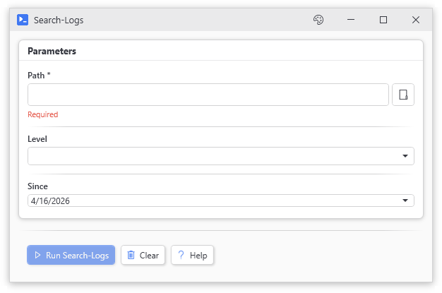</p>

Type mappings:
- `[string]` → text input
- `[int]`, `[double]` → number input (validates as you type)
- `[switch]` → toggle
- `[datetime]` → date picker
- `[ValidateSet()]` → dropdown
- `[ValidateRange()]` → slider with min/max
- `[SecureString]` → password field
- `[PSCredential]` → full credential picker with username

Mandatory parameters get validation markers; parameter sets get a selector at the top. Results go to tabs with sorting and filtering. You can add row-level actions with `-ResultActions` - "click this row, run this code with `$_` set to the row data." See the [Result Row Actions](#result-row-actions) pattern below.

### Scope and Threading Model

Button actions run in **separate runspaces** from your console. This is the most important thing to understand about PsUi, and the thing that will bite you if you don't.

**What works:**
- Control values are injected as variables (`$userName`, `$selectedItem`, etc.) before your action runs
- Changes to those variables sync back to controls when the action completes
- User-defined functions from your console are captured and available
- Variables from your script's scope are captured at window creation time

**What doesn't work:**
- Globals set in button actions (`$Global:Result = 'done'`) do **not** propagate back to your console session
- Real-time variable sync - changes happen at action boundaries, not during execution
- Reference semantics across runspace boundaries - objects get copied, not shared

**Live objects don't cross runspaces.** SQL connections, file streams, COM objects, open sockets - anything holding a native handle gets serialized when crossing the runspace boundary. Properties copy but the underlying connection is gone.

Concrete example: you create a `SqlConnection` in Button A's action and store it in a variable. Button B tries to use that connection. It doesn't work. The connection object got copied, not referenced. The copy has the same connection string but the actual TCP socket is back in Button A's runspace, probably already disposed.

This applies to:
- Database connections (`SqlConnection`, `OracleConnection`, etc.)
- File streams and handles
- Socket connections
- Excel COM objects (`$excel = New-Object -ComObject Excel.Application`)
- Anything that implements `IDisposable` with native resources

If you need to share heavy state between buttons, either:
1. Store connection *info* (strings, credentials) and reconnect in each action
2. Use `$session.Variables` for things that absolutely must persist (but understand the lifecycle)
3. Accept that each button action is basically its own script invocation

The hydration layer is designed for form data - strings, numbers, dates, selections.

**Debugging sync issues:** If variables aren't syncing back to controls, the executor fires an `OnFrameworkError` event when internal operations fail. These aren't script errors - they're problems in the hydration system itself. Wire it up to see what the framework is choking on.

**Threading modes:**
```powershell
# Default (MTA): ThreadPool for performance
New-UiWindow -Title 'Fast' -Content { ... }

# STA mode: dedicated threads for Windows Forms/COM compatibility
New-UiWindow -Title 'Legacy' -AsyncApartment STA -Content { ... }
```

Use `-AsyncApartment STA` if your scripts use Windows Forms dialogs, legacy COM objects that require STA (like some Office interop), or other STA-dependent APIs. It's slower because we can't use the thread pool, but it's the only way to make certain legacy stuff work.

### Standalone Viewers

Work with or without a parent window. These are for when you just want to show some data:

```powershell
Import-Module PsUi

# Pipe to a grid with filtering and sorting
Get-Process | Select-Object Name, Id, CPU, WorkingSet | Out-Datagrid -TitleText 'Processes'

# Select rows and pass through (like Out-GridView -PassThru but better looking)
Get-Process | Select-Object Name, Id, CPU, WorkingSet | Out-Datagrid -PassThru -IsFilterable | Stop-Process -WhatIf
```

<p align="center">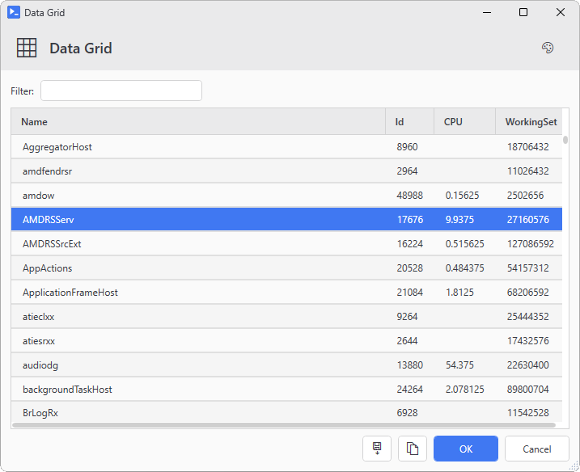</p>

Filter input is debounced (300ms) so typing doesn't freeze on large datasets. Columns sort by clicking headers. Rows are selectable. Export to CSV works. Faster filtering and better theming than Out-GridView.

`Out-TextEditor` provides find/replace, line numbers, and optional spell checking for text content:

```powershell
Import-Module PsUi

# View a file with the text editor
Get-Content C:\Windows\System32\drivers\etc\hosts | Out-TextEditor -TitleText 'Hosts File' -Theme Dark -ReadOnly

# Edit text and get it back
$notes = 'Meeting notes go here...' | Out-TextEditor -TitleText 'Notes' -SpellCheck
```

<p align="center">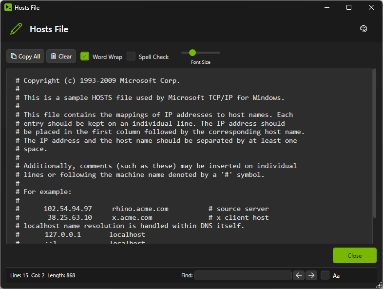</p>

---

## Requirements

- Windows 10/11 or Server 2016+ (tested most heavily on Windows 10 21H2 and Server 2019)
- PowerShell 5.1 or 7+ (Windows only - WPF doesn't exist on Linux or Mac, never will)
- .NET Framework 4.7.2+ (included with Windows 10 1803+, so you probably have it)

PowerShell 7 is faster for script execution but has some quirks with COM objects. PowerShell 5.1 is more compatible with legacy code. The module detects which version you're running and loads the appropriate binaries.

## Installation

```powershell
# Install from the PowerShell Gallery (recommended)
Install-Module -Name PsUi -Scope CurrentUser
```

Or install using `Install-PSResource` (PSResourceGet):

```powershell
Install-PSResource -Name PsUi
```

### Manual / Development Install

```powershell
# Clone and import
git clone https://github.com/jlabon2/PsUi.git
Import-Module .\PsUi\PsUi.psd1

# Or copy to your modules folder for persistent availability
$modulePath = "$env:USERPROFILE\Documents\PowerShell\Modules"
Copy-Item .\PsUi $modulePath -Recurse
Import-Module PsUi
```

The C# backend is pre-compiled. No build step needed unless you're modifying the source. Import is instant.

If you want to modify the C# code:
```powershell
# Build both net472 (PS 5.1) and net6.0-windows (PS 7+)
.\Build-PsUi.ps1

# Reload after building
Remove-Module PsUi -Force -ErrorAction SilentlyContinue
Import-Module .\PsUi\PsUi.psd1 -Force
```

Note: .NET types are cached per PowerShell session. If you modify C# classes, you need to restart PowerShell entirely for a clean reload. This is a PowerShell thing, not a PsUi thing.

---

## Examples

These should run if you paste them.

**Basic form**
```powershell
Import-Module PsUi

New-UiWindow -Title 'Greeting' -Width 400 -Height 200 -Content {
    New-UiInput -Label 'Name' -Variable 'name' -Placeholder 'Your name here'
    New-UiButton -Text 'Greet' -Accent -Action {
        Write-Host "Hello, $name!" -ForegroundColor Green
    }
}
```

**Tabbed interface with different control types**
```powershell
Import-Module PsUi

New-UiWindow -Title 'Settings' -Width 500 -Height 400 -Content {
    New-UiTab -Header 'General' -Content {
        New-UiToggle -Label 'Enable dark mode' -Variable 'darkMode'
        New-UiSlider -Label 'Volume' -Variable 'volume' -Minimum 0 -Maximum 100 -Default 50
        New-UiDropdown -Label 'Language' -Variable 'language' -Items @('English', 'Spanish', 'French', 'German')
    }
    New-UiTab -Header 'Network' -Content {
        New-UiInput -Label 'Proxy Server' -Variable 'proxy' -Placeholder 'proxy.example.com'
        New-UiInput -Label 'Port' -Variable 'port' -InputType Int -Default 8080
        New-UiToggle -Label 'Use authentication' -Variable 'useAuth'
    }
    New-UiTab -Header 'Advanced' -Content {
        New-UiDatePicker -Label 'Start Date' -Variable 'startDate'
        New-UiTimePicker -Label 'Start Time' -Variable 'startTime' -Default '09:00'
        New-UiTextArea -Label 'Notes' -Variable 'notes' -Rows 4
    }
    
    New-UiButton -Text 'Save Settings' -Icon 'Save' -Accent -Action {
        Write-Host "Dark Mode: $darkMode"
        Write-Host "Volume: $volume"
        Write-Host "Language: $language"
        Write-Host "Proxy: ${proxy}:${port}"
        Write-Host "Use Auth: $useAuth"
    }
}
```

**Command wrapper (the fast way)**
```powershell
Import-Module PsUi

# Three lines to GUI-ify any command
New-UiTool -Command 'Get-ChildItem' -Title 'File Browser' -FolderPickerParameters 'Path'
```

**Real-world pattern: progress and long-running operations**
```powershell
Import-Module PsUi

New-UiWindow -Title 'Batch Processor' -Width 500 -Height 300 -Content {
    New-UiInput -Label 'Items to process' -Variable 'itemCount' -InputType Int -Default 10
    New-UiProgress -Variable 'progress'
    New-UiInput -Label 'Status' -Variable 'status' -Default 'Ready'
    
    New-UiButton -Text 'Start Processing' -Icon 'Play' -Accent -Action {
        $total = [int]$itemCount
        for ($i = 1; $i -le $total; $i++) {
            $status   = "Processing item $i of $total..."
            $progress = ($i / $total) * 100
            
            # Simulate work
            Start-Sleep -Milliseconds 300
            Write-Host "Completed item $i" -ForegroundColor Cyan
        }
        
        $status   = 'Done!'
        $progress = 100
        Write-Host 'All items processed!' -ForegroundColor Green
    }
}
```

**Conditional controls (enable/disable based on other values)**
```powershell
Import-Module PsUi

New-UiWindow -Title 'Conditional Demo' -Width 400 -Height 300 -Content {
    New-UiToggle -Label 'Enable advanced options' -Variable 'advanced'
    
    # This input only enables when the toggle is checked
    New-UiInput -Label 'Server URL' -Variable 'serverUrl' -EnabledWhen 'advanced' -ClearIfDisabled
    
    # This button only enables when the input has content
    New-UiButton -Text 'Connect' -Icon 'Globe' -Accent -EnabledWhen 'serverUrl' -Action {
        Write-Host "Connecting to $serverUrl..."
    }
}
```

---

## Control Reference

### Layout

| Function | Description |
|----------|-------------|
| `New-UiWindow` | Main window with theme support, resizing, custom icons |
| `New-UiPanel` | Horizontal or vertical grouping |
| `New-UiCard` | Bordered container with optional header |
| `New-UiGrid` | Row/column layout, form mode |
| `New-UiTab` | Tabbed interface |
| `New-UiExpander` | Collapsible section with header |
| `New-UiSeparator` | Visual divider |

### Input Controls

| Function | Description |
|----------|-------------|
| `New-UiInput` | Text field with password mode, placeholder, filtering |
| `New-UiTextArea` | Multi-line text |
| `New-UiDropdown` | Dropdown selector |
| `New-UiRadioGroup` | Radio buttons |
| `New-UiToggle` | On/off switch |
| `New-UiSlider` | Numeric slider |
| `New-UiDatePicker` | Date selection |
| `New-UiTimePicker` | Time selection |
| `New-UiCredential` | Username and password fields |
| `New-UiList` | Selectable list with add/remove |
| `New-UiTree` | Hierarchical tree view for nested data |

### List Operations

| Function | Description |
|----------|-------------|
| `Add-UiListItem` | Add item |
| `Remove-UiListItem` | Remove item |
| `Clear-UiList` | Clear all |
| `Get-UiListItems` | Return all items |

### Display

| Function | Description |
|----------|-------------|
| `New-UiLabel` | Text label (Header, Body, Note styles) |
| `New-UiImage` | Image display |
| `New-UiGlyph` | Icon from Segoe MDL2 Assets |
| `New-UiProgress` | Progress bar |
| `Set-UiProgress` | Update progress |
| `New-UiLink` | Clickable hyperlink (opens URL or runs action) |
| `New-UiChart` | Bar, line, or pie chart on a WPF canvas |
| `Update-UiChart` | Push new data to an existing chart |
| `New-UiWebView` | Embedded Chromium browser (WebView2) |

### Buttons

| Function | Description |
|----------|-------------|
| `New-UiButton` | Button, async by default |
| `New-UiAction` | Button with no output window |
| `New-UiDropdownButton` | Button with menu |
| `New-UiButtonCard` | Card with header, description, and button |
| `New-UiActionCard` | Card with no output window |

### Theming

| Function | Description |
|----------|-------------|
| `Get-UiThemeTemplate` | Theme color definitions |
| `Register-UiTheme` | Register a custom theme |

### Dialogs

| Function | Description |
|----------|-------------|
| `Show-UiMessageDialog` | Message box |
| `Show-UiConfirmDialog` | Yes/No |
| `Show-UiChoiceDialog` | Multiple choice |
| `Show-UiInputDialog` | Text prompt |
| `Show-UiPromptDialog` | Multi-field prompt |
| `Show-UiCredentialDialog` | Credential prompt |
| `Show-UiFilePicker` | Open file |
| `Show-UiFolderPicker` | Select folder |
| `Show-UiSaveDialog` | Save file |
| `Show-UiDialog` | Custom dialog |
| `Show-UiGlyphBrowser` | Browse 400+ icons |
| `Show-WindowsObjectPicker` | AD picker (domain only) |

### Tools

| Function | Description |
|----------|-------------|
| `New-UiTool` | Generate form from command |
| `Out-Datagrid` | Sortable, filterable grid with -PassThru |
| `Out-TextEditor` | Text viewer/editor |
| `Out-CSVDataGrid` | CSV viewer/editor |
| `New-UiChildWindow` | Secondary window |
| `Invoke-UiAsync` | Run scriptblock in background |
| `Stop-UiAsync` | Cancel the running background operation |
| `Register-UiHotkey` | Bind a keyboard shortcut to an action |

### Session & Utility

| Function | Description |
|----------|-------------|
| `Get-UiValue` | Read a control's current value by variable name |
| `Set-UiValue` | Set a control's value by variable name |
| `Get-PsUiIcon` | Get an icon glyph by name |
| `Get-PsUiIconList` | List all available icon names |
| `Write-UiHostDirect` | Write to the real console, bypassing the UI proxy |

---

## Theme Usage

Themes affect all controls in the window. There's a palette button in the titlebar for runtime switching, or you can set it in code.

```powershell
# Set theme at window creation
New-UiWindow -Title 'App' -Theme Dark -Content {
    New-UiLabel -Text 'Dark mode enabled'
}

# Register a custom theme based on an existing one
Register-UiTheme -Name 'MyTheme' -BasedOn 'Dark' -Colors @{
    Accent     = '#FF6B35'
    WindowBg   = '#1A1A2E'
}

# Get available theme definitions
$themes = Get-UiThemeTemplate
$themes.Keys
```

Available themes:
- **Light** - Default light theme with warm neutral tones
- **Dark** - Dark background with light text
- **LightModern** - Light theme with blue accents
- **OceanBlue** - Deep blue tones
- **Bespin** - Warm browns inspired by the code editor theme
- **SolarizedDark** - The classic Solarized palette
- **Charcoal** - Very dark with subtle contrast
- **DeepRed** - Dark theme with red accents
- **Monokai** - Colors from the popular syntax theme
- **Azure** - Blue and white color scheme
- **Pearl** - Soft pastel tones

Semantic styles work across themes:
- `New-UiButton -Accent` - Uses the accent color (stands out)
- `New-UiCard -Accent` - Highlighted card
- Validation states (errors, warnings) use semantic colors

Custom themes can be defined by adding entries to the theme definitions in `private/ThemeDefinitions.ps1`.

---

## Patterns

Common patterns for building tools.

### Form Data Collection

```powershell
Import-Module PsUi

New-UiWindow -Title 'New User' -Content {
    New-UiCard -Header 'User Details' -Content {
        New-UiInput -Label 'Name' -Variable 'name'
        New-UiInput -Label 'Email' -Variable 'email'
        New-UiDropdown -Label 'Role' -Variable 'role' -Items @('Admin', 'User', 'Guest')
        New-UiDropdown -Label 'Department' -Variable 'dept' -Items @('Engineering', 'Sales', 'Support', 'HR')
        New-UiToggle -Label 'Active' -Variable 'isActive' -Checked
    }
    
    New-UiButton -Text 'Create User' -Accent -Action {
        Write-Host "Creating user..."
        Write-Host "  Name: $name"
        Write-Host "  Email: $email"
        Write-Host "  Role: $role"
        Write-Host "  Department: $dept"
        Write-Host "  Active: $isActive"
        
        # Your actual user creation code here
        # New-ADUser -Name $name -Email $email ...
    }
}
```

<p align="center">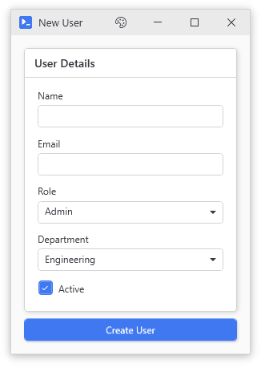</p>

### Result Row Actions

When you want to show data and let users act on individual rows. The `$_` variable in the action contains the row object.

```powershell
Import-Module PsUi

New-UiTool -Command 'Get-Service' -ResultActions @(
    @{
        Text   = 'Start'
        Icon   = 'Play'
        Action = { 
            Write-Host "Starting $($_.Name)..."
            $_ | Start-Service -WhatIf 
        }
    }
    @{
        Text   = 'Stop'
        Icon   = 'Cancel'
        Action = { 
            Write-Host "Stopping $($_.Name)..."
            $_ | Stop-Service -WhatIf 
        }
    }
    @{
        Text   = 'Properties'
        Icon   = 'Info'
        Action = { 
            $_ | Format-List * | Out-String | Write-Host
        }
    }
)
```

<p align="center">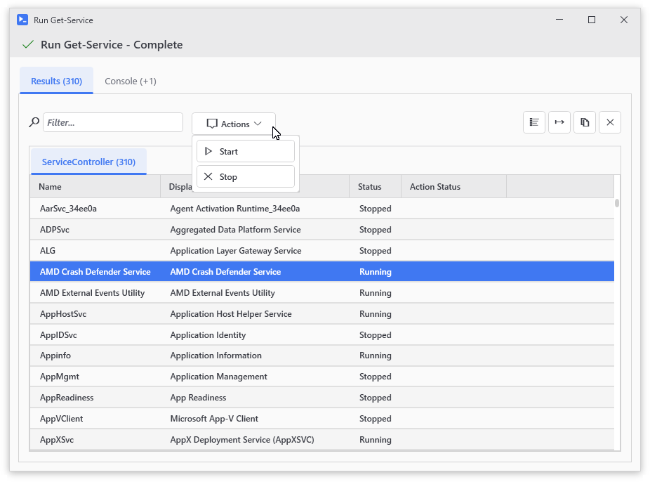</p>

### Multi-Step Wizard

Using tabs as wizard steps. Not a true wizard (no next/back buttons wired up) but close enough for most internal tools.

```powershell
Import-Module PsUi

New-UiWindow -Title 'Server Provisioning' -Width 600 -Height 500 -Content {
    New-UiTab -Header '1. Server Info' -Content {
        New-UiInput -Label 'Server Name' -Variable 'serverName' -Placeholder 'SRV-APP-001'
        New-UiDropdown -Label 'Environment' -Variable 'environ' -Items @('Dev', 'Test', 'Staging', 'Prod')
        New-UiDropdown -Label 'OS' -Variable 'osChoice' -Items @('Windows Server 2019', 'Windows Server 2022', 'RHEL 8', 'Ubuntu 22.04')
    }
    New-UiTab -Header '2. Resources' -Content {
        New-UiSlider -Label 'CPU Cores' -Variable 'cpu' -Minimum 1 -Maximum 16 -Default 4
        New-UiSlider -Label 'RAM (GB)' -Variable 'ram' -Minimum 4 -Maximum 128 -Default 16
        New-UiSlider -Label 'Disk (GB)' -Variable 'disk' -Minimum 50 -Maximum 2000 -Default 100
    }
    New-UiTab -Header '3. Network' -Content {
        New-UiDropdown -Label 'VLAN' -Variable 'vlan' -Items @('VLAN-10-Servers', 'VLAN-20-DMZ', 'VLAN-30-Internal')
        New-UiToggle -Label 'Static IP' -Variable 'staticIp'
        New-UiInput -Label 'IP Address' -Variable 'ipAddr' -EnabledWhen 'staticIp' -Placeholder '10.0.1.x'
    }
    New-UiTab -Header '4. Provision' -Content {
        New-UiLabel -Text 'Review your selections and click Provision to create the VM.' -Style Body
        New-UiButton -Text 'Provision Server' -Icon 'Play' -Accent -Action {
            Write-Host "Provisioning $serverName..." -ForegroundColor Cyan
            Write-Host "Environment: $environ | OS: $osChoice"
            Write-Host "CPU: $cpu cores, RAM: ${ram}GB, Disk: ${disk}GB"
            
            # Your PowerCLI / Azure / AWS provisioning code here
            Write-Progress -Activity 'Provisioning' -Status 'Creating VM...' -PercentComplete 50
            Start-Sleep -Seconds 2
            Write-Progress -Activity 'Provisioning' -Completed
            
            Write-Host "Server $serverName provisioned!" -ForegroundColor Green
        }
    }
}
```

<p align="center">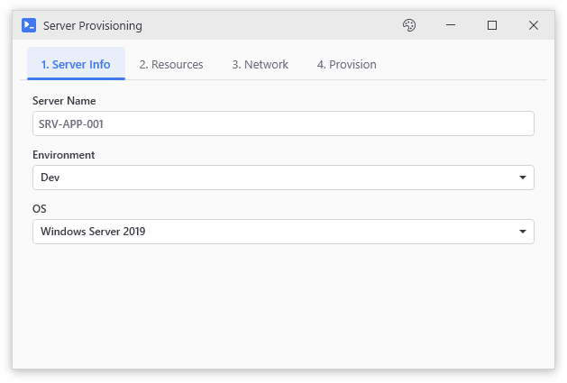</p>

### Connecting to Remote Systems

Pattern for tools that need credentials and connect to external systems.

```powershell
Import-Module PsUi

New-UiWindow -Title 'Remote Server Tool' -Width 600 -Height 400 -Content {
    New-UiCard -Header 'Connection' -Content {
        New-UiInput -Label 'Server' -Variable 'server' -Placeholder 'server.domain.local'
        New-UiCredential -Label 'Credentials' -Variable 'creds' -DefaultUser "$env:USERDOMAIN\$env:USERNAME"
        New-UiToggle -Label 'Use SSL' -Variable 'useSsl' -Checked
    }
    
    New-UiPanel -LayoutStyle Wrap -Content {
        New-UiButton -Text 'Test Connection' -Icon 'Globe' -Action {
            if (!$server) { Write-Host 'Enter a server name' -ForegroundColor Yellow; return }
            if (!$creds) { Write-Host 'Enter credentials' -ForegroundColor Yellow; return }
            
            Write-Host "Testing connection to $server..."
            try {
                # Your connection test here
                $session = New-PSSession -ComputerName $server -Credential $creds -ErrorAction Stop
                Write-Host "Connected successfully!" -ForegroundColor Green
                Remove-PSSession $session
            }
            catch {
                Write-Host "Connection failed: $($_.Exception.Message)" -ForegroundColor Red
            }
        }
        
        New-UiButton -Text 'Run Report' -Icon 'Document' -Accent -Action {
            if (!$server -or !$creds) { 
                Write-Host 'Connect to a server first' -ForegroundColor Yellow
                return 
            }
            
            Write-Host "Running report on $server..."
            # Your report code here
        }
    }
}
```

<p align="center">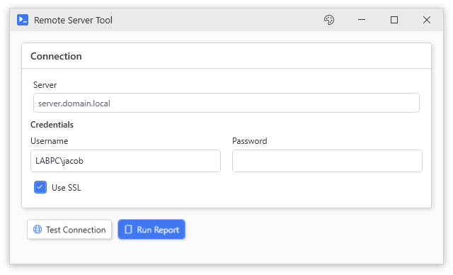</p>

---

## Limitations

- **Windows only.** WPF is a Windows technology. It will never run on Linux or Mac.

- **ISE is not supported.** The PowerShell ISE has threading quirks that make WPF unreliable. Use Windows Terminal, pwsh.exe, or VS Code's terminal.

- **Large datasets degrade performance.** Out-Datagrid handles 10k rows fine. 50k rows gets sluggish. 100k rows will make you wait. Filter before displaying large sets.

- **Not a proper MVVM framework.** No INotifyPropertyChanged, no data binding expressions, no command pattern. PsUi is for internal tools, not production apps.

- **Variable sync has boundaries.** Values sync at action start and end, not continuously. If you need real-time binding, use events manually.

- **Live objects don't cross runspaces.** Database connections, file handles, COM objects - they don't travel. Design around it.

- **No designer.** You write code, you run it, you see what it looks like.

- **Threading bugs may exist.** The core async system has been stress-tested pretty hard, but threading bugs are notoriously good at hiding. If you find one, file an issue.

---

## Architecture

The module is split into three layers:

**C# Backend** (`src/`, compiled to `PsUi/lib/`) - Runspace pooling, dispatcher marshalling, host interception, thread-safe control proxies. The C# has grown as edge cases surfaced. Dual-targets net472 (PowerShell 5.1) and net6.0-windows (PowerShell 7+).

Key classes:
- `AsyncExecutor` - Runs scripts on background threads, routes Write-Host/Progress/Error to UI events
- `SessionContext` - Per-window state isolation using `ConcurrentDictionary`
- `StateHydrationEngine` - Extracts control values into variables, syncs them back after execution
- `ThreadSafeControlProxy` - Auto-marshals property access to dispatcher thread

**PowerShell Functions** (`PsUi/public/`, `PsUi/private/`) - The DSL layer. `New-UiWindow`, `New-UiButton`, etc. These are thin wrappers that create WPF controls and wire them to the C# backend.

**State Management** - Two APIs depending on your needs:
- **Variable hydration** (default): Control values become PowerShell variables in your action. Read `$userName`, write `$status = 'Done'`.
- **Session dictionary** (advanced): Direct access via `$session = Get-UiSession; $session.Variables['controlName']`. For when you need more control.

The architecture exists because PowerShell's threading model is hostile to GUIs. Scripts expect to block. WPF expects to be responsive. The C# layer bridges that gap by running your scripts in isolated runspaces and marshalling all the I/O back to the UI thread.

---

## Contributing

If something breaks, file an issue with your PowerShell version, a sanitized copy of the script causing the problem, and the error message.

Pull requests welcome.

---

## License

MIT. Use it for whatever. Attribution appreciated but not required.

---

*For when someone asks "can you make that a GUI?" and the honest answer is "I guess."*
