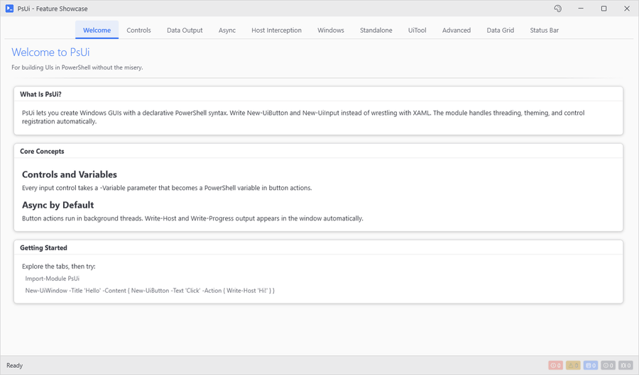
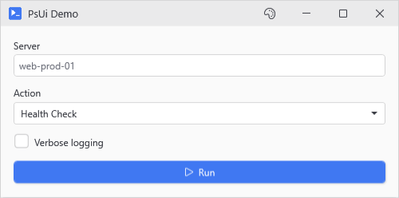
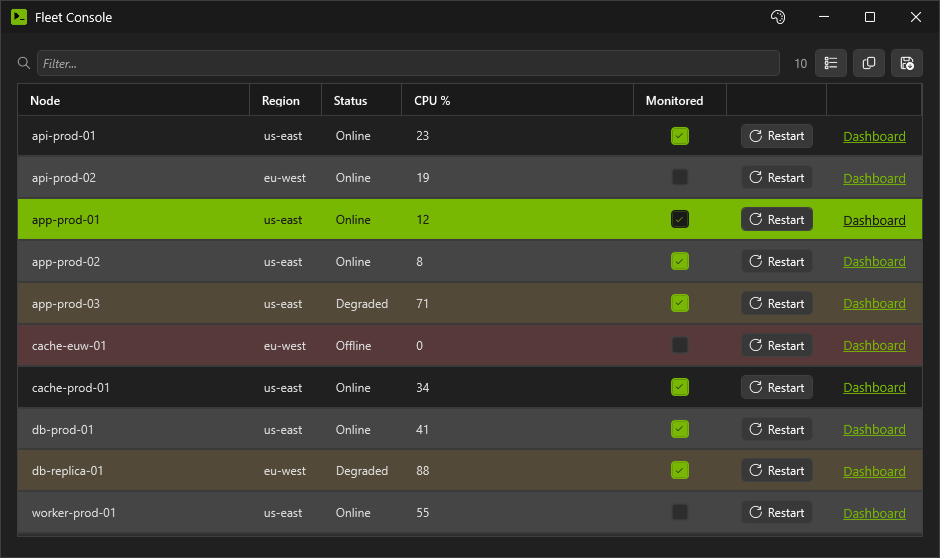
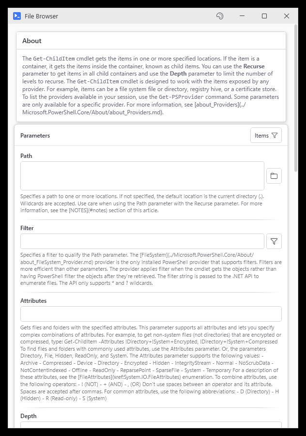
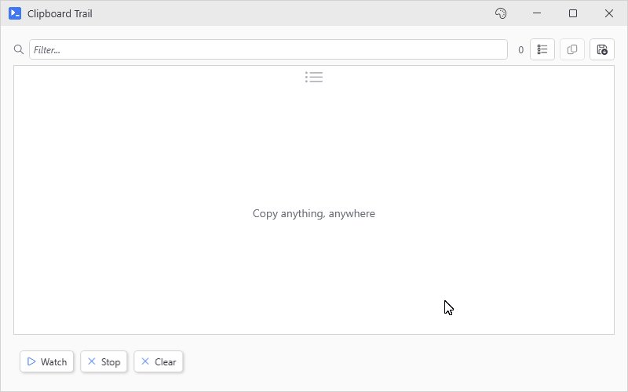
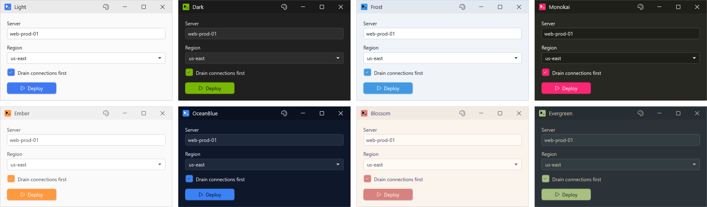

# PsUi

[](https://www.powershellgallery.com/packages/PsUi)


[](CHANGELOG.md)


For building UIs in PowerShell without the misery.

<p align="center"></p>

Build the window with PsUi commands and write normal PowerShell in the scriptblocks you attach to them. Or hand `New-UiTool` a script you already have and it builds the form from the param block.

```powershell
Import-Module PsUi

New-UiWindow -Title 'PsUi Demo' -Width 500 -Height 250 -Content {
    New-UiInput -Label 'Server' -Variable 'server' -Placeholder 'web-prod-01'
    New-UiDropdown -Label 'Action' -Variable 'action' -Items @('Health Check', 'Restart', 'Deploy')
    New-UiToggle -Label 'Verbose logging' -Variable 'verbose'
    New-UiButton -Text 'Run' -Icon 'Play' -Accent -Action {
        Write-Host "Connecting to $server..." -ForegroundColor Cyan
        Write-Progress -Activity $action -Status 'Starting...' -PercentComplete 25
        Start-Sleep -Milliseconds 500

        if ($action -eq 'Restart') {
            $confirm = Read-Host "Type YES to restart $server"
            if ($confirm -ne 'YES') { Write-Host 'Cancelled.' -ForegroundColor Yellow; return }
        }

        Write-Progress -Activity $action -PercentComplete 75
        Start-Sleep -Milliseconds 500
        Write-Host "$action complete on $server" -ForegroundColor Green
        Write-Warning "Latency: 42ms"
        Write-Progress -Activity $action -Completed
    }
}
```

<p align="center"></p>

Code runs in a background runspace so the window doesn't freeze while it works. Click Run and an output window shows the console text and a progress bar, and anything an action returns shows up in a sortable grid on its own tab.

[The Problem](#the-problem) · [Features](#features) · [Quick Start](#quick-start) · [How It Works](#how-it-works) · [Requirements](#requirements) · [Installation](#installation) · [Examples](#examples) · [Control Reference](#control-reference) · [Theme Usage](#theme-usage) · [Limitations](#limitations)

The full docs are on the wiki. Start with [Getting Started](https://github.com/jlabon2/PsUi/wiki/Getting-Started) which goes from install to your first window. Every command is in the [Command Index](https://github.com/jlabon2/PsUi/wiki/Command-Index), and when a window implodes try [FAQ and Troubleshooting](https://github.com/jlabon2/PsUi/wiki/FAQ-and-Troubleshooting). The Concepts pages cover [how PsUi scripts work](https://github.com/jlabon2/PsUi/wiki/How-PsUi-Scripts-Work), [threading and hydration](https://github.com/jlabon2/PsUi/wiki/Threading-and-Variable-Hydration), [sessions](https://github.com/jlabon2/PsUi/wiki/Sessions-and-Window-Isolation), [async and streams](https://github.com/jlabon2/PsUi/wiki/Async-and-Stream-Interception), [where output goes](https://github.com/jlabon2/PsUi/wiki/Output), [theming](https://github.com/jlabon2/PsUi/wiki/Theming-and-Custom-Themes), and [raw WPF access](https://github.com/jlabon2/PsUi/wiki/Raw-WPF-Access), and [PsUi Architecture](https://github.com/jlabon2/PsUi/wiki/PsUi-Architecture) covers how it's built.

---

## The Problem

Building GUIs in PowerShell is annoying and hard, and most people will tell you not to bother. If you want to try anyway, your immediate options are:

**Single-threaded.** Run everything on the UI thread. Works until you hit a network call or slow disk read. Then the window freezes with a blinding white light and the title bar says "(Not Responding)".

**Build your own threading.** That means spinning up a `RunspacePool`, syncing state through `[HashTable]::Synchronized`, pushing every update through `$Window.Dispatcher.Invoke`, and chasing race conditions when a control gets disposed halfway through an update. It ends up more boilerplate than actual code.

**XAML by hand.** Write the window in XAML, load it with `XamlReader`, then call `FindName` for every control you touch. You get a proper WPF window and still have all the threading work from the option above.

PsUi is an attempt at another option. It puts the threading in a C# backend which runs the runspaces and hands every update to the UI thread for you. When an action throws, the window shows you the message, the line number, the code on that line, and the stack trace.

---

## Features

### Async Without Threading Code

Button actions are async by default so the window doesn't freeze while one's running.

A background runspace normally can't see your script's variables. PsUi reads each action to work out which ones it uses and sets them up before it runs, and every control with a `-Variable` comes along too, so an input built with `-Variable 'userName'` is just `$userName` in the action. Assign to it and the input updates when the action ends. Values aren't copied or serialized on the way so a `SqlConnection` or `FileStream` your script opened shows up in the action as the same instance ([with a couple of threading rules](https://github.com/jlabon2/PsUi/wiki/Threading-and-Variable-Hydration#live-objects)).

A grid doesn't wait for the action to end. `New-UiDataGrid -ItemsSource` takes a plain `ArrayList` or `List[T]`, wraps it in a threadsafe list the grid watches, and points your variable at the wrap, so `$rows.Add(...)` from a background runspace shows up in the grid as it happens. Hand it 10k rows up front, or replace them all at once with `Set-UiDataGridItems`, and the grid updates once instead of ten thousand times. Each `Add` after that is still its own update.

### Stream Interception

PsUi catches `Write-Host`, `Write-Information`, `Write-Warning`, `Write-Progress`, and `Write-Error` and shows them in the window, and `Write-Verbose` too once the action turns verbose on. Progress calls turn into progress bars, and text keeps its color with the brightest console colors toned down a bit so they're readable. `Read-Host` and `Get-Credential` pop up themed dialogs instead of hanging on a console nobody can see, and so do `$host.UI.Prompt()` and `-Confirm` prompts.

<p align="center"></p>

If you'd rather skip the separate output window, put `-NoOutput` on the button and `New-UiStatusBar -Intercept` in the window. The bar counts warnings and errors on clickable badges, and `-CaptureHost` puts `Write-Host` lines in its status text. See [Output](https://github.com/jlabon2/PsUi/wiki/Output) for where each stream goes.

<p align="center"></p>

### A Form From Any Command

`New-UiTool` reads the parameters of any command and builds a form from them so a script you already have gets a UI without being touched. Plain strings get text boxes, `[switch]` a toggle, `[datetime]` a date picker, `[ValidateSet()]` a dropdown, and `[ValidateRange()]` a slider when the range is 10 steps or fewer. `-Path` and anything named for a folder get a folder browser, and anything with File in its name gets a file picker. On a domain joined machine, `-ComputerName` (or a Server or Host parameter) opens the Windows object picker so you can search AD, and OU, user, group, and member parameters get the matching AD picker.

If the command has more than one parameter set, you get a selector that rebuilds the form when you switch sets. Dynamic parameters and validation that checks live state don't make it onto the form so build those forms yourself.

### A DSL for Building Windows

The commands are there so a window takes a few lines of PowerShell instead of a XAML file plus the code to load it and find each control by name. `New-UiWindow -Content { }` holds the window, and containers like `New-UiTab`, `New-UiCard`, `New-UiPanel`, and `New-UiGrid` take a `-Content` block of their own, so the script nests the same way the window does ([here's how that looks](https://github.com/jlabon2/PsUi/wiki/How-PsUi-Scripts-Work#how-the-commands-nest)). Each command puts its control inside whatever block it's in, in the order you wrote it, already themed. You never have to number a grid row or hook up an event.

Actions and helpers find a control by its `-Variable`. When no parameter covers what you're after, `-WPFProperties` sets any property on the control, and [Raw WPF Access](https://github.com/jlabon2/PsUi/wiki/Raw-WPF-Access) covers reaching the control itself.

### The Controls

The controls cover the usual form stuff and a fair bit past it. For input there are text boxes, dropdowns, toggles, radio groups, sliders, date and time pickers, and a credential field that hands the action a `PSCredential`, and `-HelperButton` puts a file, folder, computer, user, group, or OU picker next to a text box. For everything else there are tabs, cards, expanders, lists, grids, trees, charts, progress bars, a status bar, and an embedded browser. `New-UiInput` checks itself against `-ValidatePattern` or a `-Validate` block, and `-EnabledWhen` keeps a control grayed out until, say, the toggle above it is on.

`New-UiDataGrid` has the most going on. Button actions get the selected rows under the grid's `-Variable`, so with `-Variable 'svc'` they're `$svc` in the action. Cells can hold controls too. `Type = 'Button'` puts a button in every row and `'Toggle'` a checkbox that writes back. Turn on `-Editable` and people can edit cells in place with a `Validator` on the column to turn down bad edits. `-RowContextMenu` adds rightclick entries, and when several rows are selected, the entry's action runs against each of them. Sorting, filtering, copy, export, and a column picker are on by default.

<p align="center"></p>

### Standalone Viewers

`Out-Datagrid`, `Out-TextEditor`, and `Out-CSVDataGrid` open a window of their own, no `New-UiWindow` needed. `Out-Datagrid` shows whatever you pipe into it in a sortable grid (add `-IsFilterable` for a filter box) and hands the selected rows back with `-PassThru`. `Out-TextEditor` shows text in an editor with find, a line and column readout, optional spell check, and a `-ReadOnly` mode, and returns the edited text when you click Save. `Out-CSVDataGrid` opens one or more CSV files in a grid you can edit, and Save writes them back to disk.

---

## Quick Start

Four ways to try it. The demo needs a clone of the repo, and with a Gallery install the other three work the same with plain `Import-Module PsUi`.

**Run the demo** (recommended first step)
```powershell
# From the repo root
Import-Module .\PsUi\PsUi.psd1
.\Start-PSUiDemo.ps1
```
It opens a window with eleven tabs covering controls, data output, async, host interception, child windows, the standalone viewers, `New-UiTool`, data grids, and the status bar, plus a welcome tab and an advanced one. Click around. Break things. When a button opens an output window, its Console tab shows what happened.

**Wrap an existing command**
```powershell
Import-Module .\PsUi\PsUi.psd1
New-UiTool -Command 'Get-ChildItem' -Title 'File Browser'
```

<p align="center"></p>

**Build something custom**
```powershell
Import-Module .\PsUi\PsUi.psd1
New-UiWindow -Title 'My First Tool' -Content {
    New-UiInput -Label 'Name' -Variable 'userName'
    New-UiButton -Text 'Greet' -Action {
        Write-Host "Hello, $userName!"
    }
}
```
Type a name, click the button, check the Console tab.

**Skip the window**
```powershell
Import-Module .\PsUi\PsUi.psd1
New-UiInput -Label 'Name' -Variable 'userName'
New-UiButton -Text 'Greet' -Action { Write-Host "Hello, $userName!" }
```
There's no `New-UiWindow` here so PsUi reads the script and builds a window around the controls.

---

## How It Works

Button actions run in **separate runspaces** from your console, and most surprises in PsUi come back to that.

Your script's functions and variables are captured when the window is created. Globals you set inside an action don't make it back to your console, and a variable you create inside an action stays there unless the button lists it in `-Capture` or the action saves it with `Set-UiCapturedVariable`.

The action runs on an STA thread either way. `New-UiWindow -AsyncApartment STA` only changes the thread that waits on it, a new one per run instead of one from the thread pool, which makes it slower.

[Threading and Variable Hydration](https://github.com/jlabon2/PsUi/wiki/Threading-and-Variable-Hydration) has the reserved names, the `-Linked*` parameters, the `-NoAsync` caveat, and what to do when a value won't sync. Child windows and what they share with their opener are on [Sessions and Window Isolation](https://github.com/jlabon2/PsUi/wiki/Sessions-and-Window-Isolation), and which control gets the mouse wheel is in the [FAQ](https://github.com/jlabon2/PsUi/wiki/FAQ-and-Troubleshooting#which-control-gets-the-mouse-wheel).

---

## Requirements

- Windows 10/11 or Server 2016+ (tested most heavily on Windows 10 21H2 and Server 2019)
- PowerShell 5.1 or 7.2 and up (Windows only since WPF doesn't exist on Linux or Mac and never will)
- .NET Framework 4.7.2+ (included with Windows 10 1803+ so you probably have it)

The module works out which edition you're on and loads the right binaries. There's also a net452 build for WinPE and older boxes, where everything works except `New-UiWebView` (there's no WebView2 there).

Icons come from Segoe MDL2 Assets on Windows 10 and Segoe Fluent Icons on Windows 11. PsUi picks whichever is installed. `Set-PsUiIconFont` or `New-UiWindow -IconFont` forces the other one, and `Test-PsUiIcon` tells you whether a glyph name renders before you ship a window full of blank squares.

---

## Installation

```powershell
# Install from the PowerShell Gallery (recommended)
Install-Module -Name PsUi -Scope CurrentUser
```

Or install using `Install-PSResource` (PSResourceGet):

```powershell
Install-PSResource -Name PsUi
```

### Manual / Development Install

```powershell
# Clone and import (the module lives in the repo's PsUi subfolder)
git clone https://github.com/jlabon2/PsUi.git
cd PsUi
Import-Module .\PsUi\PsUi.psd1

# Or copy the module folder in so Import-Module PsUi works by name.
# 5.1 looks in Documents\WindowsPowerShell\Modules instead.
$modulePath = Join-Path ([Environment]::GetFolderPath('MyDocuments')) 'PowerShell\Modules'
New-Item $modulePath -ItemType Directory -Force | Out-Null
Copy-Item .\PsUi $modulePath -Recurse -Force
Import-Module PsUi
```

The C# backend comes precompiled so there's no build step unless you're changing the C#. Import takes about a second.

If you want to modify the C# code:
```powershell
# Builds net452 (WinPE), net472 (5.1) and net6.0-windows (7.2 and up)
.\Build-PsUi.ps1

# Reload after building
Remove-Module PsUi -Force -ErrorAction SilentlyContinue
Import-Module .\PsUi\PsUi.psd1 -Force
```

.NET types stay loaded for the whole PowerShell session so after changing the C# you have to restart PowerShell to get a clean reload.

---

## Examples

Here's one of the decent ones. The rest are on the wiki's [Examples](https://github.com/jlabon2/PsUi/wiki/Examples) page.

**Live data feed**

Point a grid at an ArrayList, then add to the list from wherever the data comes in. Click Watch, then go copy anything in any application. Every Ctrl+C you press shows up in the grid while you watch until you hit Stop or press Escape. Doesn't really have much utility.

<details>
<summary>The code, 40 lines</summary>

```powershell
Import-Module PsUi

$rows = [System.Collections.ArrayList]::new()

New-UiWindow -Title 'Clipboard Trail' -Width 800 -Height 500 -Content {
    New-UiDataGrid -Variable 'trail' -ItemsSource $rows -EmptyMessage 'Copy anything, anywhere' -Fill

    New-UiPanel -LayoutStyle Wrap -Content {
        New-UiAction -Text 'Watch' -Icon 'Play' -Action {
            $last = Get-Clipboard -Raw

            while ($true) {
                $now = Get-Clipboard -Raw
                if ($now -and $now -ne $last) {
                    $last  = $now
                    $flat  = ($now -replace '\s+', ' ').Trim()
                    # $rows in here is the threadsafe list PsUi rebound the variable to.
                    # Insert at 0 rather than Add, so the newest copy sits on top without a sort.
                    $rows.Insert(0, [pscustomobject]@{
                        Copied  = Get-Date -Format 'HH:mm:ss'
                        Chars   = $now.Length
                        Kind    = switch -Regex ($now) {
                                      '^\w+://'      { 'url'; break }
                                      '^[A-Za-z]:\\' { 'path'; break }
                                      '\r?\n'        { 'multiline'; break }
                                      default        { 'text' }
                                  }
                        Preview = if ($flat.Length -gt 60) { $flat.Substring(0, 60) + '...' } else { $flat }
                    })
                }
                Start-Sleep -Milliseconds 250
            }
        }
        New-UiAction -Text 'Stop' -Icon 'Cancel' -Action { Stop-UiAsync } -NoAsync
        New-UiAction -Text 'Clear' -Icon 'Clear' -Action { Clear-UiDataGridItems -Variable 'trail' } -NoAsync
    }

    # Escape doubles as Stop, except while typing in the filter box (plain hotkeys skip text fields).
    Register-UiHotkey -Key 'Escape' -Action { Stop-UiAsync } -NoAsync
}
```

</details>

<p align="center"></p>

The watch loop calls `$rows.Insert()` from a background runspace exactly the way it would in a console script. The grid starts out without any columns and gets them from the first row that comes in. `-Fill` gives the grid whatever height is left over, which keeps the buttons at the bottom (cap it with `-MaxFillHeight` if a 4K monitor makes it look garbo).

`Stop-UiAsync` cancels the newest running action so the watch loop can get away with a lazy `while ($true)` instead of a countdown. Stop and Clear both have `-NoAsync` for the same reason. An async Stop would cancel the newest background action it could find, which is itself, and an async Clear would become the newest action and swallow the next Stop.

And yea, a clipboard watcher sees everything, your password manager's contributions included. This one keeps its rows in memory and drops them when the window closes, but that's the cost of polling... the clipboard doesn't know which copies were secrets. It's a demo, man.

---

## Control Reference

There are 87 commands. The [Command Index](https://github.com/jlabon2/PsUi/wiki/Command-Index) lists all of them with a one line summary, and each name links to a page with the full parameter list and examples.

[Windows](https://github.com/jlabon2/PsUi/wiki/Command-Index#windows) · [Layout](https://github.com/jlabon2/PsUi/wiki/Command-Index#layout) · [Buttons and Actions](https://github.com/jlabon2/PsUi/wiki/Command-Index#buttons-and-actions) · [Inputs](https://github.com/jlabon2/PsUi/wiki/Command-Index#inputs) · [Display](https://github.com/jlabon2/PsUi/wiki/Command-Index#display) · [Charts](https://github.com/jlabon2/PsUi/wiki/Command-Index#charts) · [Status and Progress](https://github.com/jlabon2/PsUi/wiki/Command-Index#status-and-progress) · [Lists, Grids, Trees, and Menus](https://github.com/jlabon2/PsUi/wiki/Command-Index#lists-grids-trees-and-menus) · [Standalone Viewers and Output](https://github.com/jlabon2/PsUi/wiki/Command-Index#standalone-viewers-and-output) · [Dialogs and Pickers](https://github.com/jlabon2/PsUi/wiki/Command-Index#dialogs-and-pickers) · [Form Generation](https://github.com/jlabon2/PsUi/wiki/Command-Index#form-generation) · [Session, Theming, Icons, and Async](https://github.com/jlabon2/PsUi/wiki/Command-Index#session-theming-icons-and-async)

---

## Theme Usage

A theme covers every control in the window. You can set it in code, or switch while the window's open with the palette button in the titlebar. Leave it out and you get `Auto` which follows the Windows light or dark setting.

```powershell
New-UiWindow -Title 'App' -Theme Dark -Content {
    New-UiLabel -Text 'Dark mode enabled'
}
```

Eighteen come with PsUi: Dark, Light, Frost, Pearl, Blossom, Ember, Sage, SolarizedLight, SolarizedDark, OceanBlue, Bespin, Charcoal, DeepRed, Monokai, Lavender, Slate, Evergreen, and Midnight. [Theming and Custom Themes](https://github.com/jlabon2/PsUi/wiki/Theming-and-Custom-Themes) describes each one, and it lists the color keys `Register-UiTheme` takes when you want one of your own.

`-Accent` on a button or card picks up the theme's accent color, and validation messages use the theme's warning and error colors.

<p align="center"></p>

---

## Limitations

- Windows only since it's WPF underneath.

- The ISE isn't supported ([here's why](https://github.com/jlabon2/PsUi/wiki/FAQ-and-Troubleshooting#does-it-run-in-the-ise)). Windows Terminal, pwsh.exe, plain powershell.exe, and VS Code's terminal all work.

- Big datasets get slow. `Out-Datagrid` and `New-UiDataGrid` share a grid that's fine at 10k rows and makes you wait at 100k so filter big sets before you display them.

- It's not an MVVM framework. There's no INotifyPropertyChanged and no binding expressions, which the internal tools PsUi is aimed at rarely need.

- Values sync when an action starts and when it ends, not while it's running. For anything more live, push updates with `Set-UiValue` or hook the control's events yourself.

- There's no designer. You write the code and run it to see what it looks like.

- Threading bugs hide well, and some will have made it past the test suite. If you find one, file an issue.

---

## Contributing

If something breaks, file an issue with your PowerShell version, the error message, and a cleaned up copy of the script that's causing it, plus the `-Debug` console output if you can get it.

Pull requests welcome. Run the Pester suite in `Tests` on 5.1 and 7 first since CI runs it on both.

If your change touches the comment help in `PsUi/public`, run `.\Build-Docs.ps1` on 7 and commit what it rebuilds under `docs/wiki` along with it. The docs check on pull requests fails when the committed pages don't match a fresh build.

---

## License

MIT. Use it for whatever. Attribution appreciated but not required.

---

*For when someone asks "can you make that a GUI?" and the honest answer is "I guess."*