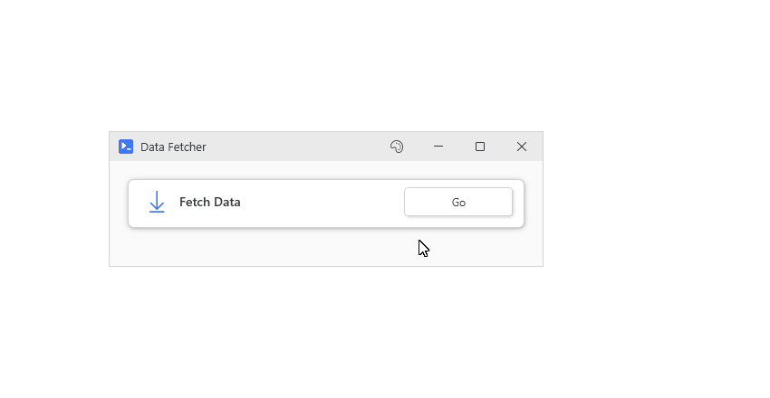
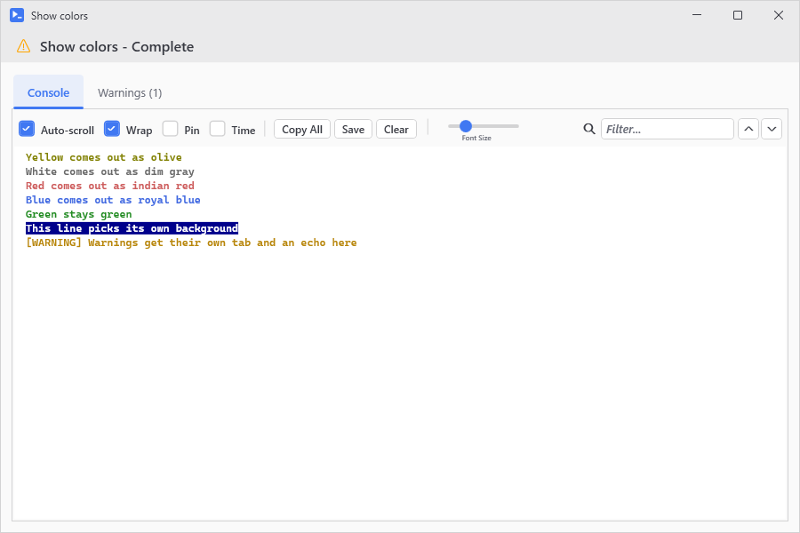

# Async and Stream Interception

Button actions run in background runspaces so the window doesn't freeze while an action is busy. Which stream [ends up where](Output) comes down to the button's switches and whether the window has a status bar.

## Async by default

The network call below can take a few seconds. The output window shows the run as it goes, and your window stays disabled behind it until you close the output window (`-NoWait` below changes that):

```powershell
New-UiWindow -Title 'Data Fetcher' -Width 480 -Content {
    New-UiButtonCard -Header 'Fetch Data' -Icon 'CloudDownload' -Action {
        $data = Invoke-RestMethod 'https://jsonplaceholder.typicode.com/posts'
        Write-Host "Fetched $($data.Count) posts"
        # Pipeline output, so it goes to the Results grid
        $data
    }
}
```

<p align="center"></p>

The [output window](Output) sorts what comes back into tabs. Pipeline objects go to Results (a sortable grid) and `Write-Host` goes to Console. Warnings and errors get their own tabs, and no tab shows up until there's something in it.

Control values work from the background through [hydration](Threading-and-Variable-Hydration). PsUi reads them on the window's thread before the action starts and hands them over as plain variables like `$userName`. Anything you assign to one goes back to its control when the action ends.

When the default isn't what you want:

- `-NoAsync` runs the action on the window's thread and the window is frozen until it returns. You rarely need to type it. If an action opens a window (`New-UiChildWindow`, `New-UiWindow`, `New-UiTool`), PsUi makes it synchronous automatically because a window opened from the background runspace dies along with it. You do need it on a button that calls `Stop-UiAsync`. If an async button calls it, the button registers itself as the newest job first, so it ends up canceling itself instead of the job you meant. PsUi warns you about that when the button is built.
- `-NoWait` runs async without holding up the parent window so other buttons stay clickable. The button you clicked stays disabled until its output window is closed.
- `-NoOutput` skips the output window completely, and errors pop up as dialogs instead unless a [status bar](Output#status-bars) built with `-Intercept` is on screen to count them. Use it for an action that has no output to show or one that just updates controls in the window you already have. `New-UiAction` is `New-UiButton` with this turned on (as is `New-UIActionCard` for `New-UIButtonCard`).
- `-HideEmptyOutput` builds the output window but keeps it hidden until a line, a warning, or an error comes in. If the action only returns objects, the window shows up when it finishes, and if it finishes without any output at all, no window ever flashes at you. Passing it along with `-NoOutput` throws. Only `New-UiButton` and `New-UiButtonCard` take it.
- `-NoInteractive` skips hooking up the input dialogs described below so the action starts a little faster. `Read-Host` and `Get-Credential` inside the action then come back empty instead of prompting. A choice prompt just takes its default answer. Only `New-UiButton` and `New-UiAction` have the switch and it only matters with `-NoOutput` because the dialogs are always on when there's an output window.

Outside of a button, `Invoke-UiAsync` runs any scriptblock in the background with optional `-OnComplete` and `-OnError` callbacks. `Stop-UiAsync` cancels the newest running action. A live data feed is just a `while ($true)` loop in a `New-UiAction`, with a second `-NoAsync` button calling `Stop-UiAsync` to end it. Put the loop on a normal button and its output window keeps you from clicking Stop.

## Stream interception

The background run gets its own PowerShell host which catches `Write-Host` and `Write-Progress`, so host text goes into the Console tab and progress calls draw progress bars. Warnings and errors skip the host and PsUi reads those straight off their streams.

The loud console colors get toned down, whatever the theme. Yellow shows up as Olive, White as DimGray, Red as IndianRed, and Blue as RoyalBlue. If a `Write-Host` sets its own `-BackgroundColor`, you get the normal console colors on the assumption that a script picking its own background already thought about contrast.

<p align="center"></p>

`Read-Host` and `Get-Credential` pop up themed dialogs since there's no console for them to wait on. `$host.UI.Prompt()` and `-Confirm` prompts do the same, and a "press any key to continue" `ReadKey` turns into a little prompt dialog.

The host doesn't go as far as `$host.UI.RawUI` which just returns made up values. The buffer reads back empty and `KeyAvailable` is always false, which breaks scripts that draw a screen by moving the cursor around or that poll the keyboard. `Format-Table` lays out to 120 columns because that's the width RawUI reports. `Clear-Host` still works and clears the Console tab.

Put `-NoOutput` on the buttons and a [status bar](Output#status-bars) built with `-Intercept` in the window, and the output goes to a bar along the bottom instead of a second window. Warnings and errors turn into clickable badges on the bar, and `-CaptureHost` sends `Write-Host` to its status text.

`Write-UiHostDirect` bypasses the host and writes to the console you launched from, for the odd message you'd rather have in that terminal.

## Keeping up with fast output

Adding lines to a text control one at a time freezes it solid when a `Write-Host` runs in a tight loop. So the lines go into a queue instead, and a 50ms timer on the window's thread empties it, 100 records at a time. Once more than 100 are waiting, each `Write-Host` in the action sleeps for a millisecond, and past 500 it sleeps for five, until the window catches up.
