# Examples

Paste any of these into a console. Each one imports PsUi itself, so if you haven't installed it yet, go through [Getting Started](Getting-Started) first.

## A basic form

One input and a button. `-Variable 'name'` makes `$name` exist inside the action, holding whatever was typed.

```powershell
Import-Module PsUi

New-UiWindow -Title 'Greeting' -Width 400 -Height 200 -Content {
    New-UiInput -Label 'Name' -Variable 'name' -Placeholder 'Your name here'
    New-UiButton -Text 'Greet' -Accent -Action {
        Write-Host "Hello, $name!" -ForegroundColor Green
    }
}
```

<p align="center">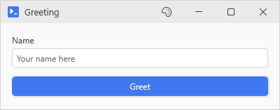</p>

## Tabs and mixed controls

A tour of the control types, grouped into tabs. Skim it for the parameter names even if you never build this window.

```powershell
Import-Module PsUi

New-UiWindow -Title 'Settings' -Width 500 -Height 400 -Content {
    New-UiTab -Header 'General' -Content {
        New-UiToggle -Label 'Enable dark mode' -Variable 'darkMode'
        New-UiSlider -Label 'Volume' -Variable 'volume' -Minimum 0 -Maximum 100 -Default 50
        New-UiDropdown -Label 'Language' -Variable 'language' -Items @('English', 'Spanish', 'French', 'German')
    }
    New-UiTab -Header 'Network' -Content {
        New-UiInput -Label 'Proxy Server' -Variable 'proxy' -Placeholder 'proxy.example.com'
        New-UiInput -Label 'Port' -Variable 'port' -InputType Int -Default 8080
        New-UiToggle -Label 'Use authentication' -Variable 'useAuth'
    }
    New-UiTab -Header 'Advanced' -Content {
        New-UiDatePicker -Label 'Start Date' -Variable 'startDate'
        New-UiTimePicker -Label 'Start Time' -Variable 'startTime' -Default '09:00'
        New-UiTextArea -Label 'Notes' -Variable 'notes' -Rows 4
    }
    
    New-UiButton -Text 'Save Settings' -Icon 'Save' -Accent -Action {
        Write-Host "Dark Mode: $darkMode"
        Write-Host "Volume: $volume"
        Write-Host "Language: $language"
        Write-Host "Proxy: ${proxy}:${port}"
        Write-Host "Use Auth: $useAuth"
    }
}
```

<p align="center">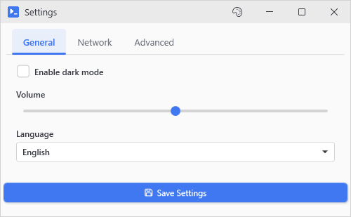</p>

## Progress and long jobs

`Set-UiProgress` moves the bar and `Set-UiValue` changes the status text, both while the loop is still going. `-NoOutput` is there so you can actually see the bar. Without it, the output window opens on top of the form and blocks it until you close it.

```powershell
Import-Module PsUi

New-UiWindow -Title 'Batch Processor' -Width 500 -Height 300 -Content {
    New-UiInput -Label 'Items to process' -Variable 'itemCount' -InputType Int -Default 10
    New-UiProgress -Variable 'progress'
    New-UiInput -Label 'Status' -Variable 'status' -Default 'Ready'
    
    New-UiButton -Text 'Start Processing' -Icon 'Play' -Accent -NoOutput -Action {
        $total = [int]$itemCount
        for ($i = 1; $i -le $total; $i++) {
            # Midrun updates go through Set-UiValue/Set-UiProgress. Plain variable writes sync once when the action ends.
            Set-UiValue -Variable 'status' -Value "Processing item $i of $total..."
            Set-UiProgress -Variable 'progress' -Value (($i / $total) * 100)

            # Simulate work
            Start-Sleep -Milliseconds 300
        }

        Set-UiValue -Variable 'status' -Value 'Done!'
    }
}
```

<p align="center">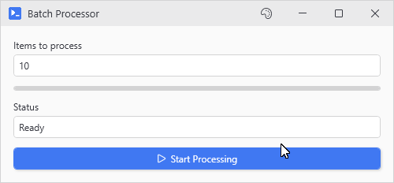</p>

## Conditional controls

`-EnabledWhen` points at another control. The input stays grayed until the toggle is on, and the button until the input has something in it.

```powershell
Import-Module PsUi

New-UiWindow -Title 'Conditional Demo' -Width 400 -Height 300 -Content {
    New-UiToggle -Label 'Enable advanced options' -Variable 'advanced'
    
    # This input only enables when the toggle is checked
    New-UiInput -Label 'Server URL' -Variable 'serverUrl' -EnabledWhen 'advanced' -ClearIfDisabled
    
    # This button only enables when the input has content
    New-UiButton -Text 'Connect' -Icon 'Globe' -Accent -EnabledWhen 'serverUrl' -Action {
        Write-Host "Connecting to $serverUrl..."
    }
}
```

<p align="center">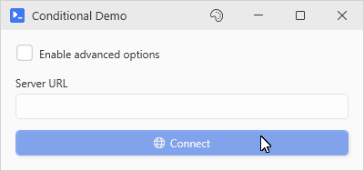</p>

## Form data collection

```powershell
Import-Module PsUi

New-UiWindow -Title 'New User' -Content {
    New-UiCard -Header 'User Details' -Content {
        New-UiInput -Label 'Name' -Variable 'name'
        New-UiInput -Label 'Email' -Variable 'email'
        New-UiDropdown -Label 'Role' -Variable 'role' -Items @('Admin', 'User', 'Guest')
        New-UiDropdown -Label 'Department' -Variable 'dept' -Items @('Engineering', 'Sales', 'Support', 'HR')
        New-UiToggle -Label 'Active' -Variable 'isActive' -Checked
    }
    
    New-UiButton -Text 'Create User' -Accent -Action {
        Write-Host "Creating user..."
        Write-Host "  Name: $name"
        Write-Host "  Email: $email"
        Write-Host "  Role: $role"
        Write-Host "  Department: $dept"
        Write-Host "  Active: $isActive"
        
        # Your actual user creation code here
        # New-ADUser -Name $name -Email $email ...
    }
}
```

<p align="center">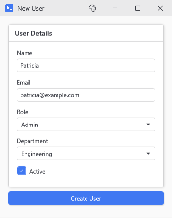</p>

## Result row actions

For when you want to show some data and let people act on individual rows. Inside each action `$_` is the row you picked, or an array of them when you pick several (`$Selected` is always the array).

```powershell
Import-Module PsUi

New-UiTool -Command 'Get-Service' -ResultActions {
    New-UiResultAction 'Start' -Icon Play -Action {
        Write-Host "Starting $($_.Name)..."
        $_ | Start-Service -WhatIf
    }
    New-UiResultAction 'Stop' -Icon Cancel -Action {
        Write-Host "Stopping $($_.Name)..."
        $_ | Stop-Service -WhatIf
    }
    New-UiResultAction 'Properties' -Icon Info -Action {
        $_ | Format-List * | Out-String | Write-Host
    }
}
```

<p align="center"></p>

## Multistep wizard

Tabs standing in for wizard steps. There are no next or back buttons so you click through the numbered tabs yourself.

<details>
<summary>The code, 34 lines</summary>

```powershell
Import-Module PsUi

New-UiWindow -Title 'Server Provisioning' -Width 600 -Height 500 -Content {
    New-UiTab -Header '1. Server Info' -Content {
        New-UiInput -Label 'Server Name' -Variable 'serverName' -Placeholder 'SRV-APP-001'
        New-UiDropdown -Label 'Environment' -Variable 'environ' -Items @('Dev', 'Test', 'Staging', 'Prod')
        New-UiDropdown -Label 'OS' -Variable 'osChoice' -Items @('Windows Server 2019', 'Windows Server 2022', 'RHEL 8', 'Ubuntu 22.04')
    }
    New-UiTab -Header '2. Resources' -Content {
        New-UiSlider -Label 'CPU Cores' -Variable 'cpu' -Minimum 1 -Maximum 16 -Default 4
        New-UiSlider -Label 'RAM (GB)' -Variable 'ram' -Minimum 4 -Maximum 128 -Default 16
        New-UiSlider -Label 'Disk (GB)' -Variable 'disk' -Minimum 50 -Maximum 2000 -Default 100
    }
    New-UiTab -Header '3. Network' -Content {
        New-UiDropdown -Label 'VLAN' -Variable 'vlan' -Items @('VLAN-10-Servers', 'VLAN-20-DMZ', 'VLAN-30-Internal')
        New-UiToggle -Label 'Static IP' -Variable 'staticIp'
        New-UiInput -Label 'IP Address' -Variable 'ipAddr' -EnabledWhen 'staticIp' -Placeholder '10.0.1.x'
    }
    New-UiTab -Header '4. Provision' -Content {
        New-UiLabel -Text 'Click Provision Server to create the VM.' -Style Body
        New-UiButton -Text 'Provision Server' -Icon 'Play' -Accent -Action {
            Write-Host "Provisioning $serverName..." -ForegroundColor Cyan
            Write-Host "Environment: $environ | OS: $osChoice"
            Write-Host "CPU: $cpu cores, RAM: ${ram}GB, Disk: ${disk}GB"
            
            # Your PowerCLI / Azure / AWS provisioning code here
            Write-Progress -Activity 'Provisioning' -Status 'Creating VM...' -PercentComplete 50
            Start-Sleep -Seconds 2
            Write-Progress -Activity 'Provisioning' -Completed
            
            Write-Host "Server $serverName provisioned!" -ForegroundColor Green
        }
    }
}
```

</details>

<p align="center">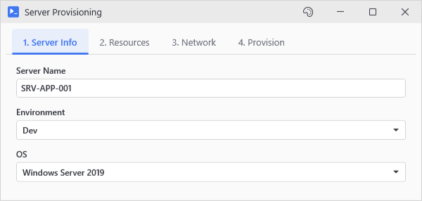</p>

## Connecting to remote systems

Test Connection opens a PSSession with whatever credential you entered, and Run Report is where your own code goes.

```powershell
Import-Module PsUi

New-UiWindow -Title 'Remote Server Tool' -Width 600 -Height 400 -Content {
    New-UiCard -Header 'Connection' -Content {
        New-UiInput -Label 'Server' -Variable 'server' -Placeholder 'server.domain.local'
        New-UiCredential -Label 'Credentials' -Variable 'creds' -DefaultUsername "$env:USERDOMAIN\$env:USERNAME"
        New-UiToggle -Label 'Use SSL' -Variable 'useSsl' -Checked
    }
    
    New-UiPanel -LayoutStyle Wrap -Content {
        New-UiButton -Text 'Test Connection' -Icon 'Globe' -Action {
            if (!$server) { Write-Host 'Enter a server name' -ForegroundColor Yellow; return }
            if (!$creds) { Write-Host 'Enter credentials' -ForegroundColor Yellow; return }
            
            Write-Host "Testing connection to $server..."
            try {
                # Your connection test here
                $session = New-PSSession -ComputerName $server -Credential $creds -ErrorAction Stop
                Write-Host "Connected successfully!" -ForegroundColor Green
                Remove-PSSession $session
            }
            catch {
                Write-Host "Connection failed: $($_.Exception.Message)" -ForegroundColor Red
            }
        }
        
        New-UiButton -Text 'Run Report' -Icon 'Document' -Accent -Action {
            if (!$server -or !$creds) { 
                Write-Host 'Connect to a server first' -ForegroundColor Yellow
                return 
            }
            
            Write-Host "Running report on $server..."
            # Your report code here
        }
    }
}
```

<p align="center">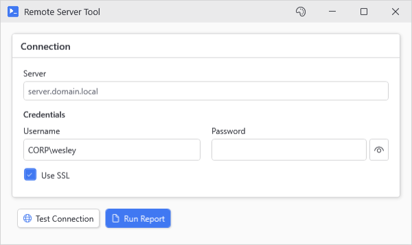</p>

## Fetching data without freezing

An async button. The action runs in a background runspace so the window doesn't freeze while the web call is out.

```powershell
Import-Module PsUi

New-UiWindow -Title 'Data Fetcher' -Width 480 -Content {
    New-UiButtonCard -Header 'Fetch Data' -Icon 'CloudDownload' -Action {
        $data = Invoke-RestMethod 'https://jsonplaceholder.typicode.com/posts'
        Write-Host "Fetched $($data.Count) posts"
        
        Write-Progress -Activity 'Processing' -Status "$($data.Count) posts" -PercentComplete 50
        Start-Sleep -Seconds 1
        Write-Progress -Activity 'Processing' -Completed
        
        $data  # Appears in Results tab
    }
}
```

<p align="center">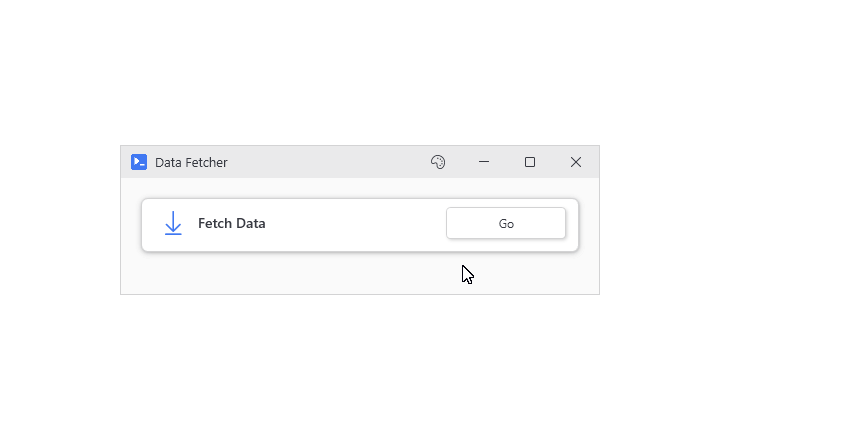</p>

Put `-NoAsync` on the card and the window locks up until the web call comes back and the rest of the action is done.

## Nesting controls

`New-UiCard` takes a `-Content` block like the window does, and the inputs inside it still show up in the action as `$user`, `$pass`, and `$role`.

```powershell
Import-Module PsUi

New-UiWindow -Title 'User Form' -Theme Dark -Content {
    New-UiCard -Header 'Account Details' -Content {
        New-UiInput -Label 'Username' -Variable 'user' -Placeholder 'sarah'
        New-UiInput -Label 'Password' -Variable 'pass' -Password
        New-UiDropdown -Label 'Role' -Variable 'role' -Items @('Admin', 'User', 'Guest')
    }
    
    New-UiButton -Text 'Submit' -Icon 'Accept' -Accent -Action {
        Write-Host "Creating $user with role $role"
    }
}
```

<p align="center">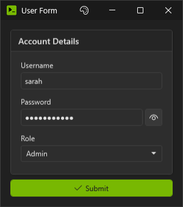</p>

`$user` starts out as whatever was in the box when you clicked. Assign it something else and the box picks that up when the action ends.

## Generating a form from a command

`New-UiTool` reads a command's parameter block and builds a form from it, and the types and validation attributes you declared decide what each field looks like.

```powershell
Import-Module PsUi

# Wrap a builtin cmdlet
New-UiTool -Command 'Get-Process'

# Works on any command with CmdletBinding
New-UiTool -Command 'Get-ChildItem' -Title 'File Browser'
```

```powershell
Import-Module PsUi

# Or your own function with proper parameter decorations
function Search-Logs {
    param(
        [Parameter(Mandatory)]
        [string]$Path,
        
        [ValidateSet('Error', 'Warning', 'Info')]
        [string]$Level = 'Error',
        
        [datetime]$Since = (Get-Date).AddDays(-7)
    )
    Get-Content $Path | Where-Object { $_ -match $Level }
}

New-UiTool -Command 'Search-Logs'
```

<p align="center">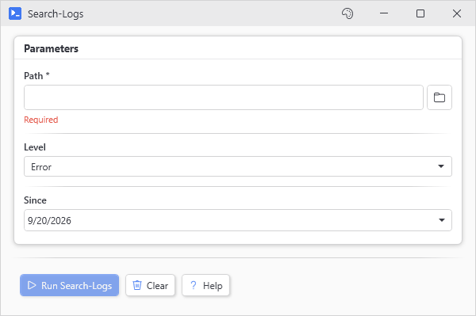</p>

- `[string]` becomes a text input
- `[int]` and `[double]` become a number input (validates as you type)
- `[switch]` and `[bool]` become a checkbox
- `[datetime]` becomes a date picker
- `[ValidateSet()]` becomes a dropdown
- `[ValidateRange()]` becomes a slider when the range spans 10 steps or fewer, a number input with a range tooltip past that
- `[SecureString]` becomes a password field
- `[PSCredential]` becomes a full credential picker with username

Mandatory parameters get a red Required tag, and the Run button stays grayed out until they're filled in. If the command has more than one parameter set, there's a dropdown at the top to pick one. Results open in tabs you can sort and filter, and `-ResultActions` adds entries to their [Actions dropdown](Output#the-actions-button), with `$_` set to the selected row or rows. An entry's `-Confirm` asks before it runs, and its `-ObjectType` hides it on tabs of other types.

## Standalone viewers

The `Out-*` commands open their own window so you don't need a `New-UiWindow` around them.

```powershell
Import-Module PsUi

# Sorting, column picking and CSV export come as standard. The filter box is opt in, see the next line.
Get-Process | Out-Datagrid -TitleText 'Processes'

# Select rows and pass through (like Out-GridView -PassThru but better looking)
Get-Process | Out-Datagrid -PassThru -IsFilterable | Stop-Process -WhatIf
```

<p align="center">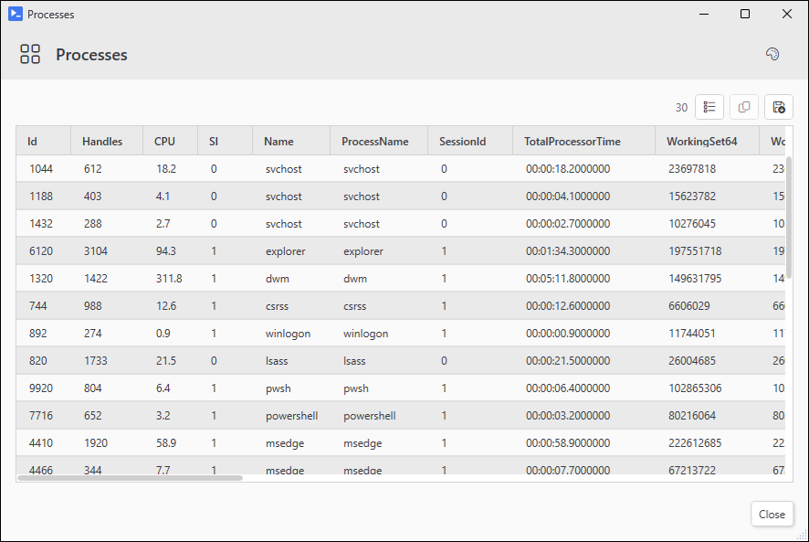</p>

Clicking a header sorts by that column, and with `-PassThru` the rows you select go down the pipeline when you click OK.

When you want a datagrid inside a window you're already building, use `New-UiDataGrid` instead.

`Out-TextEditor` does find (with match case) and shows the line and column you're on. Spell check is optional:

```powershell
Import-Module PsUi

# View a file with the text editor
Get-Content C:\Windows\System32\drivers\etc\hosts | Out-TextEditor -TitleText 'Hosts File' -Theme Dark -ReadOnly

# Edit text and get it back
$notes = 'Meeting notes go here...' | Out-TextEditor -TitleText 'Notes' -SpellCheck
```

<p align="center">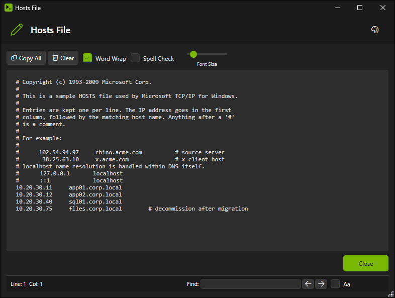</p>
