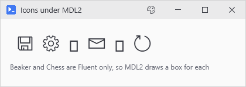

# FAQ and Troubleshooting

## *The window opens but the colors look washed out*

Something in that console made a theme or WPF call before your first `New-UiWindow` so WPF's Application object got created on that thread and your window's stuck with it. Running some other script earlier in that session with its own WPF GUI does the same thing. PsUi notices this and prints `[PsUi] Warning: a WPF or theme call ran before New-UiWindow...` to the console so scroll up and look for it. In the window itself, the giveaway is that switching themes only changes the title bar. Move the early call inside the `-Content` block, or rearrange things so the window comes first. Restarting the console only helps if the early call came from something else in the session. If it's in your script, the next run will be washed out again.

## *My icons are empty boxes*

That machine's icon fonts don't have a glyph for the name you used. `Test-PsUiIcon 'Name'` returns `$false` when that happens, and `-Font MDL2` lets you check against Windows 10 before you ship there. `Show-UiGlyphBrowser` lists every name PsUi knows, boxes included, and dims the ones this machine can't draw. Clicking a tile copies its name. Most names work on Windows 11 anyway because both fonts are installed there and PsUi borrows a missing glyph from the other Segoe font unless you turned that off with `-NoIconFontFallback`. Windows 10 only has MDL2 so a name that only exists in Fluent stays a box there.

<p align="center"></p>

## *A variable isn't syncing back to its control*

Few possibilities:

1. The `-Variable` name is on the reserved list (`Matches`, `args`, `input`, `this`, and [the rest](Threading-and-Variable-Hydration#names-you-cant-use)), and hydration skips those without telling you.
2. You expected it to update while the action was still running, but plain assignments only sync once it *ends*, so updates partway through need `Set-UiValue` or `Set-UiProgress`.
3. The value is a live object like an open connection or a COM handle. It gets across fine, the control just can't display it. If a text box says `System.Data.SqlClient.SqlConnection`, that's your sync working.
4. Something broke in PsUi's sync step, not in your script. Run it again with `New-UiWindow -Debug`, and the console prints a `[DEHYDRATION]` line saying which variable and what went wrong. Without `-Debug` the action finishes like everything's fine and the control just never changes. That line goes to the console you launched from, and a transcript won't catch it (the [dead button entry](#a-button-seems-dead-and-shows-no-error) below has the way around that).

## *Why can't Button B use the connection Button A opened?*

Button A's variables are gone once its action ends so Button B never sees them. If A's action keeps the connection in `$conn`, put `-Capture 'conn'` on Button A, and every action that runs after A finishes gets `$conn` until the window closes. Opening the connection in your script before `New-UiWindow` works too since PsUi hands both buttons your script's own object. Connections aren't threadsafe so read [Live objects](Threading-and-Variable-Hydration#live-objects) before two buttons use one at once.

## *The window froze*

Something slow is running on the UI thread. If the action has `-NoAsync` on it, take that off. The switch is for opening child windows and dialogs, not for doing work. If you never wrote `-NoAsync`, check whether the action opens a window. `New-UiButton` looks through the action, and if it finds something that opens a window (`New-UiTool`, `New-UiChildWindow`, `New-UiWindow`), it goes synchronous on its own because a window opened from the async runspace dies when the runspace ends. Move the slow work into a separate button and leave the window button as it is. The check also counts a window call sitting in a branch that never runs, and `-NoAsync:$false` turns it off when that's what tripped it.

## *Does it run in the ISE?*

Not with `New-UiWindow`. The ISE is a WPF app so its process already has an Application object sitting on the ISE's own thread. WPF only allows one per process, and PsUi builds its windows on a thread of their own. You get the [washed out window](#the-window-opens-but-the-colors-look-washed-out) from the top of this page, and restarting the ISE won't fix it. `Out-Datagrid` still works there since it opens in place on the thread that called it. Windows Terminal, pwsh.exe, the VS Code terminal, and plain powershell.exe all work.

## *PowerShell 5.1 or 7?*

Both, with the same module. It works out which edition it's on and loads the right binaries, and WinPE gets its own net452 build. On either edition, `New-UiWebView` needs the WebView2 runtime installed. On the net452 build it warns you and draws a placeholder where the browser would be.

## *The grid crawls with my dataset*

10k rows is fine and 100k means sitting there waiting so filter it down before it goes in the grid.

## *Which control gets the mouse wheel?*

The page does, by default, wherever the cursor is. Lists, trees, grids, and closed dropdowns leave the wheel alone so a window full of them still scrolls as one page. Give one `-ScrollWheel Edge` and it scrolls its own rows first, then hands the wheel back to the page once it hits the top or bottom, like a scrollable box on a web page. `-ScrollWheel Capture` (or the older `-CaptureScrollWheel` switch) keeps the wheel even at the ends, and on `New-UiDropdown`, which doesn't take `Edge`, it changes the selection as you scroll over the box without opening it. An open dropdown list always scrolls itself.

`-Fill` controls get `Edge` unless you say otherwise, since they take up the whole viewport and the page behind them has hardly any scrolling left to do.

## *A button seems dead and shows no error*

Put `-Debug` on `New-UiWindow`:

```powershell
New-UiWindow -Title 'Deploy' -Width 420 -Height 240 -Debug -Content {
    New-UiInput -Label 'Server' -Variable 'server'
    New-UiButton -Text 'Deploy' -Action { Write-Host "deploying to $server" }
}
```

All of it goes to the console you launched from, never to the window, so keep that terminal where you can see it. Two kinds of lines come out mixed together. The ones in brackets come from the C# side, tagged by area:

```
[INJECT] Injecting 232 private functions
[PsUi Debug Mode Enabled]
[ICON] Icon font inherited: Segoe Fluent Icons
[APP] Created new Application instance
[THEME] Auto resolved to: Light
[WINDOW] Fixed window size: 420x240
DEBUG: Called by New-UiInput, SessionId=e7f3eb2a-..., Session is null: False, CurrentParent is null: False
DEBUG: Registering 'server', Control type: TextBox
DEBUG: AddControlSafe succeeded for 'server'
DEBUG: Click handler fired, Action is null: False
```

The `DEBUG:` lines are ordinary `Write-Debug` output from PsUi's PowerShell side. They show up because `-Debug` sets `DebugPreference` in the window's runspace and in every async runspace after it. The bracket tags are `APP`, `CAPTURE`, `CONTENT`, `CONTROL`, `DEHYDRATION`, `DISPATCHER`, `EXPORT`, `HOTKEY`, `HYDRATION`, `ICON`, `INJECT`, `RUNSPACE`, `SECURITY`, `SPLASH`, `THEME`, `WEBVIEW`, and `WINDOW`. Your own `Write-Debug` inside an async action never shows up in the window. When the button has an output window, the line comes out in this same console as `[DEBUG] ...` instead of `DEBUG:`.

The line you're usually looking for is this one:

```
[HYDRATION] Skipped 1 control(s) due to collision with LinkedVariables: role
```

If a control has the same name as a variable your action already captured, the control gets skipped, so `$role` holds the captured object instead of the control's value. Read a property off it and it comes back empty, or use it as a string and you can get an Action Error dialog blaming a line that looks fine. Neither of those mentions the name clash. The sync back after the action won't either because the clashing name syncs like any other variable, and you only get a `[DEHYDRATION]` line when a sync actually fails.

A `New-UiChildWindow` gets a session of its own, and the bracket lines stop there while the `DEBUG:` ones keep going, which looks a lot like `-Debug` is working and there's just no name clash. Reproduce name clashes in the parent window.

If you can't sit and watch the window, run the script as a child process and redirect its whole console:

```powershell
powershell.exe -NoProfile -File .\repro.ps1 > C:\Temp\repro.log 2>&1
```

Everyone reaches for `Start-Transcript` here, and it doesn't catch any of this, neither the bracket lines nor the `DEBUG:` ones. The bracket lines go straight to the console, and the `DEBUG:` ones come from the window's own runspaces which your transcript isn't attached to.

## *Everything is broken and I want to start over*

`Reset-UiSession` clears out the module state (active sessions, the theme engine, the runspace pool). It's there to get your console working again after a crash when `New-UiWindow` won't run anymore. If you find yourself using it all the time, something else is wrong so file an issue with a repro.

## *Where do I report bugs? (It's not working and I hate you)*

On [GitHub issues](https://github.com/jlabon2/PsUi/issues). Include your PowerShell version, a cleaned up repro script, the error message, the `-Debug` console output, and what you expected to happen. If the repro starts from a fresh `-NoProfile` console, it'll get fixed faster.
