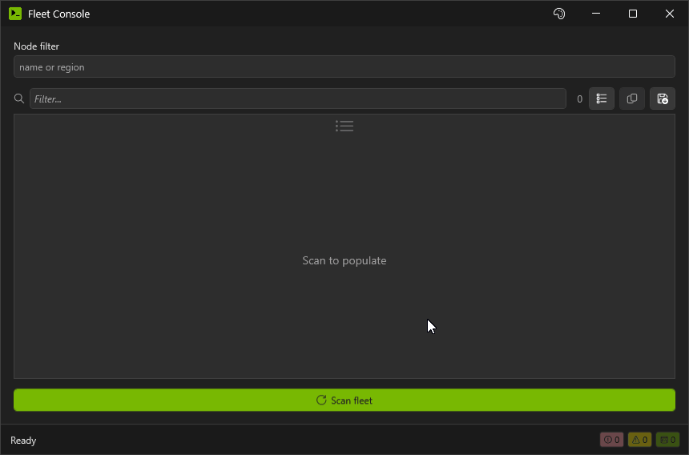
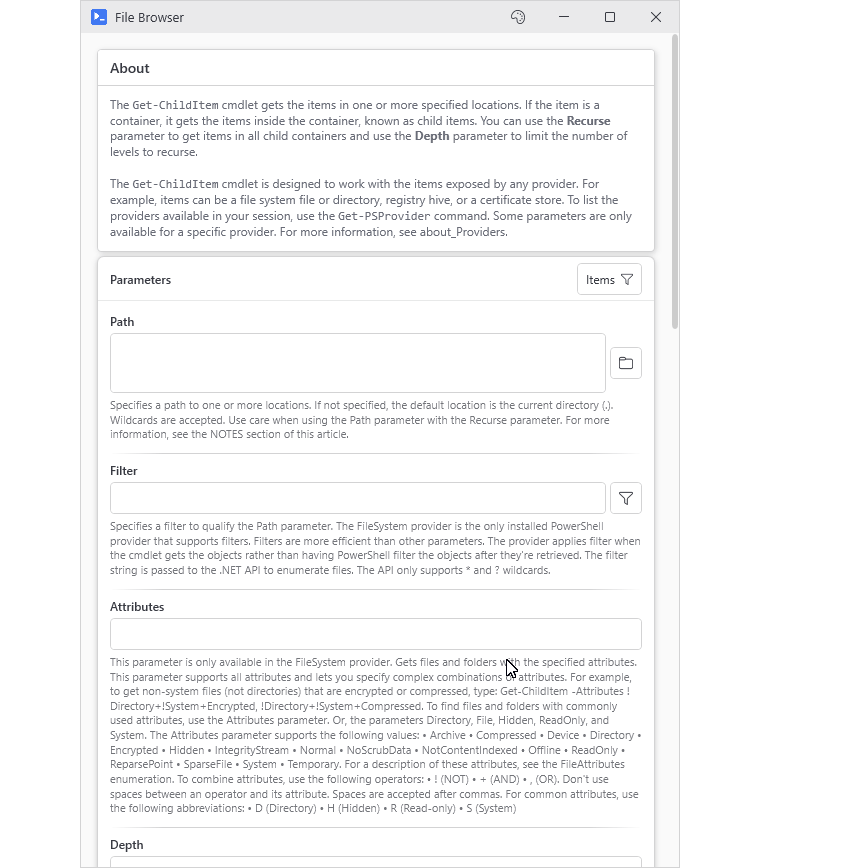
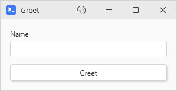
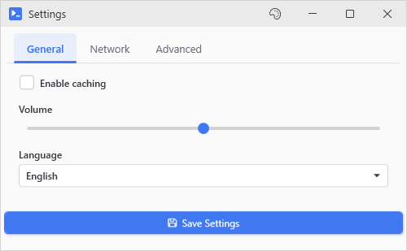

# Getting Started

<p align="center"></p>

## Install

```powershell
# From the PowerShell Gallery
Install-Module -Name PsUi -Scope CurrentUser

# Or with PSResourceGet
Install-PSResource -Name PsUi
```

You need Windows 10/11 or Server 2016+, and PowerShell 5.1 or 7.2 and up. 7.0 and 7.1 won't work because the 7 build targets net6.0-windows and those two can't load it.

[The ISE isn't supported](FAQ-and-Troubleshooting#does-it-run-in-the-ise). It's a WPF app itself and already holds the process's Application object which PsUi needs on its own thread. Any console host is fine, plain powershell.exe included.

## Run the demo

The demo script ships with the repo but not with the Gallery module so clone the repo first:

```powershell
git clone https://github.com/jlabon2/PsUi.git
cd PsUi
Import-Module .\PsUi\PsUi.psd1
.\Start-PSUiDemo.ps1
```

It has eleven tabs, starting with basic controls and working through async, host interception, `New-UiTool`, data grids, and the status bar. Nearly every exported command is in there somewhere. A lot of the demo buttons use `-NoOutput` and just change something in the window you're looking at so don't sit there waiting for an output window to show up. Most questions about "can PsUi do X" can be answered faster by checking out the demo than by reading these documents.

## Wrap an existing command

```powershell
New-UiTool -Command 'Get-ChildItem' -Title 'File Browser'
```

`New-UiTool` reads the command's parameters and builds a form for them. Each parameter gets a control that fits its type (a toggle for a switch, a dropdown for a ValidateSet), and after you click Run the results come back in a sortable grid. `-Path` gets a folder browse button, and so do `-LiteralPath` and anything with Directory or Folder in its name. If File is in the name you get a file browse button instead.

<p align="center"></p>

## Build something custom

```powershell
New-UiWindow -Title 'My First Tool' -Content {
    New-UiInput -Label 'Name' -Variable 'userName'
    New-UiButton -Text 'Greet' -Action {
        Write-Host "Hello, $userName!"
    }
}
```

Inside the action, `$userName` holds whatever was in the box when you clicked. PsUi takes the name from the input's `-Variable` and fills in the value before your code runs (that's [variable hydration](Threading-and-Variable-Hydration)).

The action ran on a [background runspace](Async-and-Stream-Interception), and `Write-Host` went to the Console tab of the [output window](Output). Warnings, errors, progress bars, and `Read-Host` prompts get caught the same way. Put `Start-Sleep 10` in the action and you can still drag the output window around while it waits, but the main window stays locked until you close the output window. `-NoWait` on the button leaves the rest of the main window usable.

The `New-UiWindow` block is optional in a script. Save these two lines as a .ps1 and run it:

```powershell
New-UiInput -Label 'Name' -Variable 'userName'
New-UiButton -Text 'Greet' -Action { Write-Host "Hello, $userName!" }
```

When there's no window around them, PsUi makes one, titled after the file. The script ends when you close it, and anything you put after the last control doesn't run. PsUi skips this under `-NonInteractive`, over remoting, in a session without an interactive desktop (a service, or a scheduled task set to run whether or not anyone is logged on), and whenever `$env:PsUiNoImplicitWindow` is set.

<p align="center"></p>

## A fuller example

Put a few `New-UiTab` blocks next to each other and the window gets tabs:

```powershell
New-UiWindow -Title 'Settings' -Width 500 -Height 340 -Content {
    New-UiTab -Header 'General' -Content {
        New-UiToggle -Label 'Enable caching' -Variable 'cacheMode'
        New-UiSlider -Label 'Volume' -Variable 'volume' -Minimum 0 -Maximum 100 -Default 50
        New-UiDropdown -Label 'Language' -Variable 'language' -Items @('English', 'Spanish', 'French', 'German')
    }
    New-UiTab -Header 'Network' -Content {
        New-UiInput -Label 'Proxy Server' -Variable 'proxy' -Placeholder 'proxy.example.com'
        New-UiInput -Label 'Port' -Variable 'port' -InputType Int -Default 8080
        New-UiToggle -Label 'Use authentication' -Variable 'useAuth'
    }
    New-UiTab -Header 'Advanced' -Content {
        New-UiDatePicker -Label 'Start Date' -Variable 'startDate'
        New-UiTimePicker -Label 'Start Time' -Variable 'startTime' -Default '09:00'
        New-UiTextArea -Label 'Notes' -Variable 'notes' -Rows 2
    }

    New-UiButton -Text 'Save Settings' -Icon 'Save' -Accent -Action {
        Write-Host "Cache Mode: $cacheMode"
        Write-Host "Volume: $volume"
        Write-Host "Language: $language"
        Write-Host "Proxy: ${proxy}:${port}"
        Write-Host "Use Auth: $useAuth"
    }
}
```

<p align="center"></p>

Save reads `$proxy` and `$port` even if you never clicked over to the Network tab.

## Where next

[How PsUi Scripts Work](How-PsUi-Scripts-Work) explains how the commands nest and when each part of a script runs.

If a variable comes up empty inside an action, or a box doesn't change after you assign to it, read [Threading and Variable Hydration](Threading-and-Variable-Hydration) before you file an issue.
