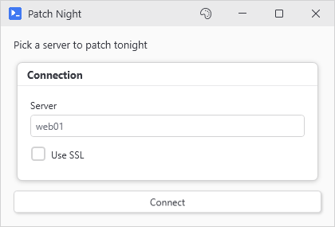

# How PsUi Scripts Work

PsUi scripts are PowerShell scripts. The `New-Ui*` commands work like any other PowerShell command, and most of them add a piece to the window when they run. PsUi could be considered a DSL (a small language built for one job) but it has no syntax of its own, just commands and scriptblocks.

This page is about how those commands fit together and when each part of your script runs. If you haven't built a window yet, start with [Getting Started](Getting-Started).

## How the commands nest

```powershell
New-UiWindow -Title 'Patch Night' -Content {
    New-UiLabel -Text 'Pick a server to patch tonight'
    New-UiPanel -Header 'Connection' -Content {
        New-UiInput -Label 'Server' -Variable 'server' -Placeholder 'web01'
        New-UiToggle -Label 'Use SSL' -Variable 'useSsl'
    }
    New-UiButton -Text 'Connect' -Action {
        Write-Host "Connecting to $server, SSL is $useSsl"
    }
}
```

<p align="center"></p>

That builds a window with the label at the top, a box headed Connection with the server input and the toggle inside it, and the Connect button at the bottom. Clicking Connect prints what's in the box and whether the toggle is on.

Commands hold other commands through `-Content`, and eight of them take it: `New-UiWindow`, `New-UiPanel`, `New-UiTab`, `New-UiCard`, `New-UiGrid`, `New-UiExpander`, `New-UiStatusBar`, and `New-UiChildWindow`. Inputs and buttons can't hold controls.

Each command finds its place when it runs. It asks PsUi which container (one of those eight) is being filled right now and adds itself to the end of it. `New-UiWindow` starts with the window's main area as that container, and each container makes itself the one being filled while its own `-Content` runs, then puts the old one back. So inside one container the order you write is the order you see, and by default that's top to bottom in one column.

Three commands place things their own way:

- Every `New-UiTab` at the same level joins the tab strip the first one started so a control written between two tabs ends up below the whole strip.
- `New-UiStatusBar` goes along the bottom of the window (or the top with `-Location Top`) wherever you write it unless it's inside a tab or an expander, or has `-Inline`. Inside a tab or expander the bar stays put and hides along with it. If the window has a bar of its own too, `Write-Status` goes to that one unless you name the inner bar with `-Bar`.
- `New-UiGrid` fills its cells left to right and starts a new row after `-Columns` (2 by default). It sets the row and column of everything inside it so a button's `-GridRow` and `-GridColumn` get overwritten in there.

```powershell
New-UiWindow -Title 'Order' -Content {
    New-UiTab -Header 'One' -Content { New-UiLabel -Text 'On tab one' }
    New-UiLabel -Text 'Written second, shown under the tabs'
    New-UiTab -Header 'Two' -Content { New-UiLabel -Text 'On tab two' }
    New-UiStatusBar -DefaultText 'Written fourth, shown at the bottom'
    New-UiLabel -Text 'Written last'
}
```

Both tabs share one strip at the top and the two labels sit under it in the order they were written. The status bar ends up at the bottom of the window.

## When each part runs

`New-UiWindow` runs your `-Content` block once, top to bottom, to build the window, and shows the window when the block's done. Your script then waits on the `New-UiWindow` line until the window closes. An `-Action` block doesn't run during the build. The button keeps it and runs it on every click.

```powershell
New-UiWindow -Title 'Timing' -Content {
    New-UiLabel -Text "Built at $(Get-Date -Format T)"
    New-UiButton -Text 'What time is it' -Action {
        Write-Host "Clicked at $(Get-Date -Format T)"
    }
}
Write-Host 'The window closed, so the script carries on'
```

The label keeps the time the window was built. Each click opens the [output window](Output) with the time of that click, and the last line doesn't print until you close the main window.

What that means for your script:

- Slow work (a database query or a big `Get-ChildItem`) belongs in an action. In `-Content` it holds up the window which doesn't appear until the block finishes. If there's no way around a slow build, `New-UiWindow -Splash` shows a small loading window in the meantime.
- If a command in `-Content` writes an error like a `Get-ChildItem` on a folder that isn't there, `New-UiWindow` prints it with the file and line and opens the window anyway. A `throw` stops the window, and so does a PsUi control that can't build. The `-Content` section on [New-UiWindow](New-UiWindow#-content) covers how `-ErrorAction` changes that.
- A control's `-Variable` doesn't create a variable in `-Content`. Right after `New-UiInput -Variable 'server'`, `$server` is still empty because the box's value only turns into a variable when an action runs. If the build needs the value, use `Get-UiValue -Variable 'server'`.
- An action runs by default in a background runspace (a separate PowerShell session inside the same process), which PsUi calls async. It gets every control's value as it stood at the click. [Threading and Variable Hydration](Threading-and-Variable-Hydration) covers what else it can and can't see.
- `-NoAsync` actions and `-OnChange` blocks run on the window's own thread, as do event handlers you hook up yourself. Slow work in any of them freezes the window.

## Plain PowerShell inside -Content

The block is ordinary PowerShell so loops, `if`, splatting, and your own functions all work in it. Call `New-UiToggle` from a function and the toggle goes in whichever container is being filled when the function runs, which lets you build part of a window in a function and call it from more than one place.

```powershell
function Add-ServerToggle {
    param([string]$Server)
    New-UiToggle -Label $Server -Variable "patch_$Server"
}

$servers = 'web01', 'web02', 'sql01'

New-UiWindow -Title 'Patch Run' -Content {
    New-UiPanel -Header 'Targets' -Content {
        foreach ($server in $servers) { Add-ServerToggle -Server $server }
    }
    if ($servers.Count -gt 2) {
        New-UiLabel -Text "$($servers.Count) servers, so this run takes a while"
    }
    New-UiButton -Text 'Patch' -Action {
        foreach ($server in $servers) {
            if (Get-UiValue -Variable "patch_$server") { Write-Host "Patching $server" }
        }
    }
}
```

`$servers` and `Add-ServerToggle` live in the script, outside the window, and `New-UiWindow` copies them in before `-Content` runs (more on that below). The three toggles go inside the Targets box because the function runs while that box is being filled. The action builds each toggle's name from a string so it asks for the value with `Get-UiValue`. Turn on web02, click Patch, and the output window shows only `Patching web02`.

## What PsUi reads from your script

Most of the time PsUi just runs your code. In four places it also looks at your script's text or its variables.

### Your script's variables and functions

`-Content` doesn't run where you wrote it. The window gets its own thread and runspace, and the block runs there as text, so on its own it can't see anything in your script. Before it runs, `New-UiWindow` copies in every variable it can see from the line that called it, and every function too as long as it doesn't come from a module. Hashtables and lists come across as the same object on both sides so changing one in place from the window changes it for your script too. Assigning a new value inside the window doesn't carry back to your script. To hand a value back, capture it and use `-ExportOnClose` ([Keeping values with -Capture](Threading-and-Variable-Hydration#keeping-values-with--capture)). `-NoImplicitCapture` turns the copying off.

### The action scan

When a button is built, PsUi reads its action for the variables and functions it uses, and keeps what they hold right then with the button. That's why buttons built in a loop each remember their own value:

```powershell
New-UiWindow -Title 'Restart' -Content {
    foreach ($server in 'web01', 'web02', 'web03') {
        New-UiButton -Text "Restart $server" -Action { Write-Host "Restarting $server" }
    }
}
```

Restart web02 prints `Restarting web02` even though `$server` is `web03` by the time the loop finishes. Control values don't go through the scan. When a button's clicked, every control with a `-Variable` gets read and handed to the action as a variable (PsUi calls this hydration), whether the action mentions it or not. The scan only reads the action's own text so a variable that only a helper function uses needs `-LinkedVariables` ([When hydration misses something](Threading-and-Variable-Hydration#when-hydration-misses-something)).

### The implicit window

Leave `New-UiWindow` out of a script file and the first control that runs builds a window around the script. PsUi reads the file to find which lines go in it, from the first control to the last line that still calls a PsUi command, and runs those as the window's `-Content`. Lines above the first control run once before the window opens, and lines below the last one never run, function definitions included, so keep helpers above the controls that use them. [Getting Started](Getting-Started#build-something-custom) shows it working and lists the cases where PsUi skips it.

Put a dialog or window command (`Show-UiMessageDialog`, `Out-Datagrid`) between two controls and the window ends right there so neither the dialog nor the controls after it ever run. Inside an `-Action` they're fine. PsUi also refuses to build when the control sits inside a loop, an `if`, a `switch`, or a `try` that already ran a command that changes something (a `Set-Content` or a `Restart-Service`, say), because building the window would run that command a second time. The error says which command it was. For a size, a theme, or anything else `New-UiWindow` takes, write the `New-UiWindow` yourself.

### What -EnabledWhen looks for

`-EnabledWhen` keeps a control grayed out until a condition holds, and it goes by `-Variable` names. Give it a string and it watches the control with that `-Variable`. Give it a scriptblock and PsUi looks through the block's text for `$` variables that match controls already built, then reruns the block whenever one of those controls changes. Only a real `$true` from the block enables the control, so `{ $userName }` stays gray even with text in the box, while `{ $userName -ne '' }` works.

Build the controls it points at first. If the string refers to a control that doesn't exist yet, PsUi takes it as a [-Capture](Threading-and-Variable-Hydration#keeping-values-with--capture) name instead, and the control stays gray without a warning. If none of a scriptblock's `$` names match a control yet, PsUi warns and leaves the control enabled. [Conditional controls](Examples#conditional-controls) has a full example.

## Reacting to the user

You don't write event handlers for the usual cases since PsUi has parameters for them:

- When a button's clicked, a normal async action gets every control's current value, and assigning to one (`$status = 'Done'`) puts the new value in its control when the action ends.
- `-EnabledWhen` grays a control out until its condition holds, and `-ClearIfDisabled` empties it when it goes gray.
- `-OnChange` on `New-UiDropdown` runs when the selection changes, with the new item as its first argument. It doesn't run for the item the dropdown starts on. It runs on the window's thread without control variables so it reads and sets other controls with `Get-UiValue` and `Set-UiValue`.
- `Set-UiValue` and `Get-UiValue` look the control up by name when they run so they work from any of these blocks and don't care which control you built first. `Write-Status` sets the status bar's text.
- `-SubmitButton` on `New-UiInput` clicks the button with that `-Variable` when someone presses Enter in the box as long as the box isn't empty.

```powershell
New-UiWindow -Title 'Deploy' -Content {
    New-UiDropdown -Label 'Environment' -Variable 'envName' -Items 'Dev', 'Test', 'Prod' -OnChange {
        param($picked)
        Set-UiValue -Variable 'target' -Value "app-$($picked.ToLower()).contoso.local"
    }
    New-UiInput -Label 'Target' -Variable 'target' -Default 'app-dev.contoso.local' -ReadOnly
    New-UiToggle -Label 'Change approved' -Variable 'approved'
    New-UiButton -Text 'Deploy' -EnabledWhen 'approved' -Action {
        Write-Host "Deploying to $target"
    }
}
```

Picking Prod changes Target to `app-prod.contoso.local`, and Deploy stays gray until the toggle's on. Target is built after the dropdown, which is fine since `Set-UiValue` only looks for it when the selection changes. It gets its own `-Default` because `-OnChange` doesn't run for the starting item.

For anything no parameter covers, like reacting to every keystroke in a `New-UiInput`, you can hook the event on the WPF control yourself (WPF is the Windows UI framework PsUi builds its controls from). [Raw WPF Access](Raw-WPF-Access#getting-at-the-controls-psui-built) shows how.

## Using WPF directly

When a command has no parameter for the property you want, `-WPFProperties` takes a hashtable of WPF properties and sets them on the control. When you want the control itself, `(Get-UiSession).GetControl('name')` returns it by its `-Variable` name.

```powershell
New-UiWindow -Title 'Search' -Content {
    New-UiLabel -Text 'Server search' -WPFProperties @{ ToolTip = 'Matches the start of the name' }
    New-UiInput -Label 'Name' -Variable 'query'
    $queryBox = (Get-UiSession).GetControl('query')
    $queryBox.MaxLength = 15
}
```

The label gets a tooltip and the box stops taking characters after 15. Neither `New-UiLabel` nor `New-UiInput` has a parameter for those.

Only touch a raw control from code on the window's thread, which means `-Content` while the window builds, and later a `-NoAsync` action or an `-OnChange` block. A normal action runs in the background so it sticks to `Get-UiValue` and `Set-UiValue`. [Raw WPF Access](Raw-WPF-Access) covers which object gets the hashtable and how to add a WPF control PsUi has no command for.

## Common mistakes

- `New-UiWindow 'Tools' { ... }` fails because `-Title` is the only positional parameter. Write `-Content` out. `New-UiGrid { ... }` doesn't work either since its first positional parameter is `-Columns` which takes the block.
- Anything `-Content` outputs is dropped without a message. A `Get-Process` on a line of its own shows no list and no error so put data in a control such as `New-UiDataGrid`.
- If your script has a variable with the same name as a control's `-Variable`, an action that uses the name gets your script's value instead of the box's. With `$userName = $env:USERNAME` above the window and a `New-UiInput -Variable 'userName'` inside it, the action gets your login name whatever's typed. Pick different names. The [FAQ](FAQ-and-Troubleshooting#a-button-seems-dead-and-shows-no-error) shows the `-Debug` line that gives it away.
- Two controls with the same `-Variable` don't warn. The second one replaces the first, and actions read the second. When a function builds the same section twice, pass it a prefix for the names.
- Reserved names such as `input`, `matches`, `profile`, and `state` still build a control, but its value never reaches an action. Your script's own `$state` or `$session` doesn't get copied into the window either ([the full list](Threading-and-Variable-Hydration#names-you-cant-use)).
- `-NoAsync` actions don't get control values as variables so read them there with `Get-UiValue`.
- `New-UiLabel` has no `-Variable` so `Set-UiValue` can't change it later. For text that changes, use `New-UiInput -ReadOnly` or a status bar with `Write-Status`.
- Some parameters take scriptblocks that hold definitions instead of layout, like `-ResultActions` and `New-UiDataGrid -Columns`, and a `New-UiLabel` in one of them throws.
- The script stops at `New-UiWindow` until the window closes so code meant to run while it's open goes in an action (or use `-PassThru`).
