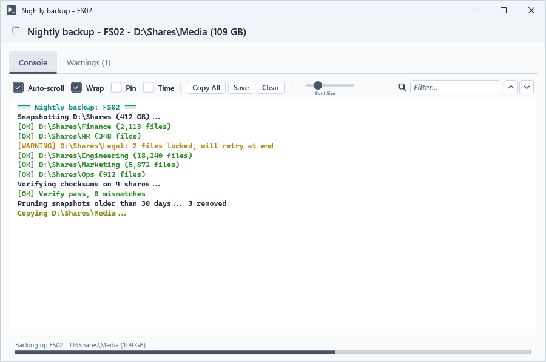
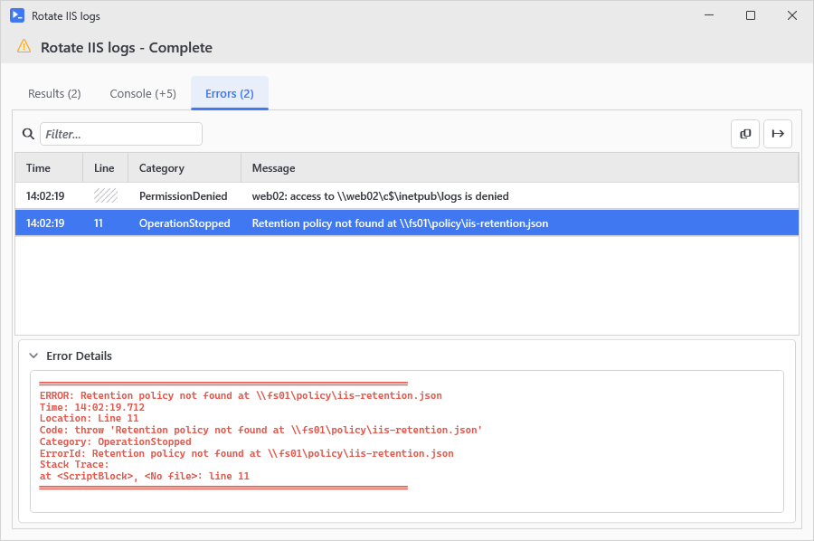
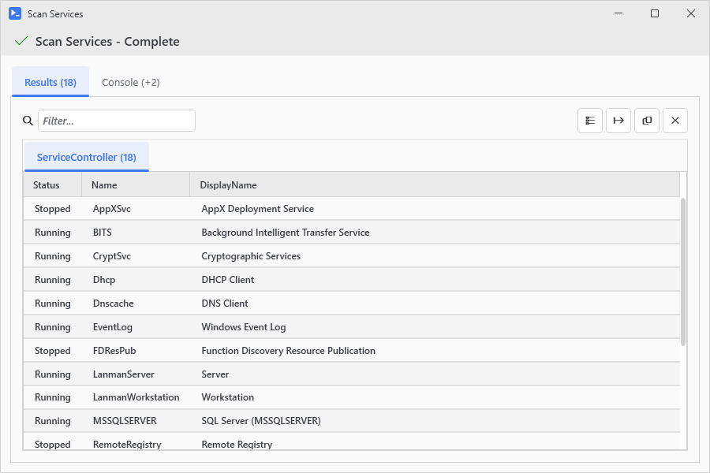
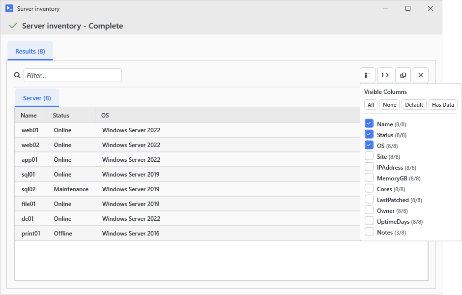
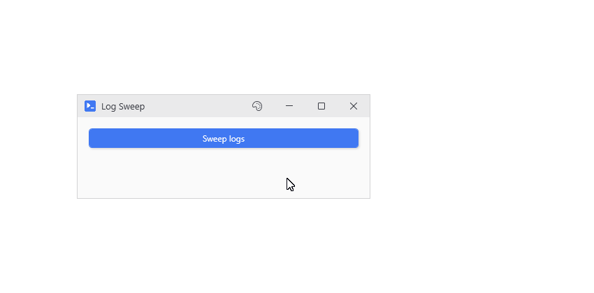
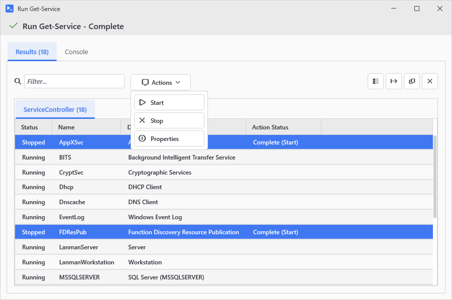
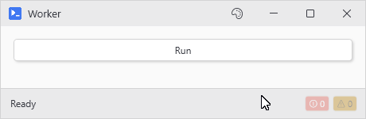
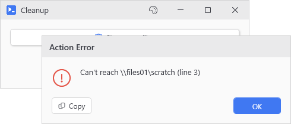

# Output

A button action runs in a background runspace without a console so PsUi catches whatever it writes: host lines, warnings, errors, progress, and the objects it returns.

Where it ends up depends on the button, and on whether the window has a status bar:

- Normal async buttons open an [output window](#the-output-window), and everything goes there.
- A [status bar](#status-bars) built with `-Intercept` picks up warnings, errors, progress and, if you ask it to, `Write-Host` from the window's buttons.
- With `-NoOutput` and no status bar showing, only errors make it out as a dialog. [The rest is dropped](#buttons-without-an-output-window).
- A `-NoAsync` button runs on the window's own thread. Its output goes to the [console you started the script from](#synchronous-actions), and its errors show up in a dialog once it's done.
- `Write-UiHostDirect` always writes [straight to that console](#straight-to-the-console), from anywhere.

## The output window

Click an async button and this window opens centered over yours. Yours stays disabled until you close it. With `-NoWait` only the button you clicked does.

<p align="center"></p>

### What goes where

- `Write-Host` and `Write-Information` show up in the Console tab as they happen, in [color](Async-and-Stream-Interception#stream-interception). The lines go into a [queue](Async-and-Stream-Interception#keeping-up-with-fast-output) that a 50ms timer empties so a chatty loop can't bog the window down.
- `Write-Progress` draws a progress bar along the bottom. Each activity gets its own bar, with child activities under their parent, and a top level activity's status also shows in the header next to the title. The bars go away when the run ends.
- Warnings and errors each get their own tab once the first one comes in, and each one also gets a colored `[WARNING]` or `[ERROR]` line in the console.
- If the action throws, the window stays open and the error becomes a row in the Errors tab. Select the row and an Error Details bar appears under the grid. Click it to see the message, the line number, the code on that line, and the stack trace. Line numbers start at the line your `-Action` block opens on so the `{` line is line 1.
- `Write-Verbose` lines show up in the console in gray, but only if the action turns verbose on itself (`$VerbosePreference = 'Continue'`, or `-Verbose` on a command). Your script's preference doesn't carry over into the action. `Write-Debug` never shows in the window. With `New-UiWindow -Debug` it goes to the console you launched from, as `[DEBUG] ...`.
- `Read-Host` and `Get-Credential` open themed dialogs over the window instead of hanging the run, and so do choice prompts.
- While the run is going, a tab you aren't looking at shows how much is new in it like `Console (+5)`.
- Objects the action returns wait until the run ends and then fill the Results tab which is the tab you end up on. If the run throws partway through, you still get whatever it returned before the error so Results shows up next to the Errors tab.

<p align="center"></p>

### The Results tab

Objects get one tab per type, biggest first, each labeled with the short type name and a count. If there are more than ten types, the ten biggest keep their own tabs and the rest share an "Other" tab. A single object gets a grid with one row like any other result, and hashtables come out as one Key/Value grid. Strings and plain values like numbers and dates get a text view instead of a grid. The search box highlights matches right in the text.

<p align="center"></p>

A grid starts out with the columns the object's type wants shown by default so a plain `Get-Process` gets five. The rest stay hidden until you bring them back with the column picker on the toolbar. It lists every property with a checkbox and how many rows actually have a value for it, and the All, None, Default, and Has Data buttons at the top switch a whole set at once.

<p align="center"></p>

The filter box searches every property, hidden ones included, off an index it builds in the background. Until that's done it says `Indexing...`. It filters once you've stopped typing for 300ms. Properties too slow to read, like a Process's `CommandLine` on 7, stay out of the index, and the filter box's tooltip lists them. If the filter hides every row, the grid says `No items matched 'x'`.

Copy and CSV export on the toolbar take every row the filter leaves, in the columns you can see. The Copy button shows a checkmark once the clipboard has it. To copy just some rows, select them and press Ctrl+C, or rightclick and pick Copy Selected Rows. Click a cell in the link color to open a viewer for the list or hashtable it holds. When the whole result is plain text, the toolbar has Copy but no export.

Rightclick the grid for the [New-UiDataGrid](New-UiDataGrid) menu. New-UiDataGrid's column definitions, row backgrounds, row details, and custom menu items aren't available here.

### The Console tab

The Console tab has its own toolbar. The find box highlights every match and its arrows step through them with a `1 of N` count, and auto-scroll follows new lines until you scroll with the mouse wheel. Pin keeps the window on top, Time stamps every line including the ones already there, Save writes everything to a .txt or .log file and Copy All puts it on the clipboard. Ctrl+wheel changes the font size, and double clicking the size slider resets it.

### While it runs

A spinner in the header and a running overlay on the window's taskbar button show the run is still going. Pressing Esc cancels it after an are you sure prompt, and closing the window mid run asks first as well. When you cancel, the header changes to `<Title> - Cancelled` and an orange `Operation cancelled by user` line goes into the console. Anything the run had returned by then is thrown away so a canceled run doesn't get a Results tab.

<p align="center"></p>

When a run finishes on its own, the header says `<Title> - Complete` and the spinner turns into a green check, or an orange warning triangle if there were errors or warnings (a throw counts). The taskbar overlay changes to match. If the run didn't produce any output at all, the window says `Completed successfully. No output was returned.`

### The Actions button

`-ResultActions` on the button adds an Actions dropdown to the results toolbar, so it only shows up when the run returns objects. You build the entries with `New-UiResultAction` in a scriptblock, or pass the old hashtable array. Inside an action, `$_` is the selected row (or the whole array if several rows are selected), and `$Selected` is always the full array. If no rows are selected, clicking an action just shows `Please select one or more items first.` [New-UiTool](New-UiTool) takes `-ResultActions` too and puts them on its results.

- `-Confirm` asks before running. `{0}` in the message gets replaced with the number of selected rows.
- `-ObjectType` hides the entry on result tabs of the wrong type. It matches against the tab label, exactly or as a substring, and labels use the short type name, so it's `Process`, not `System.Diagnostics.Process`. If every entry gets hidden, the Actions button goes too.

`-SingleSelect` on the button limits the grid to one selected row, for actions that only make sense on one thing.

```powershell
New-UiButton -Text 'Get Processes' -Action { Get-Process } -ResultActions {
    New-UiResultAction 'Stop' -Icon Stop -Confirm 'Stop {0} processes?' -Action { $_ | Stop-Process -Force }
}

# the hashtable form, still supported
New-UiButton -Text 'Get Processes' -Action { Get-Process } -ResultActions @(
    @{ Text = 'Stop'; Icon = 'Stop'; Confirm = 'Stop {0} processes?'; Action = { $_ | Stop-Process -Force } }
)
```

The grid also gets an Action Status column. The rows an action ran against show `Running (Stop)...` there, then `Complete (Stop)` or `Complete with errors (Stop)`.

<p align="center"></p>

### Other switches

`-OutputTitle` gives the window a better title than the button text. `-ScrollToTop` leaves the console scrolled to the top when the run finishes, for when you're dumping help text and want to read it from the start. `New-UiButtonCard` doesn't have either one, and its window always takes the card's `-Header` as the title.

`-HideEmptyOutput` keeps the window hidden until something shows up in it, and if the run ends without any output, the window closes without ever appearing. The rest of the button's parameters are on [New-UiButton](New-UiButton).

## Status bars

A status bar puts output at the bottom of the window you already have. Built with `-Intercept`, `New-UiStatusBar` listens to the actions in its window and counts their warnings and errors on two badges which sit dimmed at zero until something comes in. The status text shows the latest warning or error, and the whole bar turns the warning or error color, with a matching icon, for 5 seconds after a warning and 8 after an error. Click a badge to see every message with a timestamp, and copy or clear the list from there.

```powershell
New-UiWindow -Title 'Worker' -Width 460 -Content {
    New-UiButton -Text 'Run' -NoOutput -Action {
        Write-Status 'Working...'
        foreach ($pct in 25, 50, 75, 100) {
            Write-Progress -Activity 'Working' -PercentComplete $pct
            Start-Sleep -Milliseconds 500
        }
        Write-Warning 'Skipped a locked file'
        Write-Status 'Done' -Severity Success
    }
    New-UiStatusBar -DefaultText 'Ready' -Intercept -AutoProgress -AutoCancel
}
```

<p align="center"></p>

A few more switches go with it:

- `-CaptureHost` sends `Write-Host` and `Write-Information` to the status text as well, with a third badge counting the lines.
- `-CaptureVerbose` and `-CaptureDebug` add badges for verbose and debug lines, and `-CaptureAll` turns on all three capture switches. These only count lines the action actually produces so the action still needs verbose or debug turned on.
- `-AutoProgress` adds a small progress bar that plain `Write-Progress` drives so a script that already reports progress fills it without any changes.
- `-AutoCancel` shows a Cancel button while an action is running. Clicking it calls `Stop-UiAsync`.
- The counts start over with each action unless you add `-Persist`. `-MaxMessages` caps how many messages each badge keeps (100 by default).

<p align="center"></p>

The bar listens to async buttons, whether or not they have an output window, and to grid cell buttons, row menu actions, and the Actions dropdown in an output window. It doesn't pick up `-NoAsync` buttons, hotkeys, links, or anything you start yourself with `Invoke-UiAsync`.

While an `-Intercept` bar is on screen, `-NoOutput` buttons and async grid actions skip the Action Error dialog and leave their errors to the bar. Once `Hide-UiStatusBar` hides it, or it sits in an expander or tab you can't see, the dialogs come back.

If a button has an output window, it still reports to the status bar so its warnings and errors show up in both places. If that's too much, `-NoOutputOnly` tells the bar to ignore host, verbose, and debug lines from those buttons and to leave their warnings and errors off the badges. The status text still changes for them, though.

You can also write to the bar yourself from any action, async or not. `Write-Status 'text'` sets the status text and `Set-UiStatusBar` sets progress and severity. `Clear-UiStatus` puts the bar back the way it started.

## Buttons without an output window

`-NoOutput` skips the output window, and `New-UiAction` and `New-UiActionCard` have it built in. Without a status bar listening, most of what the action writes gets dropped:

- `Write-Host`, `Write-Information`, warnings, progress, and verbose and debug lines all just disappear.
- Objects the action returns are dropped too, though `-Capture` still works for keeping variables.
- Errors don't get dropped. Each one pops up an Action Error dialog, and a throw includes its line number.
- `Read-Host` and `Get-Credential` still get their dialogs unless the button has `-NoInteractive`, in which case they come back empty.

<p align="center"></p>

So if a windowless action needs to tell you something, send it somewhere yourself. `Set-UiValue` can put it in a control and `Write-Status` on a status bar. For the console there's `Write-UiHostDirect`.

## Synchronous actions

A `-NoAsync` action runs on the window's own thread and in the window's own runspace which uses the host of the console you started the script from. So `Write-Host` and `Write-Warning` from the action show up in that console, not in the window, and `-NoOutput` makes no difference either way. Objects the action returns are thrown away. A failed line doesn't stop the action, and once it finishes, every error it wrote (stderr from a native command too) shows up in one dialog titled `Error: <button text>`. Past ten, the dialog lists the first ten and counts the rest. A throw ends the action early and gets the same dialog with any errors written before it listed first.

## Straight to the console

`Write-UiHostDirect` skips all of this and writes to the console you launched from, from any thread or runspace. It's handy for tracing what an action is doing especially a `-NoOutput` one where `Write-Host` would be dropped. If there's no visible console like when the script runs in a hidden window, you won't see it.

`New-UiWindow -Debug` sends PsUi's own diagnostics to that console too. [FAQ and Troubleshooting](FAQ-and-Troubleshooting#a-button-seems-dead-and-shows-no-error) explains how to read them.

## Your own background runs

`Invoke-UiAsync` doesn't get an output window or a status bar so its callbacks are the only way anything comes out. `-OnHost` gets each `Write-Host` line as it happens, and `-OnError` gets all the errors as one string at the end. `-OnComplete` gets whatever the scriptblock returned. Warnings, progress, and verbose lines are dropped. There are no input dialogs either so `Read-Host` comes back empty. If a callback throws or writes an error of its own, you get it as a warning on the console you launched from.
