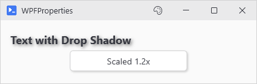
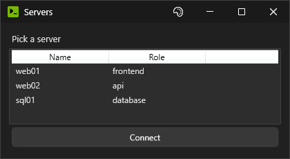

# Raw WPF Access

The named parameters cover most cases. This page is for when they don't, such as when you need a property no parameter covers, or a control PsUi never heard of. The raw WPF objects are still excessible for this very purpose.

Everything on this page has to run on the UI thread. In practice that means at build time in `-Content`, and later in any `-NoAsync` action or `-OnChange` handler. From an async action, stick to `Get-UiValue` and `Set-UiValue` (see [Sessions and Window Isolation](Sessions-and-Window-Isolation) for why).

## WPFProperties

`-WPFProperties` takes a hashtable of raw WPF property values. Reach for it when no named parameter does the job.

```powershell
New-UiLabel -Text 'Hover over me' -WPFProperties @{
    Cursor  = 'Hand'
    ToolTip = 'Custom tooltip'
}
```

Nearly every `New-Ui*` command takes it. `New-UiColumn`, `New-UiMenuItem`, `New-UiDialogButton`, `New-UiHeaderAction`, and `New-UiResultAction` return a definition hashtable so there's no control to put it on. Three commands that do build something still don't take it: `New-UiChart`, `New-UiSpacer`, and `New-UiTool`.

Simple values convert from strings (`'Hand'`, `'SemiBold'`). You can also build real WPF objects inline:

```powershell
New-UiLabel -Text 'Text with Drop Shadow' -Style Header -WPFProperties @{
    Effect = ([System.Windows.Media.Effects.DropShadowEffect]@{
        BlurRadius  = 8
        ShadowDepth = 3
        Color       = [System.Windows.Media.Colors]::Gray
        Opacity     = 0.7
    })
}
```

The demo's Advanced tab has more of these like transforms, opacity, gradient backgrounds, and a tooltip built from a StackPanel of TextBlocks instead of a string. Here's one of them:

```powershell
New-UiAction -Text 'Scaled 1.2x' -Width 160 -Action { } -WPFProperties @{
    RenderTransform       = ([System.Windows.Media.ScaleTransform]@{ ScaleX = 1.2; ScaleY = 1.2 })
    RenderTransformOrigin = ([System.Windows.Point]::new(0.5, 0.5))
}
```

<p align="center"></p>

### Which object gets the hashtable

On a plain control, the properties go on the control itself. If the command draws a label above the control, they go on the panel holding both. New-UiInput, New-UiDropdown, New-UiTextArea, New-UiSlider, New-UiDatePicker, New-UiTimePicker, New-UiRadioGroup, and New-UiCredential all do that. So on those, `Background` colors the whole strip, and `BorderBrush` is ignored because a StackPanel doesn't have a border. To get at the actual box, use `GetControl` instead.

In a row, PsUi moves a control down so it lines up with the box of a labeled control next to it. Put `VerticalAlignment` or `Margin` in the hashtable and it leaves that control where you put it.

New-UiDataGrid and New-UiList put it on the toolbar container when the toolbar is on, and on the control itself when it's off. Turn the toolbar off on a New-UiDataGrid that has an `-EmptyMessage` and the hashtable goes on the Grid that stacks the message over the DataGrid instead. New-UiWebView splits the hashtable up by key, sending the layout ones to the container around the browser and the rest to the browser itself.

Five commands flat out refuse a `Tag` key and warn you about it because PsUi already keeps something there. New-UiButton keeps click context in it, New-UiWindow keeps window chrome state, New-UiProgress and New-UiStatusBar keep label and severity metadata, and a New-UiTree with checkboxes keeps hydration data.

PsUi uses `Tag` in other places too. A label keeps its theme brush key there so the theme engine can read it back on every switch, and cards and separators do the same. The commands that draw a label above the control all keep form metadata on the same StackPanel your hashtable goes to, though New-UiSlider, New-UiDatePicker, and New-UiCredential only do it when they have a `-Label`. If the `Tag` already has something in it, you get the same warning and your value is dropped.

### Attached properties

A dot in the key gets you attached properties, and the values convert like anywhere else, so a string works:

```powershell
New-UiLabel -Text 'Left only in a DockPanel' -WPFProperties @{ 'DockPanel.Dock' = 'Left' }
```

Whether it does anything is up to the parent, and PsUi's own containers mostly won't care. Content stacks up in a StackPanel which ignores `Grid.Row` and `DockPanel.Dock` alike, and `New-UiGrid` calls `SetRow` and `SetColumn` on every child it gets, so anything you set here gets overwritten there. The property still gets set, and `-Verbose` still says so, which is the part that costs you an afternoon. Attached placement only does something on a Grid or DockPanel you built and added yourself.

Unknown keys get skipped, and all you get is a `-Verbose` line. The lookup is plain reflection so get the case wrong on a property name and it counts as unknown too (`cursor = 'Hand'` is silently ignored). Only the property name is that picky. PowerShell resolves the owner type in a dotted key so `'grid.Row'` is fine, and value strings are looser as well (`'hand'` and `'semibold'` both work). If the property is readonly or the value won't convert, you get an actual warning. Brushes are the exception since a color string that doesn't parse just turns the control gray.

`New-UiWindow` does the same conversions, but `-Verbose` stays quiet there, and a failed setter prints a `[PsUi] Warning:` line on the console instead of going to the warning stream.

### Theme switches

When the theme switches, PsUi goes through the window and puts the theme brushes back on each control, and on most controls that wins over whatever you set here. On TextBox, PasswordBox, ComboBox, ListBox, TreeView, DatePicker, DataGrid, CheckBox, RadioButton, Slider, and ProgressBar, `Background` and `Foreground` both get pointed back at the theme so a custom brush only lasts until the first switch. TextBlock and Label foregrounds get cleared completely before the theme brush goes back on, and accent buttons get `Background`, `Foreground`, and `BorderBrush` cleared the same way. A Panel's `Background` gets replaced too, and the only value that survives there is the literal `[System.Windows.Media.Brushes]::Transparent` because the engine checks for it by reference. If you write `Background = 'Transparent'` in the hashtable, the string converts to a brand new brush and gets replaced like any other. If a color should follow the theme, get it from `-Accent` or a label `-Style` like `Success` instead.

A label's `Background` survives a switch (the theme engine only resets the TextBlock `Foreground`), and so does anything on a button that isn't an accent button since the switch skips those entirely. The demo's gradient examples are a label and a plain button.

## Getting at the controls PsUi built

`$session.GetControl('name')` returns the WPF control behind a `-Variable`. For the commands that build more than one piece, you get the piece you'd actually want so New-UiInput gives you the TextBox itself and not the strip around it.

Buttons aren't in that registry. They have their own so `GetControl('saveBtn')` quietly returns `$null`. Use this instead:

```powershell
$saveButton = (Get-UiSession).GetRegisteredButton('saveBtn')
```

Once you have the control, you can hook any of its events. Check for a parameter first, though. Pressing Enter to click a button is already `New-UiInput -SubmitButton` which ignores an empty box and marks the key as handled. There's no parameter for selecting the whole box when it gets focus, so that one you'd do yourself:

```powershell
New-UiInput -Label 'Search' -Variable 'query' -SubmitButton 'searchBtn'
New-UiButton -Text 'Search' -Variable 'searchBtn' -Action {
    Write-Host "Searching for $query"
}

# Tab into the box and the next keystroke replaces what was there
$queryBox = (Get-UiSession).GetControl('query')
$queryBox.Add_GotFocus({
    param($eventSource, $eventArgs)
    $eventSource.SelectAll()
})
```

Handlers you attach this way run on the UI thread, and `Get-UiSession` works inside them because they run in the window's runspace. While a nonmodal `New-UiChildWindow` is open, though, it returns the child's session in there since only PsUi's own controls switch back to the window that built them.

## The window itself

`$session.Window` is the live Window object from the moment `-Content` starts running. PsUi fades the window in once `-Content` finishes so an `Opacity` set in there gets overwritten. Unless `New-UiWindow` got a `-Height`, it also sizes the window to fit what you built at that point, and a `Height` or `SizeToContent` you set gets replaced.

If you know the property at build time, `New-UiWindow -WPFProperties @{ Topmost = $true }` does it without the session at all. The session is for changing the window later, from an action:

```powershell
New-UiWindow -Title 'Watcher' -Content {
    New-UiButton -Text 'Pin on top' -NoAsync -Action {
        (Get-UiSession).Window.Topmost = $true
    }
}
```

## Bringing your own control

When there's no `New-Ui*` command for what you need, you can build the WPF control yourself and hook it into PsUi. PsUi has no command for WPF's ListView so the one below is built by hand, and three calls make it behave like one of PsUi's own:

```powershell
New-UiWindow -Title 'Servers' -Content {
    $session = Get-UiSession

    New-UiLabel -Text 'Pick a server' -Style Body

    $columns = [System.Windows.Controls.GridView]::new()
    foreach ($propName in 'Name', 'Role') {
        [void]$columns.Columns.Add([System.Windows.Controls.GridViewColumn]@{
            Header               = $propName
            Width                = 140
            DisplayMemberBinding = [System.Windows.Data.Binding]::new($propName)
        })
    }
    $serverBox = [System.Windows.Controls.ListView]@{
        Height      = 110
        View        = $columns
        ItemsSource = @(
            [pscustomobject]@{ Name = 'web01'; Role = 'frontend' }
            [pscustomobject]@{ Name = 'web02'; Role = 'api' }
            [pscustomobject]@{ Name = 'sql01'; Role = 'database' }
        )
    }

    # Place it, then register it for hydration and theming
    [void]$session.CurrentParent.Children.Add($serverBox)
    $session.AddControlSafe('server', $serverBox)
    [PsUi.ThemeEngine]::RegisterElement($serverBox)

    New-UiButton -Text 'Connect' -Action {
        Write-Host "Connecting to $($server.SelectedItem.Name)"
    }
}
```

`CurrentParent` is whichever panel is taking children at that point so the ListView ends up exactly where a `New-Ui*` control would have. `AddControlSafe` registers it as `server` so actions get a `$server`. A ListView can have more than one row selected so instead of the item itself your action gets a snapshot: a hashtable with `SelectedItem`, `SelectedIndex`, and a `SelectedItems` array. That's what `$server` holds in the action above, and what `Get-UiValue -Variable server` returns anywhere else. It works the other way too, so if you hand `Set-UiValue` one of the row objects, that row gets selected and an `Add_SelectionChanged` on `$serverBox` fires the same as for a click. `RegisterElement` puts theme brushes on the control right away and keeps it on the list for later switches.

The theme engine goes by type, and to it a ListView is just a ListBox which gets `Background`, `Foreground`, and `BorderBrush` and that's it. The GridView column headers and the rows have their own styles that the theme brushes don't reach so a raw ListView on a dark theme still has the light stock headers. Anything beyond those three properties is on you, set in the ListView's own hashtable for a one-off, or through a proper style if you're going to use the control a lot.

<p align="center"></p>

The variable holding the control can't have the same name you registered it under. If you'd called the variable `$server` instead of `$serverBox` above, the window's variable capture would link that variable and hydration would skip the control so your action would get the raw ListView instead of the snapshot. PsUi only mentions the clash under `-Debug`, and the failure it causes turns up later on a line that looks unrelated. The FAQ entry on [dead buttons](FAQ-and-Troubleshooting#a-button-seems-dead-and-shows-no-error) shows the log line to look for.
