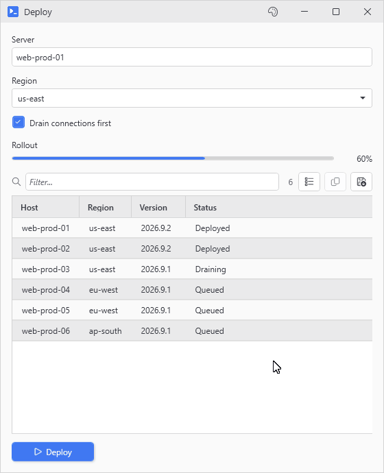
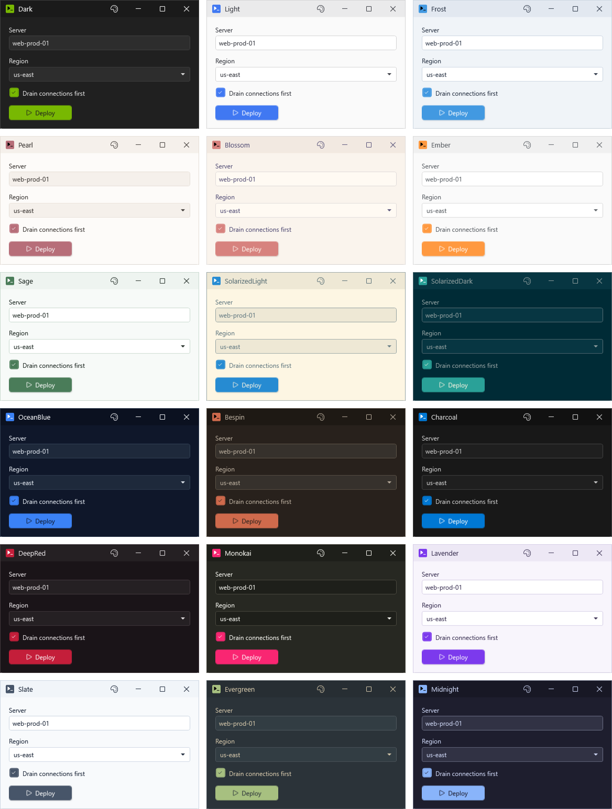
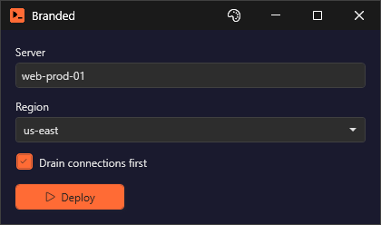

# Theming and Custom Themes

Pick a theme with `-Theme` when you create the window, or switch while it's running from the palette button in the titlebar. The default, `Auto`, follows the Windows light or dark setting.

```powershell
New-UiWindow -Title 'App' -Theme Dark -Content {
    New-UiLabel -Text 'Dark mode enabled'
}
```

<p align="center"></p>

The standalone viewers (`Out-Datagrid`, `Out-TextEditor`, `Out-CSVDataGrid`) take `-Theme` too. Without it they use the module's active theme, or Light if there isn't one. Pass `-Theme` to one of them from inside a running window and the parent window switches too since theming is app wide.

## The builtin themes

- **Dark**: blackish base with green accent
- **Light**: what `Auto` picks on a light mode OS, a corporate looking blue
- **Frost**: pale blue
- **Pearl**: soft light, rose gold accent
- **Blossom**: light with a pink accent
- **Ember**: light with orange
- **Sage**: light, muted green
- **SolarizedLight**: classic cream palette
- **SolarizedDark**: its dark counterpart
- **OceanBlue**: dark navy
- **Bespin**: based off the greatest theme ever used anywhere - a warm brown shamelessly copied from NPP
- **Charcoal**: very dark, subtle contrast
- **DeepRed**: dark with red accents
- **Monokai**: the syntax theme, hot pink included
- **Lavender**: light with purple
- **Slate**: light, gray blue accent
- **Evergreen**: dark green, a personal favorite
- **Midnight**: dark indigo

<p align="center"></p>

`New-UiButton -Accent` fills the button with the theme's accent color. `New-UiCard -Accent` colors the card's header with `Accent` behind it and `AccentHeaderFg` on the title text and icon. Validation errors use the `Error` color, and so does `New-UiLabel -Style Warning`. `Warning` goes on a progress bar or the status bar set to `-Severity Warning`, and on the icon in `Show-UiMessageDialog -Icon Warning`.

## Custom themes

Start from an existing theme and override the colors you care about. For a brand theme that's usually just `Accent` and `WindowBg`:

```powershell
Register-UiTheme -Name 'MyTheme' -BasedOn 'Dark' -Colors @{
    Accent   = '#FF6B35'
    WindowBg = '#1A1A2E'
}

New-UiWindow -Title 'Branded' -Theme MyTheme -Content { ... }
```

<p align="center"></p>

`Register-UiTheme` errors out on a name that's already taken unless you add `-Force`, and in a script you rerun while dialing in colors you'll want it on from the start.

`Get-UiThemeTemplate` prints a hashtable you can copy, filled in from the Dark palette. If you're building on Light, pass `-Type Light` or you'll be copying dark hex values. `-AsHashtable` returns it instead of printing it, ready to edit and pass to `Register-UiTheme -Colors`. PsUi doesn't read `SuccessText` or `ErrorText` anywhere, and `WarningText` only colors the Warnings tab in the output window.

| Group | Keys |
|-------|------|
| Window | `WindowBg`, `WindowFg`, `HeaderBackground`, `HeaderForeground`, `WindowControlHover` |
| Controls | `ControlBg`, `ControlFg`, `Border`, `Disabled`, `DisabledOpacity`, `SecondaryText` |
| Buttons | `ButtonBg`, `ButtonFg`, `ButtonHover`, `Accent`, `AccentHeaderBg`, `AccentHeaderFg` |
| Selection | `Selection`, `SelectionBackground`, `SelectionFg`, `ItemHover` |
| Grids | `GridAlt`, `GridLine` |
| Tabs | `SelectedTabBg`, `TabHoverBg` |
| Group boxes | `GroupBoxBg`, `GroupBoxBorder` |
| Semantic | `Success`, `Warning`, `Error`, `SuccessText`, `WarningText`, `ErrorText` |
| Text extras | `Link`, `FindHighlight`, `TextHighlight`, `TextHighlightFg` |
| Meta | `Type` (`'Dark'` or `'Light'`) |

`Type` decides whether your theme shows up under Light or Dark in the titlebar's palette picker. If you leave out `WindowControlHover`, it also picks the hover color behind the titlebar buttons for you (a faint white overlay on dark themes, a faint black one on light). The template doesn't print `WindowControlHover` so add it yourself if that overlay clashes.

If you'd rather users didn't retheme your tool, `-HideThemeButton` on `New-UiWindow` takes the palette button away.

## Icon fonts

Icons are from Segoe MDL2 Assets on Windows 10 and Segoe Fluent Icons on Windows 11. PsUi takes Fluent whenever it's installed and MDL2 otherwise, and falls back glyph by glyph to the other font when the active one lacks an icon.

`Set-PsUiIconFont` switches the font for the session, and `New-UiWindow -IconFont` sets it for one window. Unlike a theme switch, neither one touches controls already on screen so set the font before you open the window.

`-NoIconFontFallback` (on both commands) turns the glyph borrowing off if you'd rather see blank tofu squares for some reason than mixed font styles. `Test-PsUiIcon 'Name'` tells you up front whether a glyph renders under the active font. For browsing, `Show-UiGlyphBrowser` shows the whole set with the missing names dimmed, and clicking a tile copies its name.
