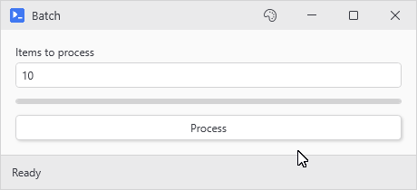

# Threading and Variable Hydration

Button actions run in a **separate runspace** from your console so on their own they couldn't see any of your variables. PsUi gets around that with what it calls hydration. When the button is built, PsUi reads its action to see which of your script's variables and functions it uses and keeps them with the button. When the action runs, those come back as variables, and so does every control with a `-Variable` (`$userName`, `$selectedItem`), whether the action mentions it or not. When the action finishes, whatever you assigned to `$userName` goes back into its textbox.

Everything else you assign in the action is thrown away when it ends. [Keeping values with -Capture](#keeping-values-with--capture) covers the way around that.

## What doesn't work

- Setting a global in a button action (`$Global:Result = 'done'`) does **not** carry back to your console session. Capture the variable and open the window with `-ExportOnClose` instead.
- Setting `$status = 'Working'` halfway through an action doesn't show in its control until the action ends (see [Updating the UI while an action runs](#updating-the-ui-while-an-action-runs)).
- Assigning a new value to a variable in an action (`$config = @{}`) only changes it inside the action unless the button captures it. Changing a hashtable or a list in place does reach the original because it was never a copy in the first place.
- `-NoAsync` actions (the switch that runs an action synchronously on the UI thread) don't get hydration. There's no separate runspace to set variables in so read values there with `Get-UiValue`.

## Live objects

Hydration's built for form data like strings, numbers, dates, and selections. If your script has a SQL connection, a file stream, an open socket, or a COM object in a variable when the window builds, `New-UiWindow` warns you about it by name. Your action gets the same instance your script holds, which is fine from the action's thread as long as two threads never use it at once (connections and streams aren't threadsafe). COM objects are the exception since they only work on the thread that created them.

Say you create a `SqlConnection` in Button A's action and store it in a variable, then Button B tries to use it and it doesn't work. That isn't a threading problem. Button A's variables are gone once its action ends so Button B never sees the connection. Open it inside the action that uses it, or have Button A capture it, which the next section shows.

## Keeping values with -Capture

`-Capture` is the way around most of that. Name the variables when you build the button, and when the action ends PsUi reads them out of its runspace and keeps them with the window. Every action that runs after that, on any button in the window, gets them back under the same names. The capture runs even when the action throws or gets canceled, and keeps whatever the variables held at that point.

```powershell
New-UiInput -Label 'SQL server' -Variable 'sqlServer' -Default 'sql01'
New-UiButton -Text 'Connect' -NoOutput -Capture 'conn' -Action {
    $conn = [System.Data.SqlClient.SqlConnection]::new("Server=$sqlServer;Database=Inventory;Integrated Security=True")
    $conn.Open()
    Write-Status "Connected to $sqlServer"
}
New-UiButton -Text 'Count servers' -EnabledWhen 'conn' -Action {
    $query = $conn.CreateCommand()
    $query.CommandText = 'SELECT COUNT(*) FROM Servers'
    Write-Host "$($query.ExecuteScalar()) servers in Inventory"
}
New-UiStatusBar -DefaultText 'Not connected'
```

Count servers stays disabled until Connect has captured `$conn`, because `-EnabledWhen` follows captured names as well as controls. From then on it gets the connection Connect opened, the same object and not a copy. That works from another button's thread as long as two actions never use the connection at once. A COM object won't make the trip since it only works on the thread that created it, so open those inside the action that uses them.

A few rules come with it:

- A later action reads the captured value, but a new value it assigns is dropped when it ends unless that button lists the name in its own `-Capture`. Changing the captured object in place (adding to a captured list, setting a key on a captured hashtable) sticks without that since there's only the one object.
- A captured value beats a control's value under the same name so pick names no control uses.
- `New-UiWindow -ExportOnClose` hands every captured value back to your script once the window closes, into the scope that called `New-UiWindow`, so a result can get out even though a `$Global:` assignment in an action never reaches your console. It's ignored with `-PassThru` which returns before there's anything to export. If an async action calls `Close-UiWindow`, the window waits for the action to end before it closes so what `-Capture` collected still gets exported.
- `New-UiButton`, `New-UiAction`, `New-UiButtonCard`, `New-UiActionCard`, and `Invoke-UiAsync` take `-Capture`. A `-NoAsync` action has no runspace to read from, and hotkeys and menu entries don't take the parameter, so store the value yourself there with `Set-UiCapturedVariable -Name 'name' -Value $value`. It fills the same store, and [Sessions and Window Isolation](Sessions-and-Window-Isolation#state-that-sticks-around-between-clicks) covers the store itself.

## When hydration misses something

Variables and functions get captured once, when the window is created, from the scope that called `New-UiWindow`. The button commands (`New-UiButton`, `New-UiAction`, `New-UiButtonCard`, `New-UiActionCard`) take parameters for whatever that misses. Hotkeys, menu entries, links, and panel header actions (`New-UiHeaderAction`) only get the automatic capture.

You need them when the action throws CommandNotFound for a function you can see right there in your console, or a variable you definitely set comes through as `$null`.

- `-LinkedVariables 'name1', 'name2'` captures variables by name from your script's scope, for the ones the parser didn't see you use. The usual culprit is a variable that's only used inside a function the action calls. The function gets captured but the variable it depends on doesn't, and the action runs with it empty. Link it, or give the function a parameter default so it doesn't need the variable. Link a hashtable or an ArrayList this way and every window gets the same object, which is the closest PsUi gets to shared state across windows.
- `-LinkedFunctions 'Verb-Noun'` does the same for functions. The parser reads the action but not the functions it calls. If the action calls `Get-Report` and `Get-Report` calls `Format-Row`, the action throws CommandNotFound on `Format-Row` until you link it.
- `-LinkedModules 'C:\path\Module.psd1'` runs a real `Import-Module` inside the action's runspace. If your action calls something from a module that doesn't autoload, you need this.
- `-Variables @{ name = $value }` passes explicit values into one action. It adds to the automatic capture instead of replacing it, and if both have the same name, your explicit value wins.
- `Invoke-UiAsync -NoAutoCapture` turns the automatic capture off completely so you have to say what goes across. `New-UiWindow -NoImplicitCapture` does that for the whole window.

## Updating the UI while an action runs

For a progress readout that moves *during* a long action, push the updates yourself:

```powershell
New-UiInput -Label 'Items to process' -Variable 'itemCount' -InputType Int -Default 10
New-UiProgress -Variable 'progress'
New-UiStatusBar -DefaultText 'Ready'
New-UiButton -Text 'Process' -NoOutput -Action {
    $total = [int]$itemCount
    for ($i = 1; $i -le $total; $i++) {
        Write-Status "Processing item $i of $total..."
        Set-UiProgress -Variable 'progress' -Value (($i / $total) * 100)
        Start-Sleep -Milliseconds 300
    }
    Write-Status 'Done'
}
```

<p align="center"></p>

`Set-UiProgress` and `Write-Status` (which sets the status bar's text) are on a short list of PsUi functions that get loaded into every async runspace. They work inside an action without an import, and they deal with the UI thread for you. `Set-UiValue` and `Get-UiValue` are on it too so they work from a helper function the action calls as well as from the action itself.

`Write-Progress` updates while the action runs too, but only if something is listening for it. The button's output window shows it as a bar, and so does a status bar built with `-AutoProgress`. A `New-UiProgress` control only moves when you call `Set-UiProgress`.

## Names you can't use

Hydration skips reserved names so it doesn't stomp on things PowerShell relies on. Don't use any of these as a `-Variable` name. The control still gets built, but its value never shows up in your action:

`args`, `input`, `this`, `_`, `PSItem`, `PSCmdlet`, `PSBoundParameters`, `MyInvocation`, `PSScriptRoot`, `PSCommandPath`, `Matches`, `LastExitCode`, `ForEach`, `Switch`, `Event`, `EventArgs`, `EventSubscriber`, `Sender`, `SourceArgs`, `SourceEventArgs`, `StackTrace`, `null`, `env`, `NestedPromptLevel`, `Profile`, `PWD`, `OFS`, `OutputEncoding`, the preference variables (`ErrorActionPreference` and friends), plus `state` and `session` which PsUi uses internally.

On top of that list, anything a default runspace marks ReadOnly or Constant is reserved too: `Host`, `HOME`, `PID`, `PSVersionTable`, `PSEdition`, `ExecutionContext`, and so on.

The check ignores case so `-Variable 'matches'` is just as broken as `-Variable 'Matches'`.

## Threading modes

```powershell
# Default (MTA): thread pool threads, reused between clicks
New-UiWindow -Title 'Fast' -Content { ... }

# STA: a new thread per run, slower and not needed for Windows Forms or COM
New-UiWindow -Title 'Legacy' -AsyncApartment STA -Content { ... }
```

The action itself runs on an STA thread in both modes since each runspace starts its own STA thread for the pipeline. Windows Forms dialogs and Office COM already work under the default. `-AsyncApartment STA` only changes the thread that waits on the run, which becomes a brand new thread per run instead of a pool thread. Either way, at most 8 runs go at once across every window in the process, and a ninth click waits for one to finish and gives up with an error after 60 seconds.

## Debugging sync issues

Check the boring stuff first: a `-Variable` name from the reserved list, or a typo between the control's `-Variable` and the name your action uses.

If it's neither of those, `New-UiWindow -Debug` logs the build and every hydration step to the console you launched the window from. A transcript won't catch it and neither will a `5>` redirect (the window runs its own runspace), so keep that console where you can see it, or run the script as a child process and redirect all of its output. [FAQ and Troubleshooting](FAQ-and-Troubleshooting#a-button-seems-dead-and-shows-no-error) explains how to read it.
