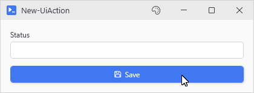
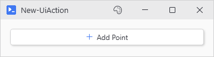

# New-UiAction

## SYNOPSIS
Creates a silent button that runs actions without an output window.

## SYNTAX

### ScriptBlock (Default)
```
New-UiAction -Text <String> -Action <ScriptBlock> [-Accent] [-Width <Int32>] [-Height <Int32>] [-NoAsync]
 [-NoWait] [-NoInteractive] [-LinkedVariables <String[]>] [-LinkedFunctions <String[]>]
 [-LinkedModules <String[]>] [-Capture <String[]>] [-Parameters <Hashtable>] [-Variables <Hashtable>]
 [-ValidateScript <ScriptBlock>] [-GridColumn <Int32>] [-GridRow <Int32>] [-EnabledWhen <Object>]
 [-Variable <String>] [-WPFProperties <Hashtable>] [-Icon <String>]
 [<CommonParameters>]
```

### File
```
New-UiAction -Text <String> -File <String> [-ArgumentList <Hashtable>] [-Accent] [-Width <Int32>]
 [-Height <Int32>] [-NoAsync] [-NoWait] [-NoInteractive] [-LinkedVariables <String[]>]
 [-LinkedFunctions <String[]>] [-LinkedModules <String[]>] [-Capture <String[]>] [-Parameters <Hashtable>]
 [-Variables <Hashtable>] [-ValidateScript <ScriptBlock>] [-GridColumn <Int32>] [-GridRow <Int32>]
 [-EnabledWhen <Object>] [-Variable <String>] [-WPFProperties <Hashtable>]
 [-Icon <String>] [<CommonParameters>]
```

## DESCRIPTION
New-UiButton with -NoOutput baked in. Use this for buttons that update UI state (charts, forms, toggles) rather than producing pipeline output. For buttons that need an output window, use New-UiButton instead.

## EXAMPLES

### EXAMPLE 1
```
New-UiInput -Label 'Status' -Variable 'status' -ReadOnly
New-UiAction -Text 'Save' -Icon 'Save' -Accent -NoAsync -Action { Set-UiValue -Variable 'status' -Value 'Saved' }
```

<p align="center"></p>

### EXAMPLE 2
```
New-UiAction -Text 'Add Point' -Icon 'Add' -Action { Update-UiChart -Variable 'chart' -Data $newData }
```

<p align="center"></p>

## PARAMETERS

### -Text
The button label text.

<details><summary>Type: String (required)</summary>

```yaml
Type: String
Parameter Sets: (All)
Aliases:

Required: True
Position: Named
Default value: None
Accept pipeline input: False
Accept wildcard characters: False
```

</details>

### -Action
The scriptblock to execute when clicked. Mutually exclusive with -File.

<details><summary>Type: ScriptBlock (required)</summary>

```yaml
Type: ScriptBlock
Parameter Sets: ScriptBlock
Aliases:

Required: True
Position: Named
Default value: None
Accept pipeline input: False
Accept wildcard characters: False
```

</details>

### -File
Path to a script file to execute when clicked. Supports .ps1, .bat, .cmd, .vbs, and .exe files. Mutually exclusive with -Action.

<details><summary>Type: String (required)</summary>

```yaml
Type: String
Parameter Sets: File
Aliases:

Required: True
Position: Named
Default value: None
Accept pipeline input: False
Accept wildcard characters: False
```

</details>

### -ArgumentList
Hashtable of arguments to pass to the script file.

<details><summary>Type: Hashtable (optional)</summary>

```yaml
Type: Hashtable
Parameter Sets: File
Aliases:

Required: False
Position: Named
Default value: None
Accept pipeline input: False
Accept wildcard characters: False
```

</details>

### -Accent
Use accent color styling for the button.

<details><summary>Type: SwitchParameter (optional)</summary>

```yaml
Type: SwitchParameter
Parameter Sets: (All)
Aliases:

Required: False
Position: Named
Default value: False
Accept pipeline input: False
Accept wildcard characters: False
```

</details>

### -Width
Button width in pixels. Defaults to auto-sizing.

<details><summary>Type: Int32 (optional)</summary>

```yaml
Type: Int32
Parameter Sets: (All)
Aliases:

Required: False
Position: Named
Default value: 0
Accept pipeline input: False
Accept wildcard characters: False
```

</details>

### -Height
Button height in pixels. Defaults to 28.

<details><summary>Type: Int32 (optional)</summary>

```yaml
Type: Int32
Parameter Sets: (All)
Aliases:

Required: False
Position: Named
Default value: 28
Accept pipeline input: False
Accept wildcard characters: False
```

</details>

### -NoAsync
Execute synchronously on the UI thread (blocks UI).

<details><summary>Type: SwitchParameter (optional)</summary>

```yaml
Type: SwitchParameter
Parameter Sets: (All)
Aliases:

Required: False
Position: Named
Default value: False
Accept pipeline input: False
Accept wildcard characters: False
```

</details>

### -NoWait
Execute async but don't block the parent window.

<details><summary>Type: SwitchParameter (optional)</summary>

```yaml
Type: SwitchParameter
Parameter Sets: (All)
Aliases:

Required: False
Position: Named
Default value: False
Accept pipeline input: False
Accept wildcard characters: False
```

</details>

### -NoInteractive
Use fast pooled execution without interactive input support.

<details><summary>Type: SwitchParameter (optional)</summary>

```yaml
Type: SwitchParameter
Parameter Sets: (All)
Aliases:

Required: False
Position: Named
Default value: False
Accept pipeline input: False
Accept wildcard characters: False
```

</details>

### -LinkedVariables
Variable names to capture from your script's scope.

<details><summary>Type: String[] (optional)</summary>

```yaml
Type: String[]
Parameter Sets: (All)
Aliases:

Required: False
Position: Named
Default value: None
Accept pipeline input: False
Accept wildcard characters: False
```

</details>

### -LinkedFunctions
Function names to capture from your script's scope.

<details><summary>Type: String[] (optional)</summary>

```yaml
Type: String[]
Parameter Sets: (All)
Aliases:

Required: False
Position: Named
Default value: None
Accept pipeline input: False
Accept wildcard characters: False
```

</details>

### -LinkedModules
Module paths to import in the async runspace.

<details><summary>Type: String[] (optional)</summary>

```yaml
Type: String[]
Parameter Sets: (All)
Aliases:

Required: False
Position: Named
Default value: None
Accept pipeline input: False
Accept wildcard characters: False
```

</details>

### -Capture
Variable names to capture from the runspace after execution completes.

<details><summary>Type: String[] (optional)</summary>

```yaml
Type: String[]
Parameter Sets: (All)
Aliases:

Required: False
Position: Named
Default value: None
Accept pipeline input: False
Accept wildcard characters: False
```

</details>

### -Parameters
Hashtable of parameters to pass to the action.

<details><summary>Type: Hashtable (optional)</summary>

```yaml
Type: Hashtable
Parameter Sets: (All)
Aliases:

Required: False
Position: Named
Default value: None
Accept pipeline input: False
Accept wildcard characters: False
```

</details>

### -Variables
Hashtable of variables to inject into the action.

<details><summary>Type: Hashtable (optional)</summary>

```yaml
Type: Hashtable
Parameter Sets: (All)
Aliases:

Required: False
Position: Named
Default value: None
Accept pipeline input: False
Accept wildcard characters: False
```

</details>

### -ValidateScript
Pre-action validation script. Runs synchronously before Action.

<details><summary>Type: ScriptBlock (optional)</summary>

```yaml
Type: ScriptBlock
Parameter Sets: (All)
Aliases:

Required: False
Position: Named
Default value: None
Accept pipeline input: False
Accept wildcard characters: False
```

</details>

### -GridColumn
If specified, sets Grid.Column attached property.

<details><summary>Type: Int32 (optional)</summary>

```yaml
Type: Int32
Parameter Sets: (All)
Aliases:

Required: False
Position: Named
Default value: -1
Accept pipeline input: False
Accept wildcard characters: False
```

</details>

### -GridRow
If specified, sets Grid.Row attached property.

<details><summary>Type: Int32 (optional)</summary>

```yaml
Type: Int32
Parameter Sets: (All)
Aliases:

Required: False
Position: Named
Default value: -1
Accept pipeline input: False
Accept wildcard characters: False
```

</details>

### -EnabledWhen
Conditional enabling based on another control's state.

<details><summary>Type: Object (optional)</summary>

```yaml
Type: Object
Parameter Sets: (All)
Aliases:

Required: False
Position: Named
Default value: None
Accept pipeline input: False
Accept wildcard characters: False
```

</details>

### -Variable
Optional name to register the button for -SubmitButton lookups.

<details><summary>Type: String (optional)</summary>

```yaml
Type: String
Parameter Sets: (All)
Aliases:

Required: False
Position: Named
Default value: None
Accept pipeline input: False
Accept wildcard characters: False
```

</details>

### -WPFProperties
Hashtable of WPF properties to apply to the button.

<details><summary>Type: Hashtable (optional)</summary>

```yaml
Type: Hashtable
Parameter Sets: (All)
Aliases:

Required: False
Position: Named
Default value: None
Accept pipeline input: False
Accept wildcard characters: False
```

</details>

### -Icon
Optional icon name shown before the text. Use Show-UiGlyphBrowser to browse names.

<details><summary>Type: String (optional)</summary>

```yaml
Type: String
Parameter Sets: (All)
Aliases:

Required: False
Position: Named
Default value: None
Accept pipeline input: False
Accept wildcard characters: False
```

</details>

### CommonParameters
This cmdlet supports the common parameters: -Debug, -ErrorAction, -ErrorVariable, -InformationAction, -InformationVariable, -OutVariable, -OutBuffer, -PipelineVariable, -Verbose, -WarningAction, and -WarningVariable. For more information, see [about_CommonParameters](http://go.microsoft.com/fwlink/?LinkID=113216).

## INPUTS

## OUTPUTS

## NOTES

## RELATED LINKS
