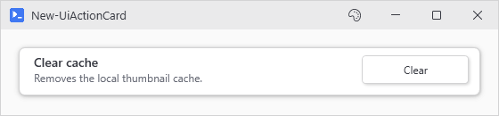
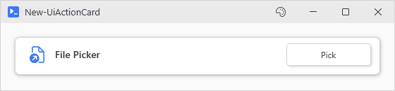
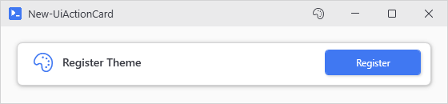

# New-UiActionCard

<p align="center"></p>

## SYNOPSIS
Creates a silent action card that runs without an output window.

## SYNTAX

### ScriptBlock (Default)
```
New-UiActionCard -Header <String> [-Description <String>] [-ButtonText <String>] -Action <ScriptBlock>
 [-Accent] [-FullWidth] [-NoAsync] [-NoWait] [-LinkedVariables <String[]>] [-LinkedFunctions <String[]>]
 [-LinkedModules <String[]>] [-Capture <String[]>] [-Parameters <Hashtable>] [-Variables <Hashtable>]
 [-Variable <String>] [-WPFProperties <Hashtable>] [-Icon <String>]
 [<CommonParameters>]
```

### File
```
New-UiActionCard -Header <String> [-Description <String>] [-ButtonText <String>] -File <String>
 [-ArgumentList <Hashtable>] [-Accent] [-FullWidth] [-NoAsync] [-NoWait] [-LinkedVariables <String[]>]
 [-LinkedFunctions <String[]>] [-LinkedModules <String[]>] [-Capture <String[]>] [-Parameters <Hashtable>]
 [-Variables <Hashtable>] [-Variable <String>] [-WPFProperties <Hashtable>]
 [-Icon <String>] [<CommonParameters>]
```

## DESCRIPTION
New-UiButtonCard with -NoOutput baked in. Use this for cards that update UI state or open dialogs without needing output display. For cards that produce pipeline output or need an output window, use New-UiButtonCard instead.

## EXAMPLES

### EXAMPLE 1
```
New-UiActionCard -Header 'File Picker' -Icon 'OpenFile' -ButtonText 'Pick' -Action { Show-UiFilePicker }
```

<p align="center"></p>

### EXAMPLE 2
```
New-UiActionCard -Header 'Register Theme' -Icon 'ColorBackground' -Accent -ButtonText 'Register' -Action { Register-UiTheme @theme }
```

<p align="center"></p>

## PARAMETERS

### -Header
The card title/header text.

<details><summary>Type: String (required)</summary>

```yaml
Type: String
Parameter Sets: (All)
Aliases:

Required: True
Position: Named
Default value: None
Accept pipeline input: False
Accept wildcard characters: False
```

</details>

### -Description
Optional description text shown below the header.

<details><summary>Type: String (optional)</summary>

```yaml
Type: String
Parameter Sets: (All)
Aliases:

Required: False
Position: Named
Default value: None
Accept pipeline input: False
Accept wildcard characters: False
```

</details>

### -ButtonText
Text shown on the action button. Defaults to 'Go'.

<details><summary>Type: String (optional)</summary>

```yaml
Type: String
Parameter Sets: (All)
Aliases:

Required: False
Position: Named
Default value: Go
Accept pipeline input: False
Accept wildcard characters: False
```

</details>

### -Action
The scriptblock to execute when the button is clicked. Mutually exclusive with -File.

<details><summary>Type: ScriptBlock (required)</summary>

```yaml
Type: ScriptBlock
Parameter Sets: ScriptBlock
Aliases:

Required: True
Position: Named
Default value: None
Accept pipeline input: False
Accept wildcard characters: False
```

</details>

### -File
Path to a script file to execute when clicked. Mutually exclusive with -Action.

<details><summary>Type: String (required)</summary>

```yaml
Type: String
Parameter Sets: File
Aliases:

Required: True
Position: Named
Default value: None
Accept pipeline input: False
Accept wildcard characters: False
```

</details>

### -ArgumentList
Hashtable of arguments to pass to the script file.

<details><summary>Type: Hashtable (optional)</summary>

```yaml
Type: Hashtable
Parameter Sets: File
Aliases:

Required: False
Position: Named
Default value: None
Accept pipeline input: False
Accept wildcard characters: False
```

</details>

### -Accent
If specified, the button uses accent color styling.

<details><summary>Type: SwitchParameter (optional)</summary>

```yaml
Type: SwitchParameter
Parameter Sets: (All)
Aliases:

Required: False
Position: Named
Default value: False
Accept pipeline input: False
Accept wildcard characters: False
```

</details>

### -FullWidth
If specified, the card spans the full width of its container.

<details><summary>Type: SwitchParameter (optional)</summary>

```yaml
Type: SwitchParameter
Parameter Sets: (All)
Aliases:

Required: False
Position: Named
Default value: False
Accept pipeline input: False
Accept wildcard characters: False
```

</details>

### -NoAsync
Execute synchronously on the UI thread (blocks UI).

<details><summary>Type: SwitchParameter (optional)</summary>

```yaml
Type: SwitchParameter
Parameter Sets: (All)
Aliases:

Required: False
Position: Named
Default value: False
Accept pipeline input: False
Accept wildcard characters: False
```

</details>

### -NoWait
Execute async but don't block the parent window.

<details><summary>Type: SwitchParameter (optional)</summary>

```yaml
Type: SwitchParameter
Parameter Sets: (All)
Aliases:

Required: False
Position: Named
Default value: False
Accept pipeline input: False
Accept wildcard characters: False
```

</details>

### -LinkedVariables
Variable names to capture from your script's scope.

<details><summary>Type: String[] (optional)</summary>

```yaml
Type: String[]
Parameter Sets: (All)
Aliases:

Required: False
Position: Named
Default value: None
Accept pipeline input: False
Accept wildcard characters: False
```

</details>

### -LinkedFunctions
Function names to capture from your script's scope.

<details><summary>Type: String[] (optional)</summary>

```yaml
Type: String[]
Parameter Sets: (All)
Aliases:

Required: False
Position: Named
Default value: None
Accept pipeline input: False
Accept wildcard characters: False
```

</details>

### -LinkedModules
Module paths to import in the async runspace.

<details><summary>Type: String[] (optional)</summary>

```yaml
Type: String[]
Parameter Sets: (All)
Aliases:

Required: False
Position: Named
Default value: None
Accept pipeline input: False
Accept wildcard characters: False
```

</details>

### -Capture
Variable names to capture from the runspace after execution completes.

<details><summary>Type: String[] (optional)</summary>

```yaml
Type: String[]
Parameter Sets: (All)
Aliases:

Required: False
Position: Named
Default value: None
Accept pipeline input: False
Accept wildcard characters: False
```

</details>

### -Parameters
Hashtable of parameters to pass to the action.

<details><summary>Type: Hashtable (optional)</summary>

```yaml
Type: Hashtable
Parameter Sets: (All)
Aliases:

Required: False
Position: Named
Default value: None
Accept pipeline input: False
Accept wildcard characters: False
```

</details>

### -Variables
Hashtable of variables to inject into the action.

<details><summary>Type: Hashtable (optional)</summary>

```yaml
Type: Hashtable
Parameter Sets: (All)
Aliases:

Required: False
Position: Named
Default value: None
Accept pipeline input: False
Accept wildcard characters: False
```

</details>

### -Variable
Optional name to register the button for -SubmitButton lookups.

<details><summary>Type: String (optional)</summary>

```yaml
Type: String
Parameter Sets: (All)
Aliases:

Required: False
Position: Named
Default value: None
Accept pipeline input: False
Accept wildcard characters: False
```

</details>

### -WPFProperties
Hashtable of WPF properties to apply to the card container.

<details><summary>Type: Hashtable (optional)</summary>

```yaml
Type: Hashtable
Parameter Sets: (All)
Aliases:

Required: False
Position: Named
Default value: None
Accept pipeline input: False
Accept wildcard characters: False
```

</details>

### -Icon
Optional icon name to display in the header. Use Show-UiGlyphBrowser to browse names.

<details><summary>Type: String (optional)</summary>

```yaml
Type: String
Parameter Sets: (All)
Aliases:

Required: False
Position: Named
Default value: None
Accept pipeline input: False
Accept wildcard characters: False
```

</details>

### CommonParameters
This cmdlet supports the common parameters: -Debug, -ErrorAction, -ErrorVariable, -InformationAction, -InformationVariable, -OutVariable, -OutBuffer, -PipelineVariable, -Verbose, -WarningAction, and -WarningVariable. For more information, see [about_CommonParameters](http://go.microsoft.com/fwlink/?LinkID=113216).

## INPUTS

## OUTPUTS

## NOTES

## RELATED LINKS
