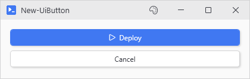
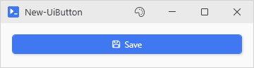
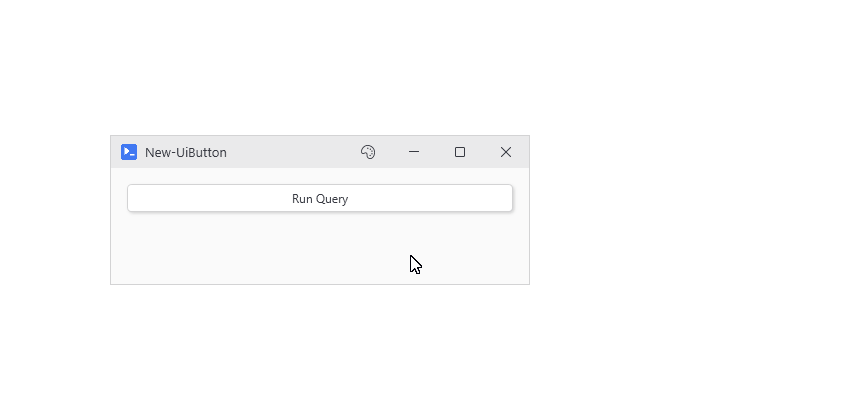
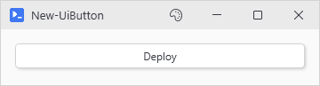
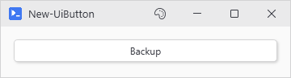
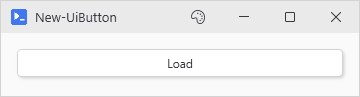
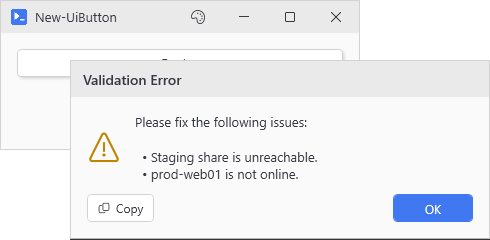
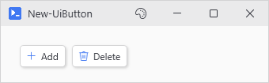
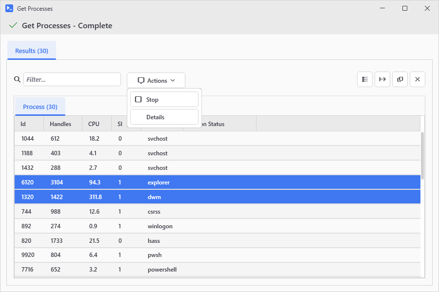

# New-UiButton

<p align="center"></p>

## SYNOPSIS
Creates a styled button with async action support.

## SYNTAX

### ScriptBlock (Default)
```
New-UiButton -Text <String> -Action <ScriptBlock> [-Accent] [-Width <Int32>] [-Height <Int32>] [-NoAsync]
 [-NoWait] [-NoOutput] [-NoInteractive] [-HideEmptyOutput] [-ScrollToTop] [-ResultActions <Object>]
 [-SingleSelect] [-LinkedVariables <String[]>] [-LinkedFunctions <String[]>] [-LinkedModules <String[]>]
 [-Capture <String[]>] [-Parameters <Hashtable>] [-Variables <Hashtable>] [-OutputTitle <String>]
 [-ValidateScript <ScriptBlock>] [-GridColumn <Int32>] [-GridRow <Int32>] [-EnabledWhen <Object>]
 [-Variable <String>] [-WPFProperties <Hashtable>] [-Icon <String>]
 [<CommonParameters>]
```

### File
```
New-UiButton -Text <String> -File <String> [-ArgumentList <Hashtable>] [-Accent] [-Width <Int32>]
 [-Height <Int32>] [-NoAsync] [-NoWait] [-NoOutput] [-NoInteractive] [-HideEmptyOutput] [-ScrollToTop]
 [-ResultActions <Object>] [-SingleSelect] [-LinkedVariables <String[]>] [-LinkedFunctions <String[]>]
 [-LinkedModules <String[]>] [-Capture <String[]>] [-Parameters <Hashtable>] [-Variables <Hashtable>]
 [-OutputTitle <String>] [-ValidateScript <ScriptBlock>] [-GridColumn <Int32>] [-GridRow <Int32>]
 [-EnabledWhen <Object>] [-Variable <String>] [-WPFProperties <Hashtable>]
 [-Icon <String>] [<CommonParameters>]
```

## DESCRIPTION
Creates a themed WPF button that executes actions asynchronously by default, with output streamed to the output window and result actions on what comes back. Can be used standalone or as part of other layouts (toolbars, forms, etc.).

Use -Action to provide an inline scriptblock, or -File to run an external script file. These parameters are mutually exclusive.

Yeah, there's a lot of parameters here. Splitting them into separate cmdlets would mean more boilerplate for every button. They group logically: appearance (Text/Icon/Width), execution (Action/NoAsync/NoWait), variable capture (LinkedVariables/Capture), and result handling (ResultActions). You configure all of these together when defining a button, not separately.

## EXAMPLES

### EXAMPLE 1
```
New-UiButton -Text "Save" -Icon "Save" -Accent -Action { Save-Data }
```

<p align="center"></p>

### EXAMPLE 2
```
New-UiButton -Text "Run Query" -Action { Get-Process } -HideEmptyOutput
```

<p align="center"></p>

### EXAMPLE 3
```
New-UiButton -Text "Deploy" -File "C:\Scripts\Deploy.ps1" -ArgumentList @{ Environment = 'Prod' }
```

<p align="center"></p>

### EXAMPLE 4
```
New-UiButton -Text "Backup" -File ".\scripts\backup.bat" -NoOutput
```

<p align="center"></p>

### EXAMPLE 5
```
# Capture variables for use in other buttons or after window closes
New-UiButton -Text "Load" -Capture services, loadTime -Action {
    $services = Get-Service | Where-Object Status -eq 'Running'
    $loadTime = Get-Date
}
# In another button, $services and $loadTime are now available
```

<p align="center"></p>

### EXAMPLE 6
```
# Return error strings to block the click - returning nothing will let it run.
New-UiButton -Text 'Deploy' -ValidateScript {
    $problems = @()
    if (!(Test-Path '\\deploy\staging$')) { $problems += 'Staging share is unreachable.' }
    if (!(Test-Connection prod-web01 -Count 1 -Quiet)) { $problems += 'prod-web01 is not online.' }
    $problems
} -Action { Publish-Build }
```

<p align="center"></p>

### EXAMPLE 7
```
# A horizontal toolbar
New-UiPanel -Orientation Horizontal -Content {
    New-UiButton -Text "Add" -Icon "Add" -Action { Add-Entry }
    New-UiButton -Text "Delete" -Icon "Delete" -Action { Remove-Entry }
}
```

<p align="center"></p>

### EXAMPLE 8
```
# Actions against the results grid selection
New-UiButton -Text 'Get Processes' -Action { Get-Process } -ResultActions {
    New-UiResultAction 'Stop' -Icon Stop -Confirm 'Stop {0} processes?' -Action { $_ | Stop-Process -Force }
    New-UiResultAction 'Details' -Action { $Selected | Format-List * | Out-String | Write-Host }
}
```

<p align="center"></p>

### EXAMPLE 9
```
# Legacy hashtable form, still supported
New-UiButton -Text 'Get Processes' -Action { Get-Process } -ResultActions @(
    @{ Text = 'Stop'; Icon = 'Stop'; Confirm = 'Stop {0} processes?'; Action = { $_ | Stop-Process -Force } }
)
```

<p align="center"></p>

## PARAMETERS

### -Text
The button label text.

<details><summary>Type: String (required)</summary>

```yaml
Type: String
Parameter Sets: (All)
Aliases:

Required: True
Position: Named
Default value: None
Accept pipeline input: False
Accept wildcard characters: False
```

</details>

### -Action
The scriptblock to execute when clicked. Mutually exclusive with -File.

<details><summary>Type: ScriptBlock (required)</summary>

```yaml
Type: ScriptBlock
Parameter Sets: ScriptBlock
Aliases:

Required: True
Position: Named
Default value: None
Accept pipeline input: False
Accept wildcard characters: False
```

</details>

### -File
Path to a script file to execute when clicked. Supports .ps1, .bat, .cmd, .vbs, and .exe files. The file must exist at button creation time. Mutually exclusive with -Action.

<details><summary>Type: String (required)</summary>

```yaml
Type: String
Parameter Sets: File
Aliases:

Required: True
Position: Named
Default value: None
Accept pipeline input: False
Accept wildcard characters: False
```

</details>

### -ArgumentList
Hashtable of arguments to pass to the script file. For .ps1 files, these are splatted as parameters. For other file types, values are passed as command-line arguments.

<details><summary>Type: Hashtable (optional)</summary>

```yaml
Type: Hashtable
Parameter Sets: File
Aliases:

Required: False
Position: Named
Default value: None
Accept pipeline input: False
Accept wildcard characters: False
```

</details>

### -Accent
Use accent color styling for the button.

<details><summary>Type: SwitchParameter (optional)</summary>

```yaml
Type: SwitchParameter
Parameter Sets: (All)
Aliases:

Required: False
Position: Named
Default value: False
Accept pipeline input: False
Accept wildcard characters: False
```

</details>

### -Width
Button width in pixels. Defaults to auto-sizing.

<details><summary>Type: Int32 (optional)</summary>

```yaml
Type: Int32
Parameter Sets: (All)
Aliases:

Required: False
Position: Named
Default value: 0
Accept pipeline input: False
Accept wildcard characters: False
```

</details>

### -Height
Button height in pixels. Defaults to 28.

<details><summary>Type: Int32 (optional)</summary>

```yaml
Type: Int32
Parameter Sets: (All)
Aliases:

Required: False
Position: Named
Default value: 28
Accept pipeline input: False
Accept wildcard characters: False
```

</details>

### -NoAsync
Execute synchronously on the UI thread (blocks UI). Auto-set when the action spawns a window so it renders on the host's UI thread; pass -NoAsync:$false to override. Errors the action writes, a command's stderr included, show in one dialog when it finishes. After ten, the dialog counts the rest instead of listing them.

<details><summary>Type: SwitchParameter (optional)</summary>

```yaml
Type: SwitchParameter
Parameter Sets: (All)
Aliases:

Required: False
Position: Named
Default value: False
Accept pipeline input: False
Accept wildcard characters: False
```

</details>

### -NoWait
Execute async with output window, but don't block the parent window. Other buttons remain clickable while this action runs. The clicked button is still disabled to prevent duplicate execution of the same action.

<details><summary>Type: SwitchParameter (optional)</summary>

```yaml
Type: SwitchParameter
Parameter Sets: (All)
Aliases:

Required: False
Position: Named
Default value: False
Accept pipeline input: False
Accept wildcard characters: False
```

</details>

### -NoOutput
Execute async but don't show output window.

<details><summary>Type: SwitchParameter (optional)</summary>

```yaml
Type: SwitchParameter
Parameter Sets: (All)
Aliases:

Required: False
Position: Named
Default value: False
Accept pipeline input: False
Accept wildcard characters: False
```

</details>

### -NoInteractive
Use fast pooled execution. A prompt inside the action does not fail, it just returns nothing useful: an empty string from Read-Host, an empty SecureString from Read-Host -AsSecureString, no credential object from Get-Credential, and the default answer from a choice prompt. Save it for actions that only move data around.

<details><summary>Type: SwitchParameter (optional)</summary>

```yaml
Type: SwitchParameter
Parameter Sets: (All)
Aliases:

Required: False
Position: Named
Default value: False
Accept pipeline input: False
Accept wildcard characters: False
```

</details>

### -HideEmptyOutput
Show output window only when there's actual content.

<details><summary>Type: SwitchParameter (optional)</summary>

```yaml
Type: SwitchParameter
Parameter Sets: (All)
Aliases:

Required: False
Position: Named
Default value: False
Accept pipeline input: False
Accept wildcard characters: False
```

</details>

### -ScrollToTop
Scrolls console output to the top on completion instead of the bottom. Made for help text, which nobody reads bottom up.

<details><summary>Type: SwitchParameter (optional)</summary>

```yaml
Type: SwitchParameter
Parameter Sets: (All)
Aliases:

Required: False
Position: Named
Default value: False
Accept pipeline input: False
Accept wildcard characters: False
```

</details>

### -ResultActions
Actions offered against selected rows in the output window's results grid, shown as an Actions dropdown. Pass a { New-UiResultAction ... } definition block, an array of New-UiResultAction output, or the legacy hashtable array. Each entry carries Text and Action (required), plus optional Icon, Confirm (asks before the run; a format string where {0} is the selection count), and ObjectType (limit the action to result tabs of matching type). In the action, $_ is the selected row (the whole array on multi-select) and $Selected is always the full array.

<details><summary>Type: Object (optional)</summary>

```yaml
Type: Object
Parameter Sets: (All)
Aliases:

Required: False
Position: Named
Default value: None
Accept pipeline input: False
Accept wildcard characters: False
```

</details>

### -SingleSelect
If specified, ResultActions work with single selection.

<details><summary>Type: SwitchParameter (optional)</summary>

```yaml
Type: SwitchParameter
Parameter Sets: (All)
Aliases:

Required: False
Position: Named
Default value: False
Accept pipeline input: False
Accept wildcard characters: False
```

</details>

### -LinkedVariables
Variable names to capture from your script's scope.

<details><summary>Type: String[] (optional)</summary>

```yaml
Type: String[]
Parameter Sets: (All)
Aliases:

Required: False
Position: Named
Default value: None
Accept pipeline input: False
Accept wildcard characters: False
```

</details>

### -LinkedFunctions
Function names to capture from your script's scope.

<details><summary>Type: String[] (optional)</summary>

```yaml
Type: String[]
Parameter Sets: (All)
Aliases:

Required: False
Position: Named
Default value: None
Accept pipeline input: False
Accept wildcard characters: False
```

</details>

### -LinkedModules
Module paths to import in the async runspace.

<details><summary>Type: String[] (optional)</summary>

```yaml
Type: String[]
Parameter Sets: (All)
Aliases:

Required: False
Position: Named
Default value: None
Accept pipeline input: False
Accept wildcard characters: False
```

</details>

### -Capture
Variable names to capture from the runspace after execution completes. Captured variables are stored in the session and available to subsequent button actions. With New-UiWindow -ExportOnClose they come back to the calling script after the window closes.

<details><summary>Type: String[] (optional)</summary>

```yaml
Type: String[]
Parameter Sets: (All)
Aliases:

Required: False
Position: Named
Default value: None
Accept pipeline input: False
Accept wildcard characters: False
```

</details>

### -Parameters
Hashtable of parameters to pass to the action.

<details><summary>Type: Hashtable (optional)</summary>

```yaml
Type: Hashtable
Parameter Sets: (All)
Aliases:

Required: False
Position: Named
Default value: None
Accept pipeline input: False
Accept wildcard characters: False
```

</details>

### -Variables
Hashtable of variables to inject into the action.

<details><summary>Type: Hashtable (optional)</summary>

```yaml
Type: Hashtable
Parameter Sets: (All)
Aliases:

Required: False
Position: Named
Default value: None
Accept pipeline input: False
Accept wildcard characters: False
```

</details>

### -OutputTitle
Title for the output window. Defaults to button text.

<details><summary>Type: String (optional)</summary>

```yaml
Type: String
Parameter Sets: (All)
Aliases:

Required: False
Position: Named
Default value: None
Accept pipeline input: False
Accept wildcard characters: False
```

</details>

### -ValidateScript
Runs synchronously before the action. Return strings to block it and list them in a 'Please fix the following issues' dialog, or nothing to let it run. A throw blocks too, and a written error only warns. It runs before hydration, so it can't see control variables. Check those at the top of -Action instead.

<details><summary>Type: ScriptBlock (optional)</summary>

```yaml
Type: ScriptBlock
Parameter Sets: (All)
Aliases:

Required: False
Position: Named
Default value: None
Accept pipeline input: False
Accept wildcard characters: False
```

</details>

### -GridColumn
If specified, sets Grid.Column attached property.

<details><summary>Type: Int32 (optional)</summary>

```yaml
Type: Int32
Parameter Sets: (All)
Aliases:

Required: False
Position: Named
Default value: -1
Accept pipeline input: False
Accept wildcard characters: False
```

</details>

### -GridRow
If specified, sets Grid.Row attached property.

<details><summary>Type: Int32 (optional)</summary>

```yaml
Type: Int32
Parameter Sets: (All)
Aliases:

Required: False
Position: Named
Default value: -1
Accept pipeline input: False
Accept wildcard characters: False
```

</details>

### -EnabledWhen
Conditional enabling based on another control's state. Accepts either:
- A control proxy (e.g., $toggleControl): enabled while that control is truthy
- A scriptblock (e.g., { $toggle -and $userName }): enabled while the expression is true

Truthy values: CheckBox=checked, TextBox=non-empty, ComboBox=has selection.

<details><summary>Type: Object (optional)</summary>

```yaml
Type: Object
Parameter Sets: (All)
Aliases:

Required: False
Position: Named
Default value: None
Accept pipeline input: False
Accept wildcard characters: False
```

</details>

### -Variable
Optional name to register the button for -SubmitButton lookups. When specified, inputs using -SubmitButton with this name will trigger the button's click event when Enter is pressed.

<details><summary>Type: String (optional)</summary>

```yaml
Type: String
Parameter Sets: (All)
Aliases:

Required: False
Position: Named
Default value: None
Accept pipeline input: False
Accept wildcard characters: False
```

</details>

### -WPFProperties
Hashtable of WPF properties to apply to the button.

<details><summary>Type: Hashtable (optional)</summary>

```yaml
Type: Hashtable
Parameter Sets: (All)
Aliases:

Required: False
Position: Named
Default value: None
Accept pipeline input: False
Accept wildcard characters: False
```

</details>

### -Icon
Optional icon name shown before the text. Use Show-UiGlyphBrowser to browse names.

<details><summary>Type: String (optional)</summary>

```yaml
Type: String
Parameter Sets: (All)
Aliases:

Required: False
Position: Named
Default value: None
Accept pipeline input: False
Accept wildcard characters: False
```

</details>

### CommonParameters
This cmdlet supports the common parameters: -Debug, -ErrorAction, -ErrorVariable, -InformationAction, -InformationVariable, -OutVariable, -OutBuffer, -PipelineVariable, -Verbose, -WarningAction, and -WarningVariable. For more information, see [about_CommonParameters](http://go.microsoft.com/fwlink/?LinkID=113216).

## INPUTS

## OUTPUTS

## NOTES

## RELATED LINKS
