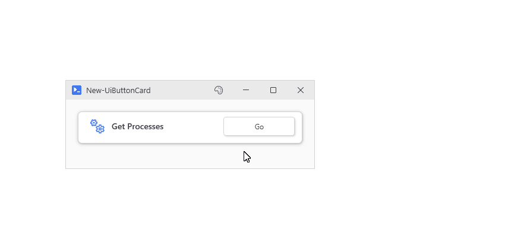
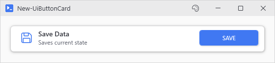
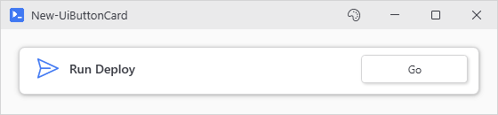
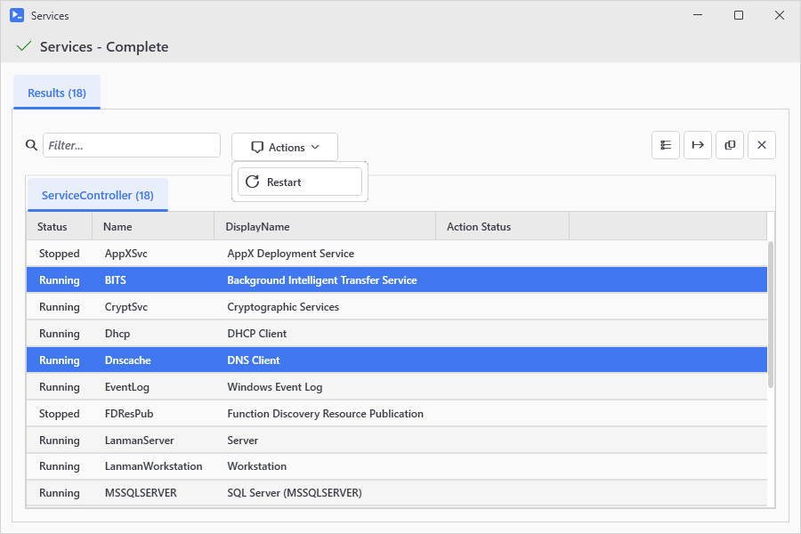
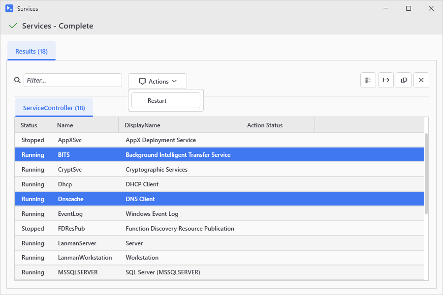

# New-UiButtonCard

## SYNOPSIS
Creates a button card with icon, header, description, and an action button.

## SYNTAX

### ScriptBlock (Default)
```
New-UiButtonCard -Header <String> [-Description <String>] [-ButtonText <String>] -Action <ScriptBlock>
 [-Accent] [-FullWidth] [-NoAsync] [-NoWait] [-NoOutput] [-HideEmptyOutput] [-ResultActions <Object>]
 [-SingleSelect] [-LinkedVariables <String[]>] [-LinkedFunctions <String[]>] [-LinkedModules <String[]>]
 [-Capture <String[]>] [-Parameters <Hashtable>] [-Variables <Hashtable>] [-Variable <String>]
 [-WPFProperties <Hashtable>] [-Icon <String>] [<CommonParameters>]
```

### File
```
New-UiButtonCard -Header <String> [-Description <String>] [-ButtonText <String>] -File <String>
 [-ArgumentList <Hashtable>] [-Accent] [-FullWidth] [-NoAsync] [-NoWait] [-NoOutput] [-HideEmptyOutput]
 [-ResultActions <Object>] [-SingleSelect] [-LinkedVariables <String[]>] [-LinkedFunctions <String[]>]
 [-LinkedModules <String[]>] [-Capture <String[]>] [-Parameters <Hashtable>] [-Variables <Hashtable>]
 [-Variable <String>] [-WPFProperties <Hashtable>] [-Icon <String>]
 [<CommonParameters>]
```

## DESCRIPTION
Creates a styled card/groupbox containing an icon, header text, optional description, and an action button. The button executes asynchronously by default with full output streaming support. Use New-UiActionCard for the same card with -NoOutput baked in.

Use -Action to provide an inline scriptblock, or -File to run an external script file. These parameters are mutually exclusive.

## EXAMPLES

### EXAMPLE 1
```
New-UiButtonCard -Header "Get Processes" -Icon "Processing" -Action { Get-Process }
```

<p align="center"></p>

### EXAMPLE 2
```
New-UiButtonCard -Header "Save Data" -Description "Saves current state" -Icon "Save" -ButtonText "SAVE" -Accent -Action { Save-Data }
```

<p align="center"></p>

### EXAMPLE 3
```
New-UiButtonCard -Header "Run Deploy" -Icon "Send" -File "C:\Scripts\Deploy.ps1" -ArgumentList @{ Env = 'Prod' }
```

<p align="center"></p>

### EXAMPLE 4
```
# Result actions run against rows selected in the output grid
New-UiButtonCard -Header 'Services' -Icon 'Settings' -Action { Get-Service } -ResultActions {
    New-UiResultAction 'Restart' -Icon Refresh -Confirm 'Restart {0} services?' -Action { $_ | Restart-Service }
}
```

<p align="center"></p>

### EXAMPLE 5
```
# Legacy hashtable form, still supported
New-UiButtonCard -Header 'Services' -Icon 'Settings' -Action { Get-Service } -ResultActions @(
    @{ Text = 'Restart'; Action = { $_ | Restart-Service } }
)
```

<p align="center"></p>

## PARAMETERS

### -Header
The card title/header text.

<details><summary>Type: String (required)</summary>

```yaml
Type: String
Parameter Sets: (All)
Aliases:

Required: True
Position: Named
Default value: None
Accept pipeline input: False
Accept wildcard characters: False
```

</details>

### -Description
Optional description text shown below the header.

<details><summary>Type: String (optional)</summary>

```yaml
Type: String
Parameter Sets: (All)
Aliases:

Required: False
Position: Named
Default value: None
Accept pipeline input: False
Accept wildcard characters: False
```

</details>

### -ButtonText
Text shown on the action button. Defaults to 'Go'.

<details><summary>Type: String (optional)</summary>

```yaml
Type: String
Parameter Sets: (All)
Aliases:

Required: False
Position: Named
Default value: Go
Accept pipeline input: False
Accept wildcard characters: False
```

</details>

### -Action
The scriptblock to execute when the button is clicked. Mutually exclusive with -File.

<details><summary>Type: ScriptBlock (required)</summary>

```yaml
Type: ScriptBlock
Parameter Sets: ScriptBlock
Aliases:

Required: True
Position: Named
Default value: None
Accept pipeline input: False
Accept wildcard characters: False
```

</details>

### -File
Path to a script file to execute when clicked. Supports .ps1, .bat, .cmd, .vbs, and .exe files. Mutually exclusive with -Action.

<details><summary>Type: String (required)</summary>

```yaml
Type: String
Parameter Sets: File
Aliases:

Required: True
Position: Named
Default value: None
Accept pipeline input: False
Accept wildcard characters: False
```

</details>

### -ArgumentList
Hashtable of arguments to pass to the script file.

<details><summary>Type: Hashtable (optional)</summary>

```yaml
Type: Hashtable
Parameter Sets: File
Aliases:

Required: False
Position: Named
Default value: None
Accept pipeline input: False
Accept wildcard characters: False
```

</details>

### -Accent
If specified, the button uses accent color styling.

<details><summary>Type: SwitchParameter (optional)</summary>

```yaml
Type: SwitchParameter
Parameter Sets: (All)
Aliases:

Required: False
Position: Named
Default value: False
Accept pipeline input: False
Accept wildcard characters: False
```

</details>

### -FullWidth
If specified, the card spans the full width of its container.

<details><summary>Type: SwitchParameter (optional)</summary>

```yaml
Type: SwitchParameter
Parameter Sets: (All)
Aliases:

Required: False
Position: Named
Default value: False
Accept pipeline input: False
Accept wildcard characters: False
```

</details>

### -NoAsync
Execute synchronously on the UI thread (blocks UI).

<details><summary>Type: SwitchParameter (optional)</summary>

```yaml
Type: SwitchParameter
Parameter Sets: (All)
Aliases:

Required: False
Position: Named
Default value: False
Accept pipeline input: False
Accept wildcard characters: False
```

</details>

### -NoWait
Execute async with output window, but don't block the parent window. Other buttons remain clickable while this action runs.

<details><summary>Type: SwitchParameter (optional)</summary>

```yaml
Type: SwitchParameter
Parameter Sets: (All)
Aliases:

Required: False
Position: Named
Default value: False
Accept pipeline input: False
Accept wildcard characters: False
```

</details>

### -NoOutput
Execute async but don't show output window.

<details><summary>Type: SwitchParameter (optional)</summary>

```yaml
Type: SwitchParameter
Parameter Sets: (All)
Aliases:

Required: False
Position: Named
Default value: False
Accept pipeline input: False
Accept wildcard characters: False
```

</details>

### -HideEmptyOutput
Show output window only when there's actual content.

<details><summary>Type: SwitchParameter (optional)</summary>

```yaml
Type: SwitchParameter
Parameter Sets: (All)
Aliases:

Required: False
Position: Named
Default value: False
Accept pipeline input: False
Accept wildcard characters: False
```

</details>

### -ResultActions
Actions offered against selected rows in the output window's results grid. Pass a { New-UiResultAction ... } definition block, an array of New-UiResultAction output, or the legacy hashtable array. See New-UiButton -ResultActions for the entry details.

<details><summary>Type: Object (optional)</summary>

```yaml
Type: Object
Parameter Sets: (All)
Aliases:

Required: False
Position: Named
Default value: None
Accept pipeline input: False
Accept wildcard characters: False
```

</details>

### -SingleSelect
If specified, ResultActions work with single selection.

<details><summary>Type: SwitchParameter (optional)</summary>

```yaml
Type: SwitchParameter
Parameter Sets: (All)
Aliases:

Required: False
Position: Named
Default value: False
Accept pipeline input: False
Accept wildcard characters: False
```

</details>

### -LinkedVariables
Variable names to capture from your script's scope.

<details><summary>Type: String[] (optional)</summary>

```yaml
Type: String[]
Parameter Sets: (All)
Aliases:

Required: False
Position: Named
Default value: None
Accept pipeline input: False
Accept wildcard characters: False
```

</details>

### -LinkedFunctions
Function names to capture from your script's scope.

<details><summary>Type: String[] (optional)</summary>

```yaml
Type: String[]
Parameter Sets: (All)
Aliases:

Required: False
Position: Named
Default value: None
Accept pipeline input: False
Accept wildcard characters: False
```

</details>

### -LinkedModules
Module paths to import in the async runspace.

<details><summary>Type: String[] (optional)</summary>

```yaml
Type: String[]
Parameter Sets: (All)
Aliases:

Required: False
Position: Named
Default value: None
Accept pipeline input: False
Accept wildcard characters: False
```

</details>

### -Capture
Variable names to capture from the runspace after execution completes. Captured variables are stored in the session and available to subsequent button actions via hydration, eliminating the need for Get-UiSession.

<details><summary>Type: String[] (optional)</summary>

```yaml
Type: String[]
Parameter Sets: (All)
Aliases:

Required: False
Position: Named
Default value: None
Accept pipeline input: False
Accept wildcard characters: False
```

</details>

### -Parameters
Hashtable of parameters to pass to the action.

<details><summary>Type: Hashtable (optional)</summary>

```yaml
Type: Hashtable
Parameter Sets: (All)
Aliases:

Required: False
Position: Named
Default value: None
Accept pipeline input: False
Accept wildcard characters: False
```

</details>

### -Variables
Hashtable of variables to inject into the action.

<details><summary>Type: Hashtable (optional)</summary>

```yaml
Type: Hashtable
Parameter Sets: (All)
Aliases:

Required: False
Position: Named
Default value: None
Accept pipeline input: False
Accept wildcard characters: False
```

</details>

### -Variable
Optional name to register the button for -SubmitButton lookups. When specified, inputs using -SubmitButton with this name will trigger the button's click event when Enter is pressed.

<details><summary>Type: String (optional)</summary>

```yaml
Type: String
Parameter Sets: (All)
Aliases:

Required: False
Position: Named
Default value: None
Accept pipeline input: False
Accept wildcard characters: False
```

</details>

### -WPFProperties
Hashtable of WPF properties to apply to the card container.

<details><summary>Type: Hashtable (optional)</summary>

```yaml
Type: Hashtable
Parameter Sets: (All)
Aliases:

Required: False
Position: Named
Default value: None
Accept pipeline input: False
Accept wildcard characters: False
```

</details>

### -Icon
Icon name (e.g., 'Play', 'Save', 'Processing'). Use Show-UiGlyphBrowser to browse names.

<details><summary>Type: String (optional)</summary>

```yaml
Type: String
Parameter Sets: (All)
Aliases:

Required: False
Position: Named
Default value: None
Accept pipeline input: False
Accept wildcard characters: False
```

</details>

### CommonParameters
This cmdlet supports the common parameters: -Debug, -ErrorAction, -ErrorVariable, -InformationAction, -InformationVariable, -OutVariable, -OutBuffer, -PipelineVariable, -Verbose, -WarningAction, and -WarningVariable. For more information, see [about_CommonParameters](http://go.microsoft.com/fwlink/?LinkID=113216).

## INPUTS

## OUTPUTS

## NOTES

## RELATED LINKS
