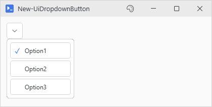
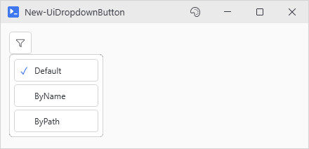

# New-UiDropdownButton

## SYNOPSIS
Creates a compact popup button with selectable items.

## SYNTAX

```
New-UiDropdownButton [-Items] <Array> [[-Default] <String>] [[-Variable] <String>] [[-Tooltip] <String>]
 [[-OnChange] <ScriptBlock>] [[-Width] <Int32>] [[-Height] <Int32>] [-ShowText] [-NoAutoAdd]
 [[-WPFProperties] <Hashtable>] [-Icon <String>] [<CommonParameters>]
```

## DESCRIPTION
Creates a button that displays a dropdown popup with selectable items when clicked. Similar to a ComboBox but styled as a compact icon button. Fits panel headers and toolbar rows. Supports an OnChange callback when the selection changes.

## EXAMPLES

### EXAMPLE 1
```
New-UiDropdownButton -Items @('Option1', 'Option2', 'Option3') -Default 'Option1' -Tooltip "Select Option"
```

<p align="center"></p>

### EXAMPLE 2
```
New-UiDropdownButton -Items $parameterSets -Variable 'selectedSet' -Icon 'Filter' -OnChange {
    param($newValue)
    Write-Host "Selected: $newValue"
}
```

<p align="center"></p>

## PARAMETERS

### -Items
Array of items to display in the popup.

<details><summary>Type: Array (required)</summary>

```yaml
Type: Array
Parameter Sets: (All)
Aliases:

Required: True
Position: 1
Default value: None
Accept pipeline input: False
Accept wildcard characters: False
```

</details>

### -Default
The default selected item.

<details><summary>Type: String (optional)</summary>

```yaml
Type: String
Parameter Sets: (All)
Aliases:

Required: False
Position: 2
Default value: None
Accept pipeline input: False
Accept wildcard characters: False
```

</details>

### -Variable
Variable name to register the control with for hydration access.

<details><summary>Type: String (optional)</summary>

```yaml
Type: String
Parameter Sets: (All)
Aliases:

Required: False
Position: 3
Default value: None
Accept pipeline input: False
Accept wildcard characters: False
```

</details>

### -Tooltip
Tooltip text shown on hover.

<details><summary>Type: String (optional)</summary>

```yaml
Type: String
Parameter Sets: (All)
Aliases:

Required: False
Position: 4
Default value: None
Accept pipeline input: False
Accept wildcard characters: False
```

</details>

### -OnChange
ScriptBlock to execute when selection changes. Receives the new selection as parameter.

<details><summary>Type: ScriptBlock (optional)</summary>

```yaml
Type: ScriptBlock
Parameter Sets: (All)
Aliases:

Required: False
Position: 5
Default value: None
Accept pipeline input: False
Accept wildcard characters: False
```

</details>

### -Width
Button width in pixels. Default is 32.

<details><summary>Type: Int32 (optional)</summary>

```yaml
Type: Int32
Parameter Sets: (All)
Aliases:

Required: False
Position: 6
Default value: 32
Accept pipeline input: False
Accept wildcard characters: False
```

</details>

### -Height
Button height in pixels. Default is 32.

<details><summary>Type: Int32 (optional)</summary>

```yaml
Type: Int32
Parameter Sets: (All)
Aliases:

Required: False
Position: 7
Default value: 32
Accept pipeline input: False
Accept wildcard characters: False
```

</details>

### -ShowText
Show the selected item text next to the icon.

<details><summary>Type: SwitchParameter (optional)</summary>

```yaml
Type: SwitchParameter
Parameter Sets: (All)
Aliases:

Required: False
Position: Named
Default value: False
Accept pipeline input: False
Accept wildcard characters: False
```

</details>

### -NoAutoAdd
Don't automatically add the dropdown to the current layout panel. Used internally by New-UiTool.

<details><summary>Type: SwitchParameter (optional)</summary>

```yaml
Type: SwitchParameter
Parameter Sets: (All)
Aliases:

Required: False
Position: Named
Default value: False
Accept pipeline input: False
Accept wildcard characters: False
```

</details>

### -WPFProperties
Hashtable of additional WPF properties to apply to the container.

<details><summary>Type: Hashtable (optional)</summary>

```yaml
Type: Hashtable
Parameter Sets: (All)
Aliases:

Required: False
Position: 8
Default value: None
Accept pipeline input: False
Accept wildcard characters: False
```

</details>

### -Icon
Icon name (e.g., 'ChevronDown', 'Settings', 'Filter'). Default is 'ChevronDown'. Use Show-UiGlyphBrowser to browse names.

<details><summary>Type: String (optional)</summary>

```yaml
Type: String
Parameter Sets: (All)
Aliases:

Required: False
Position: Named
Default value: None
Accept pipeline input: False
Accept wildcard characters: False
```

</details>

### CommonParameters
This cmdlet supports the common parameters: -Debug, -ErrorAction, -ErrorVariable, -InformationAction, -InformationVariable, -OutVariable, -OutBuffer, -PipelineVariable, -Verbose, -WarningAction, and -WarningVariable. For more information, see [about_CommonParameters](http://go.microsoft.com/fwlink/?LinkID=113216).

## INPUTS

## OUTPUTS

## NOTES

## RELATED LINKS
