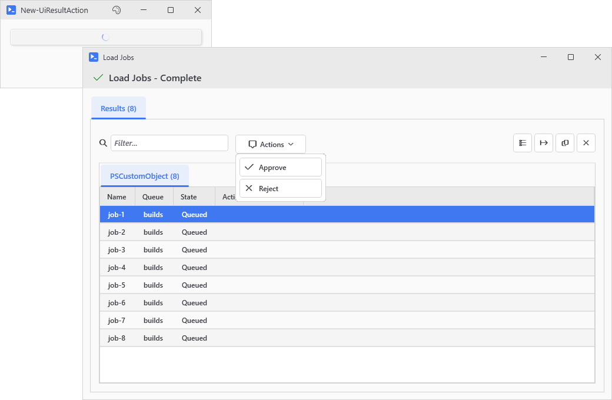
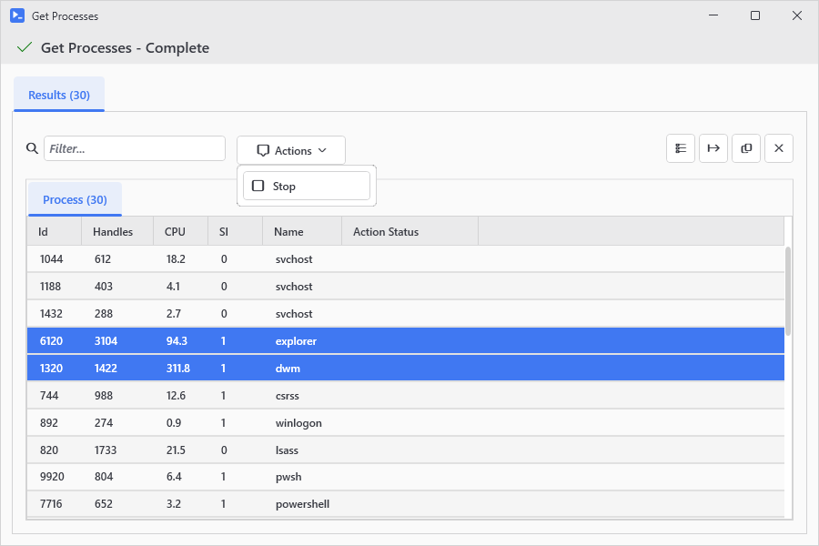

# New-UiResultAction

<p align="center"></p>

## SYNOPSIS
Defines one entry for a button's Actions dropdown in the output window.

## SYNTAX

```
New-UiResultAction [-Text] <String> [-Action] <ScriptBlock> [-Confirm <String>] [-ObjectType <String[]>]
 [-Icon <String>] [<CommonParameters>]
```

## DESCRIPTION
Builder for the -ResultActions parameter on New-UiButton, New-UiButtonCard, and New-UiTool. Each call becomes one item in the results grid's Actions dropdown, run against the selected rows. Pass the calls inside a scriptblock or an array; the dropdown keeps their order. Emits a definition object only - it does not add anything to the window.

Equivalent to a @{ Text; Action; Icon; Confirm; ObjectType } hashtable, which -ResultActions still accepts.

## EXAMPLES

### EXAMPLE 1
```
New-UiButton -Text 'Get Processes' -Action { Get-Process } -ResultActions {
    New-UiResultAction 'Stop' -Icon Stop -Confirm 'Stop {0} processes?' -Action { $_ | Stop-Process -Force }
    New-UiResultAction 'Details' -Action { $Selected | Format-List * | Out-String | Write-Host }
}
```

<p align="center"></p>

### EXAMPLE 2
```
# Legacy hashtable form, still supported
New-UiButton -Text 'Get Processes' -Action { Get-Process } -ResultActions @(
    @{ Text = 'Stop'; Icon = 'Stop'; Confirm = 'Stop {0} processes?'; Action = { $_ | Stop-Process -Force } }
)
```

<p align="center"></p>

## PARAMETERS

### -Text
Dropdown item label.

<details><summary>Type: String (required)</summary>

```yaml
Type: String
Parameter Sets: (All)
Aliases:

Required: True
Position: 1
Default value: None
Accept pipeline input: False
Accept wildcard characters: False
```

</details>

### -Action
Scriptblock run against the selection. $_ is the selected row, or the whole array when more than one row is selected. $Selected is always the full array.

<details><summary>Type: ScriptBlock (required)</summary>

```yaml
Type: ScriptBlock
Parameter Sets: (All)
Aliases:

Required: True
Position: 2
Default value: None
Accept pipeline input: False
Accept wildcard characters: False
```

</details>

### -Confirm
Ask before running. Format string where {0} is the selection count, so 'Stop {0} processes?' reads right at any selection size.

<details><summary>Type: String (optional)</summary>

```yaml
Type: String
Parameter Sets: (All)
Aliases:

Required: False
Position: Named
Default value: None
Accept pipeline input: False
Accept wildcard characters: False
```

</details>

### -ObjectType
Show this action only on result tabs whose type matches one of these names. Tabs are labeled with the short type name (Process, not System.Diagnostics.Process), and the match is exact or substring against that label.

<details><summary>Type: String[] (optional)</summary>

```yaml
Type: String[]
Parameter Sets: (All)
Aliases:

Required: False
Position: Named
Default value: None
Accept pipeline input: False
Accept wildcard characters: False
```

</details>

### -Icon
Icon name shown ahead of the label. Tab completion lists the valid names.

<details><summary>Type: String (optional)</summary>

```yaml
Type: String
Parameter Sets: (All)
Aliases:

Required: False
Position: Named
Default value: None
Accept pipeline input: False
Accept wildcard characters: False
```

</details>

### CommonParameters
This cmdlet supports the common parameters: -Debug, -ErrorAction, -ErrorVariable, -InformationAction, -InformationVariable, -OutVariable, -OutBuffer, -PipelineVariable, -Verbose, -WarningAction, and -WarningVariable. For more information, see [about_CommonParameters](http://go.microsoft.com/fwlink/?LinkID=113216).

## INPUTS

## OUTPUTS

## NOTES

## RELATED LINKS
