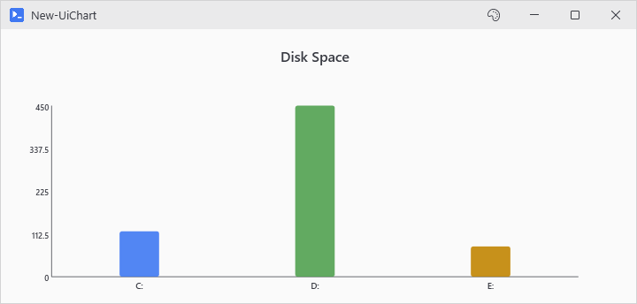
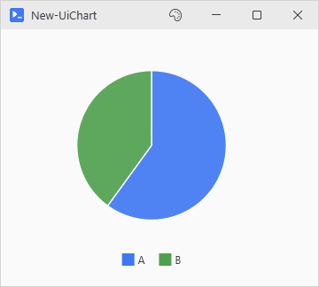
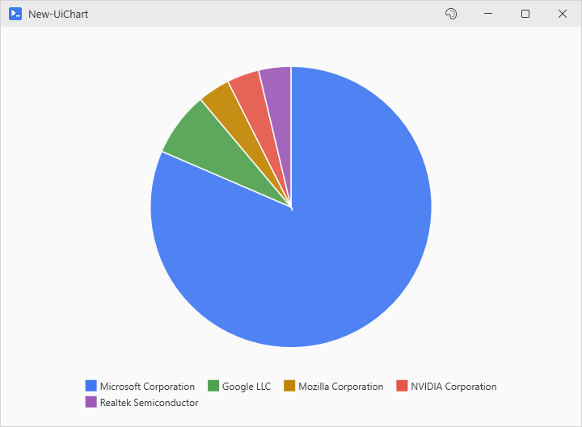
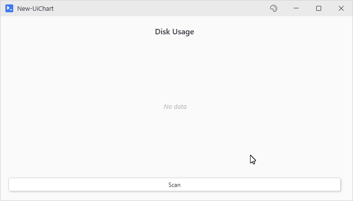
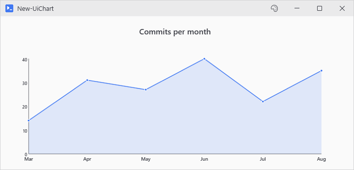

# New-UiChart

## SYNOPSIS
Creates a bar, line, or pie chart that stretches to fill its parent.

## SYNTAX

```
New-UiChart [-Type] <String> [[-Data] <Object>] [[-LabelProperty] <String>] [[-ValueProperty] <String>]
 [[-Title] <String>] [[-XAxisLabel] <String>] [[-YAxisLabel] <String>] [[-Width] <Int32>] [[-Height] <Int32>]
 [-ShowLegend] [-ShowValues] [[-Variable] <String>] [<CommonParameters>]
```

## DESCRIPTION
Renders bar, line, or pie charts using native WPF canvas drawing. By default, charts stretch to fill the width of their parent container and resize dynamically when the window is resized. When placed in a constrained parent (e.g. a Grid cell with star sizing), the chart scales to fit both width and height proportionally.

Charts registered with -Variable can be updated from button actions using Update-UiChart, or by assigning new data to the variable directly (the chart catches up automatically on dehydration).

Omit -Data to create an empty chart with a placeholder, ready to be filled by a button action later.

Specify -Width and -Height to opt into fixed display size instead. Colors are derived from the active theme's accent and semantic colors.

## EXAMPLES

### EXAMPLE 1
```
# Auto sized chart. It stretches to fill available width.
New-UiChart -Type Bar -Data ([ordered]@{ "C:" = 120; "D:" = 450; "E:" = 80 }) -Title "Disk Space"
```

<p align="center"></p>

### EXAMPLE 2
```
# Fixed size, from explicit dimensions.
New-UiChart -Type Pie -Data ([ordered]@{ "A" = 60; "B" = 40 }) -Width 300 -Height 250
```

<p align="center"></p>

### EXAMPLE 3
```
# Pipeline data with custom properties
$vendors = Get-Process | Where-Object Company | Group-Object Company | Sort-Object Count -Descending
$vendors[0..4] | New-UiChart -Type Pie -LabelProperty Name -ValueProperty Count
```

<p align="center"></p>

### EXAMPLE 4
```
# Empty chart updated by a button action
New-UiChart -Type Bar -Variable 'diskChart' -Title 'Disk Usage'
New-UiButton -Text 'Scan' -NoOutput -Action {
    $disks = [ordered]@{}
    foreach ($disk in Get-CimInstance Win32_LogicalDisk -Filter "DriveType=3") {
        $disks[$disk.DeviceID] = [math]::Round($disk.FreeSpace / 1GB)
    }
    Update-UiChart -Variable 'diskChart' -Data $disks
}
```

<p align="center"></p>

### EXAMPLE 5
```
# Line charts carry a trend over time
New-UiChart -Type Line -Title 'Commits per month' -Data ([ordered]@{
    Mar = 14; Apr = 31; May = 27; Jun = 40; Jul = 22; Aug = 35
})
```

<p align="center"></p>

## PARAMETERS

### -Type
Chart type: Bar, Line, or Pie.

<details><summary>Type: String (required)</summary>

```yaml
Type: String
Parameter Sets: (All)
Aliases:

Required: True
Position: 1
Default value: None
Accept pipeline input: False
Accept wildcard characters: False
```

</details>

### -Data
Chart data. Omit for an empty placeholder chart. Supported formats:
- Ordered hashtable: \[ordered]@{ "Label" = Value; ... }
- Array of hashtables: @(@{Label="x"; Value=1}, ...)
- Pipeline objects with configurable property names

<details><summary>Type: Object (optional)</summary>

```yaml
Type: Object
Parameter Sets: (All)
Aliases:

Required: False
Position: 2
Default value: None
Accept pipeline input: True (ByValue)
Accept wildcard characters: False
```

</details>

### -LabelProperty
Property name to use as labels when Data contains objects. When omitted, tries "Label", "Name", then "Key".

<details><summary>Type: String (optional)</summary>

```yaml
Type: String
Parameter Sets: (All)
Aliases:

Required: False
Position: 3
Default value: None
Accept pipeline input: False
Accept wildcard characters: False
```

</details>

### -ValueProperty
Property name to use as values when Data contains objects. When omitted, tries "Value", "Count", "Sum", then "Total".

<details><summary>Type: String (optional)</summary>

```yaml
Type: String
Parameter Sets: (All)
Aliases:

Required: False
Position: 4
Default value: None
Accept pipeline input: False
Accept wildcard characters: False
```

</details>

### -Title
Optional chart title displayed above the chart.

<details><summary>Type: String (optional)</summary>

```yaml
Type: String
Parameter Sets: (All)
Aliases:

Required: False
Position: 5
Default value: None
Accept pipeline input: False
Accept wildcard characters: False
```

</details>

### -XAxisLabel
Label for the X-axis (bar and line charts only).

<details><summary>Type: String (optional)</summary>

```yaml
Type: String
Parameter Sets: (All)
Aliases:

Required: False
Position: 6
Default value: None
Accept pipeline input: False
Accept wildcard characters: False
```

</details>

### -YAxisLabel
Label for the Y-axis (bar and line charts only).

<details><summary>Type: String (optional)</summary>

```yaml
Type: String
Parameter Sets: (All)
Aliases:

Required: False
Position: 7
Default value: None
Accept pipeline input: False
Accept wildcard characters: False
```

</details>

### -Width
Fixed display width in pixels. When set, disables auto-stretch.

<details><summary>Type: Int32 (optional)</summary>

```yaml
Type: Int32
Parameter Sets: (All)
Aliases:

Required: False
Position: 8
Default value: 0
Accept pipeline input: False
Accept wildcard characters: False
```

</details>

### -Height
Fixed display height in pixels. When set, disables auto-stretch.

<details><summary>Type: Int32 (optional)</summary>

```yaml
Type: Int32
Parameter Sets: (All)
Aliases:

Required: False
Position: 9
Default value: 0
Accept pipeline input: False
Accept wildcard characters: False
```

</details>

### -ShowLegend
Show legend for pie charts. Default true for pie, ignored for others.

<details><summary>Type: SwitchParameter (optional)</summary>

```yaml
Type: SwitchParameter
Parameter Sets: (All)
Aliases:

Required: False
Position: Named
Default value: False
Accept pipeline input: False
Accept wildcard characters: False
```

</details>

### -ShowValues
Display values on bars, line points, or pie slices.

<details><summary>Type: SwitchParameter (optional)</summary>

```yaml
Type: SwitchParameter
Parameter Sets: (All)
Aliases:

Required: False
Position: Named
Default value: False
Accept pipeline input: False
Accept wildcard characters: False
```

</details>

### -Variable
Variable name to register the chart for later access.

<details><summary>Type: String (optional)</summary>

```yaml
Type: String
Parameter Sets: (All)
Aliases:

Required: False
Position: 10
Default value: None
Accept pipeline input: False
Accept wildcard characters: False
```

</details>

### CommonParameters
This cmdlet supports the common parameters: -Debug, -ErrorAction, -ErrorVariable, -InformationAction, -InformationVariable, -OutVariable, -OutBuffer, -PipelineVariable, -Verbose, -WarningAction, and -WarningVariable. For more information, see [about_CommonParameters](http://go.microsoft.com/fwlink/?LinkID=113216).

## INPUTS

## OUTPUTS

## NOTES

## RELATED LINKS
