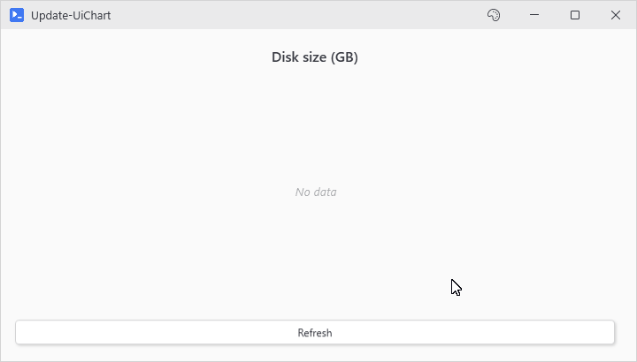
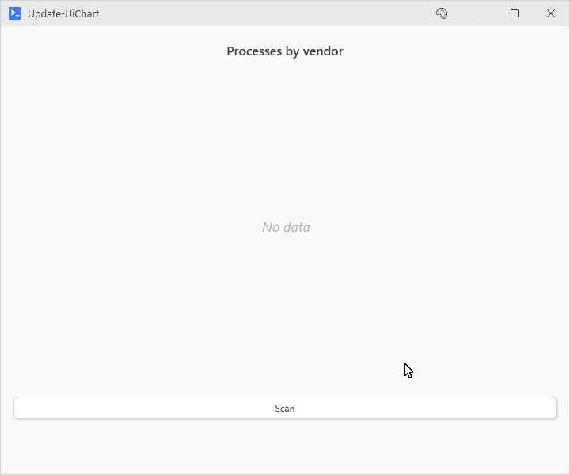

# Update-UiChart

## SYNOPSIS
Updates an existing chart with new data.

## SYNTAX

```
Update-UiChart [-Variable] <String> [-Data] <Object> [[-LabelProperty] <String>] [[-ValueProperty] <String>]
 [<CommonParameters>]
```

## DESCRIPTION
Pushes new data to a chart created with New-UiChart. Works from async button actions since the update runs on the UI thread on its own.

This is the explicit update path. Charts also update automatically when you assign an ordered hashtable of new data to the chart variable inside a button action.

## EXAMPLES

### EXAMPLE 1
```
New-UiChart -Type Bar -Variable 'diskChart' -Title 'Disk size (GB)'
New-UiButton -Text 'Refresh' -NoOutput -Action {
    $diskData = [ordered]@{}
    foreach ($disk in Get-CimInstance Win32_LogicalDisk -Filter "DriveType=3") {
        $diskData[$disk.DeviceID] = [math]::Round($disk.Size / 1GB)
    }
    Update-UiChart -Variable 'diskChart' -Data $diskData
}
```

<p align="center"></p>

### EXAMPLE 2
```
# Pipeline objects with custom property names
New-UiChart -Type Pie -Variable 'procChart' -Title 'Processes by vendor'
New-UiButton -Text 'Scan' -NoOutput -Action {
    $procs = Get-Process | Where-Object Company | Group-Object Company | Sort-Object Count -Descending
    Update-UiChart -Variable 'procChart' -Data $procs[0..7] -LabelProperty Name -ValueProperty Count
}
```

<p align="center"></p>

## PARAMETERS

### -Variable
The variable name of the chart to update (matches -Variable on New-UiChart).

<details><summary>Type: String (required)</summary>

```yaml
Type: String
Parameter Sets: (All)
Aliases:

Required: True
Position: 1
Default value: None
Accept pipeline input: False
Accept wildcard characters: False
```

</details>

### -Data
New chart data in any supported format:
- Ordered hashtable: \[ordered]@{ "Label" = Value; ... }
- Array of hashtables: @(@{ Label = "x"; Value = 1 }, ...)
- Objects with Label/Value or Name/Count properties (Key also resolves for labels, Sum and Total for values)

<details><summary>Type: Object (required)</summary>

```yaml
Type: Object
Parameter Sets: (All)
Aliases:

Required: True
Position: 2
Default value: None
Accept pipeline input: False
Accept wildcard characters: False
```

</details>

### -LabelProperty
Property name to use as labels when Data contains objects. It sticks to the chart, so a later update that omits it keeps using this name.

<details><summary>Type: String (optional)</summary>

```yaml
Type: String
Parameter Sets: (All)
Aliases:

Required: False
Position: 3
Default value: None
Accept pipeline input: False
Accept wildcard characters: False
```

</details>

### -ValueProperty
Property name to use as values when Data contains objects. Sticks the same way.

<details><summary>Type: String (optional)</summary>

```yaml
Type: String
Parameter Sets: (All)
Aliases:

Required: False
Position: 4
Default value: None
Accept pipeline input: False
Accept wildcard characters: False
```

</details>

### CommonParameters
This cmdlet supports the common parameters: -Debug, -ErrorAction, -ErrorVariable, -InformationAction, -InformationVariable, -OutVariable, -OutBuffer, -PipelineVariable, -Verbose, -WarningAction, and -WarningVariable. For more information, see [about_CommonParameters](http://go.microsoft.com/fwlink/?LinkID=113216).

## INPUTS

## OUTPUTS

## NOTES

## RELATED LINKS
