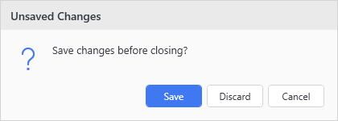
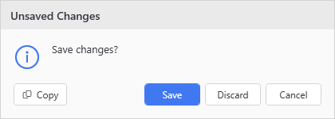

# New-UiDialogButton

<p align="center"></p>

## SYNOPSIS
Defines one button for Show-UiMessageDialog -CustomButtons.

## SYNTAX

```
New-UiDialogButton [-Label] <String> [[-Value] <Object>] [-Default] [-Accent] [-Cancel]
 [<CommonParameters>]
```

## DESCRIPTION
Builder for the -CustomButtons parameter. Buttons render left to right in call order, and the dialog returns the clicked button's -Value. Emits a definition object only - it does not show anything itself.

Equivalent to a @{ Label; Value; IsDefault; IsAccent; IsCancel } hashtable, which -CustomButtons still accepts.

## EXAMPLES

### EXAMPLE 1
```
$answer = Show-UiMessageDialog -Title 'Unsaved Changes' -Message 'Save changes?' -Icon Question -CustomButtons {
    New-UiDialogButton 'Save' -Accent -Default
    New-UiDialogButton 'Discard'
    New-UiDialogButton 'Cancel' -Cancel
}
```

<p align="center"></p>

### EXAMPLE 2
```
# Legacy hashtable form, still supported
Show-UiMessageDialog -Title 'Unsaved Changes' -Message 'Save changes?' -CustomButtons @(
    @{ Label = 'Save'; Value = 'Save'; IsAccent = $true; IsDefault = $true }
    @{ Label = 'Discard'; Value = 'Discard' }
    @{ Label = 'Cancel'; Value = 'Cancel'; IsCancel = $true }
)
```

<p align="center"></p>

## PARAMETERS

### -Label
Button text.

<details><summary>Type: String (required)</summary>

```yaml
Type: String
Parameter Sets: (All)
Aliases:

Required: True
Position: 1
Default value: None
Accept pipeline input: False
Accept wildcard characters: False
```

</details>

### -Value
What Show-UiMessageDialog returns when this button is clicked. Defaults to the label.

<details><summary>Type: Object (optional)</summary>

```yaml
Type: Object
Parameter Sets: (All)
Aliases:

Required: False
Position: 2
Default value: None
Accept pipeline input: False
Accept wildcard characters: False
```

</details>

### -Default
Enter activates this button.

<details><summary>Type: SwitchParameter (optional)</summary>

```yaml
Type: SwitchParameter
Parameter Sets: (All)
Aliases:

Required: False
Position: Named
Default value: False
Accept pipeline input: False
Accept wildcard characters: False
```

</details>

### -Accent
Accent styling for the button you want the eye drawn to.

<details><summary>Type: SwitchParameter (optional)</summary>

```yaml
Type: SwitchParameter
Parameter Sets: (All)
Aliases:

Required: False
Position: Named
Default value: False
Accept pipeline input: False
Accept wildcard characters: False
```

</details>

### -Cancel
Esc activates this button.

<details><summary>Type: SwitchParameter (optional)</summary>

```yaml
Type: SwitchParameter
Parameter Sets: (All)
Aliases:

Required: False
Position: Named
Default value: False
Accept pipeline input: False
Accept wildcard characters: False
```

</details>

### CommonParameters
This cmdlet supports the common parameters: -Debug, -ErrorAction, -ErrorVariable, -InformationAction, -InformationVariable, -OutVariable, -OutBuffer, -PipelineVariable, -Verbose, -WarningAction, and -WarningVariable. For more information, see [about_CommonParameters](http://go.microsoft.com/fwlink/?LinkID=113216).

## INPUTS

## OUTPUTS

## NOTES

## RELATED LINKS
