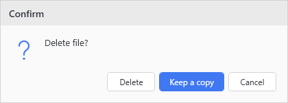

# Show-UiChoiceDialog

## SYNOPSIS
Shows a choice dialog for PromptForChoice scenarios (Confirm, ShouldProcess).

## SYNTAX

```
Show-UiChoiceDialog [[-Caption] <String>] [[-Message] <String>]
 [[-Choices] <System.Collections.ObjectModel.Collection`1[System.Management.Automation.Host.ChoiceDescription]>]
 [[-DefaultChoice] <Int32>] [<CommonParameters>]
```

## DESCRIPTION
Displays a themed dialog with multiple choice buttons. Used to intercept -Confirm prompts and $PSCmdlet.ShouldProcess() calls in async button actions. This runs through Show-UiMessageDialog with custom buttons. If any choice has a HelpMessage, a Help (?) button is added.

## EXAMPLES

### EXAMPLE 1
```
Show-UiChoiceDialog -Caption "Confirm" -Message "Delete file?" -Choices $choices -DefaultChoice 1
```

<p align="center"></p>

## PARAMETERS

### -Caption
The caption/title of the dialog.

<details><summary>Type: String (optional)</summary>

```yaml
Type: String
Parameter Sets: (All)
Aliases:

Required: False
Position: 1
Default value: None
Accept pipeline input: False
Accept wildcard characters: False
```

</details>

### -Message
The message to display.

<details><summary>Type: String (optional)</summary>

```yaml
Type: String
Parameter Sets: (All)
Aliases:

Required: False
Position: 2
Default value: None
Accept pipeline input: False
Accept wildcard characters: False
```

</details>

### -Choices
Collection of ChoiceDescription objects defining available choices.

<details><summary>Type: System.Collections.ObjectModel.Collection`1[System.Management.Automation.Host.ChoiceDescription] (optional)</summary>

```yaml
Type: System.Collections.ObjectModel.Collection`1[System.Management.Automation.Host.ChoiceDescription]
Parameter Sets: (All)
Aliases:

Required: False
Position: 3
Default value: None
Accept pipeline input: False
Accept wildcard characters: False
```

</details>

### -DefaultChoice
Index of the default choice (0-based).

<details><summary>Type: Int32 (optional)</summary>

```yaml
Type: Int32
Parameter Sets: (All)
Aliases:

Required: False
Position: 4
Default value: 0
Accept pipeline input: False
Accept wildcard characters: False
```

</details>

### CommonParameters
This cmdlet supports the common parameters: -Debug, -ErrorAction, -ErrorVariable, -InformationAction, -InformationVariable, -OutVariable, -OutBuffer, -PipelineVariable, -Verbose, -WarningAction, and -WarningVariable. For more information, see [about_CommonParameters](http://go.microsoft.com/fwlink/?LinkID=113216).

## INPUTS

## OUTPUTS

## NOTES

## RELATED LINKS
