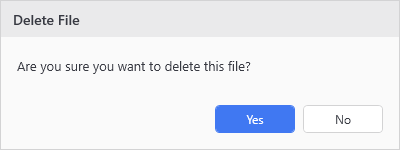
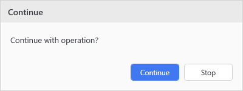

# Show-UiConfirmDialog

## SYNOPSIS
Displays a simple themed confirmation dialog.

## SYNTAX

```
Show-UiConfirmDialog [[-Title] <String>] [-Message] <String> [[-ConfirmText] <String>] [[-CancelText] <String>]
 [<CommonParameters>]
```

## DESCRIPTION
Shows a custom WPF confirmation dialog with customizable button text.

## EXAMPLES

### EXAMPLE 1
```
if (Show-UiConfirmDialog -Title 'Delete File' -Message 'Are you sure you want to delete this file?') {
    Remove-Item $file
}
```

<p align="center"></p>

### EXAMPLE 2
```
$proceed = Show-UiConfirmDialog -Title 'Continue' -Message 'Continue with operation?' -ConfirmText 'Continue' -CancelText 'Stop'
```

<p align="center"></p>

## PARAMETERS

### -Title
Dialog window title.

<details><summary>Type: String (optional)</summary>

```yaml
Type: String
Parameter Sets: (All)
Aliases:

Required: False
Position: 1
Default value: Confirm
Accept pipeline input: False
Accept wildcard characters: False
```

</details>

### -Message
Message text to display.

<details><summary>Type: String (required)</summary>

```yaml
Type: String
Parameter Sets: (All)
Aliases:

Required: True
Position: 2
Default value: None
Accept pipeline input: False
Accept wildcard characters: False
```

</details>

### -ConfirmText
Text for the confirmation button (default "Yes").

<details><summary>Type: String (optional)</summary>

```yaml
Type: String
Parameter Sets: (All)
Aliases:

Required: False
Position: 3
Default value: Yes
Accept pipeline input: False
Accept wildcard characters: False
```

</details>

### -CancelText
Text for the cancel button (default "No").

<details><summary>Type: String (optional)</summary>

```yaml
Type: String
Parameter Sets: (All)
Aliases:

Required: False
Position: 4
Default value: No
Accept pipeline input: False
Accept wildcard characters: False
```

</details>

### CommonParameters
This cmdlet supports the common parameters: -Debug, -ErrorAction, -ErrorVariable, -InformationAction, -InformationVariable, -OutVariable, -OutBuffer, -PipelineVariable, -Verbose, -WarningAction, and -WarningVariable. For more information, see [about_CommonParameters](http://go.microsoft.com/fwlink/?LinkID=113216).

## INPUTS

## OUTPUTS

## NOTES

## RELATED LINKS
