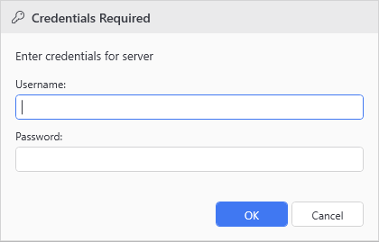

# Show-UiCredentialDialog

## SYNOPSIS
Shows a credential dialog for Get-Credential scenarios.

## SYNTAX

```
Show-UiCredentialDialog [[-Caption] <String>] [[-Message] <String>] [[-UserName] <String>]
 [[-TargetName] <String>] [<CommonParameters>]
```

## DESCRIPTION
Displays a themed credential dialog with username and password fields. Returns a PSCredential object. Uses actual PasswordBox for secure input.

## EXAMPLES

### EXAMPLE 1
```
Show-UiCredentialDialog -Caption "Credentials Required" -Message "Enter credentials for server"
```

<p align="center"></p>

## PARAMETERS

### -Caption
The caption/title of the dialog.

<details><summary>Type: String (optional)</summary>

```yaml
Type: String
Parameter Sets: (All)
Aliases:

Required: False
Position: 1
Default value: None
Accept pipeline input: False
Accept wildcard characters: False
```

</details>

### -Message
The message to display.

<details><summary>Type: String (optional)</summary>

```yaml
Type: String
Parameter Sets: (All)
Aliases:

Required: False
Position: 2
Default value: None
Accept pipeline input: False
Accept wildcard characters: False
```

</details>

### -UserName
Pre-filled username (optional).

<details><summary>Type: String (optional)</summary>

```yaml
Type: String
Parameter Sets: (All)
Aliases:

Required: False
Position: 3
Default value: None
Accept pipeline input: False
Accept wildcard characters: False
```

</details>

### -TargetName
The target resource name (shown in message if no message provided).

<details><summary>Type: String (optional)</summary>

```yaml
Type: String
Parameter Sets: (All)
Aliases:

Required: False
Position: 4
Default value: None
Accept pipeline input: False
Accept wildcard characters: False
```

</details>

### CommonParameters
This cmdlet supports the common parameters: -Debug, -ErrorAction, -ErrorVariable, -InformationAction, -InformationVariable, -OutVariable, -OutBuffer, -PipelineVariable, -Verbose, -WarningAction, and -WarningVariable. For more information, see [about_CommonParameters](http://go.microsoft.com/fwlink/?LinkID=113216).

## INPUTS

## OUTPUTS

## NOTES

## RELATED LINKS
