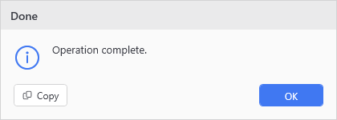
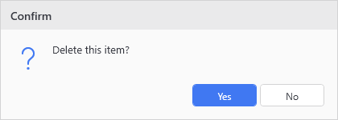

# Show-UiDialog

## SYNOPSIS
Shows a themed message dialog with configurable buttons.

## SYNTAX

```
Show-UiDialog [-Message] <String> [[-Title] <String>] [[-Type] <String>] [[-Buttons] <String>]
 [<CommonParameters>]
```

## DESCRIPTION
Show-UiMessageDialog with less typing. Automatically picks up theme colors when called from an async button action.

## EXAMPLES

### EXAMPLE 1
```
Show-UiDialog -Message 'Operation complete.' -Title 'Done' -Type Info
```

<p align="center"></p>

### EXAMPLE 2
```
$answer = Show-UiDialog -Message 'Delete this item?' -Title 'Confirm' -Type Question -Buttons YesNo
if ($answer -eq 'Yes') { Remove-Item $path }
```

<p align="center"></p>

## PARAMETERS

### -Message
The message text to display in the dialog body.

<details><summary>Type: String (required)</summary>

```yaml
Type: String
Parameter Sets: (All)
Aliases:

Required: True
Position: 1
Default value: None
Accept pipeline input: False
Accept wildcard characters: False
```

</details>

### -Title
Dialog window title. Defaults to 'Message'.

<details><summary>Type: String (optional)</summary>

```yaml
Type: String
Parameter Sets: (All)
Aliases:

Required: False
Position: 2
Default value: Message
Accept pipeline input: False
Accept wildcard characters: False
```

</details>

### -Type
Icon type displayed beside the message: Info, Warning, Error, or Question.

<details><summary>Type: String (optional)</summary>

```yaml
Type: String
Parameter Sets: (All)
Aliases:

Required: False
Position: 3
Default value: Info
Accept pipeline input: False
Accept wildcard characters: False
```

</details>

### -Buttons
Button layout: OK, OKCancel, YesNo, or YesNoCancel.

<details><summary>Type: String (optional)</summary>

```yaml
Type: String
Parameter Sets: (All)
Aliases:

Required: False
Position: 4
Default value: OK
Accept pipeline input: False
Accept wildcard characters: False
```

</details>

### CommonParameters
This cmdlet supports the common parameters: -Debug, -ErrorAction, -ErrorVariable, -InformationAction, -InformationVariable, -OutVariable, -OutBuffer, -PipelineVariable, -Verbose, -WarningAction, and -WarningVariable. For more information, see [about_CommonParameters](http://go.microsoft.com/fwlink/?LinkID=113216).

## INPUTS

## OUTPUTS

## NOTES

## RELATED LINKS
