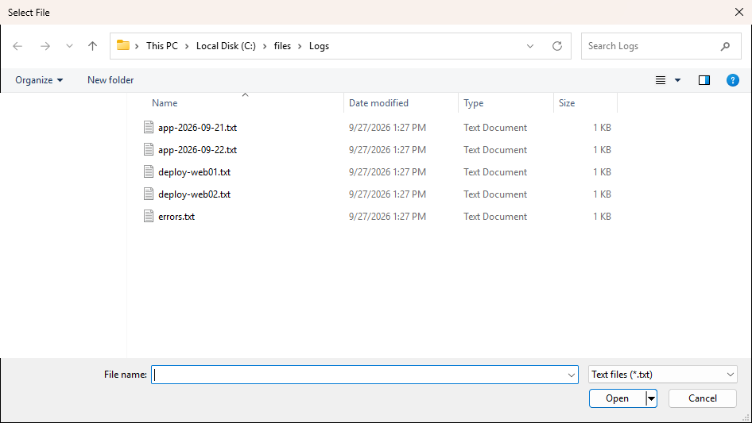

# Show-UiFilePicker

## SYNOPSIS
Shows a file open dialog.

## SYNTAX

```
Show-UiFilePicker [[-Title] <String>] [[-Filter] <String>] [[-InitialDirectory] <String>] [-MultiSelect]
 [<CommonParameters>]
```

## DESCRIPTION
Standard file open dialog, parented to the active PsUi window when one exists. Returns the chosen path (paths with -MultiSelect), $null on cancel.

## EXAMPLES

### EXAMPLE 1
```
$file = Show-UiFilePicker -Filter 'Text files|*.txt|All files|*.*'
```

<p align="center"></p>

## PARAMETERS

### -Title
Dialog title.

<details><summary>Type: String (optional)</summary>

```yaml
Type: String
Parameter Sets: (All)
Aliases:

Required: False
Position: 1
Default value: Select File
Accept pipeline input: False
Accept wildcard characters: False
```

</details>

### -Filter
File type filter.

<details><summary>Type: String (optional)</summary>

```yaml
Type: String
Parameter Sets: (All)
Aliases:

Required: False
Position: 2
Default value: All files|*.*
Accept pipeline input: False
Accept wildcard characters: False
```

</details>

### -InitialDirectory
Starting folder path when the dialog opens.

<details><summary>Type: String (optional)</summary>

```yaml
Type: String
Parameter Sets: (All)
Aliases:

Required: False
Position: 3
Default value: None
Accept pipeline input: False
Accept wildcard characters: False
```

</details>

### -MultiSelect
Allow multiple file selection.

<details><summary>Type: SwitchParameter (optional)</summary>

```yaml
Type: SwitchParameter
Parameter Sets: (All)
Aliases:

Required: False
Position: Named
Default value: False
Accept pipeline input: False
Accept wildcard characters: False
```

</details>

### CommonParameters
This cmdlet supports the common parameters: -Debug, -ErrorAction, -ErrorVariable, -InformationAction, -InformationVariable, -OutVariable, -OutBuffer, -PipelineVariable, -Verbose, -WarningAction, and -WarningVariable. For more information, see [about_CommonParameters](http://go.microsoft.com/fwlink/?LinkID=113216).

## INPUTS

## OUTPUTS

## NOTES

## RELATED LINKS
