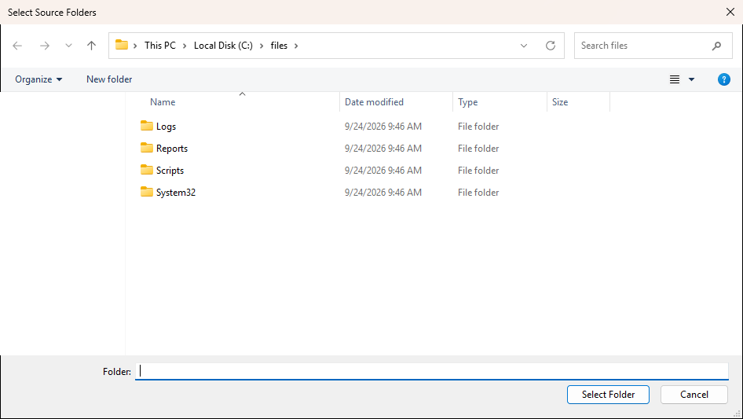

# Show-UiFolderPicker

## SYNOPSIS
Shows a folder selection dialog.

## SYNTAX

```
Show-UiFolderPicker [[-Title] <String>] [[-InitialDirectory] <String>] [-Simple] [-Multiselect]
 [<CommonParameters>]
```

## DESCRIPTION
Displays a modern Windows folder picker dialog. By default uses the Vista file dialog configured for folder selection (navigation pane, breadcrumb bar, search built in). Use -Simple for the legacy tree-view style picker.

## EXAMPLES

### EXAMPLE 1
```
$folder = Show-UiFolderPicker -Title 'Select Output Folder'
```

<p align="center"></p>

### EXAMPLE 2
```
$folders = Show-UiFolderPicker -Title 'Select Source Folders' -Multiselect
```

<p align="center"></p>

## PARAMETERS

### -Title
Dialog title shown in the title bar.

<details><summary>Type: String (optional)</summary>

```yaml
Type: String
Parameter Sets: (All)
Aliases: Description

Required: False
Position: 1
Default value: Select a folder
Accept pipeline input: False
Accept wildcard characters: False
```

</details>

### -InitialDirectory
Starting folder path.

<details><summary>Type: String (optional)</summary>

```yaml
Type: String
Parameter Sets: (All)
Aliases:

Required: False
Position: 2
Default value: None
Accept pipeline input: False
Accept wildcard characters: False
```

</details>

### -Simple
Use the legacy FolderBrowserDialog (XP-style tree view) instead of the modern picker.

<details><summary>Type: SwitchParameter (optional)</summary>

```yaml
Type: SwitchParameter
Parameter Sets: (All)
Aliases:

Required: False
Position: Named
Default value: False
Accept pipeline input: False
Accept wildcard characters: False
```

</details>

### -Multiselect
Allow selection of multiple folders. Only works with the modern picker (ignored with -Simple).

<details><summary>Type: SwitchParameter (optional)</summary>

```yaml
Type: SwitchParameter
Parameter Sets: (All)
Aliases:

Required: False
Position: Named
Default value: False
Accept pipeline input: False
Accept wildcard characters: False
```

</details>

### CommonParameters
This cmdlet supports the common parameters: -Debug, -ErrorAction, -ErrorVariable, -InformationAction, -InformationVariable, -OutVariable, -OutBuffer, -PipelineVariable, -Verbose, -WarningAction, and -WarningVariable. For more information, see [about_CommonParameters](http://go.microsoft.com/fwlink/?LinkID=113216).

## INPUTS

## OUTPUTS

## NOTES

## RELATED LINKS
