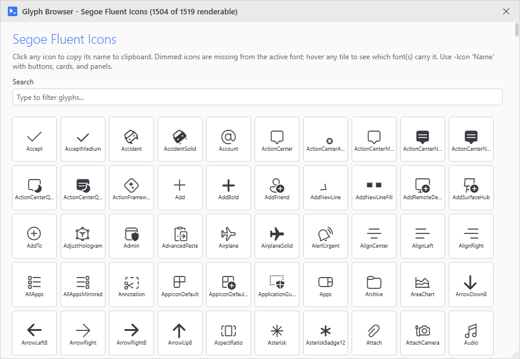

# Show-UiGlyphBrowser

## SYNOPSIS
Opens a child window displaying all available glyphs.

## SYNTAX

```
Show-UiGlyphBrowser [[-Parent] <Window>] [<CommonParameters>]
```

## DESCRIPTION
Shows a searchable grid of all glyphs defined in CharList.json. Click a glyph to copy its name to the clipboard.

## EXAMPLES

### EXAMPLE 1
```
Show-UiGlyphBrowser
```

<p align="center"></p>

### EXAMPLE 2
```
$parentSession = Get-UiSession
Show-UiGlyphBrowser -Parent $parentSession.Window
```

## PARAMETERS

### -Parent
The parent window. If not specified, uses the current session's window.

<details><summary>Type: Window (optional)</summary>

```yaml
Type: Window
Parameter Sets: (All)
Aliases:

Required: False
Position: 1
Default value: None
Accept pipeline input: False
Accept wildcard characters: False
```

</details>

### CommonParameters
This cmdlet supports the common parameters: -Debug, -ErrorAction, -ErrorVariable, -InformationAction, -InformationVariable, -OutVariable, -OutBuffer, -PipelineVariable, -Verbose, -WarningAction, and -WarningVariable. For more information, see [about_CommonParameters](http://go.microsoft.com/fwlink/?LinkID=113216).

## INPUTS

## OUTPUTS

## NOTES

## RELATED LINKS
