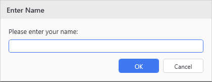
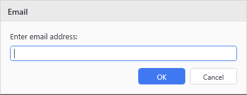
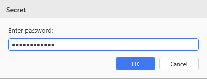

# Show-UiInputDialog

## SYNOPSIS
Displays a themed input dialog for text entry with validation support.

## SYNTAX

```
Show-UiInputDialog [[-Title] <String>] [-Prompt] <String> [[-DefaultValue] <String>]
 [[-ValidatePattern] <String>] [-Password] [<CommonParameters>]
```

## DESCRIPTION
Shows a custom WPF input dialog that respects the current theme.

## EXAMPLES

### EXAMPLE 1
```
$name = Show-UiInputDialog -Title 'Enter Name' -Prompt 'Please enter your name:'
```

<p align="center"></p>

### EXAMPLE 2
```
$email = Show-UiInputDialog -Title 'Email' -Prompt 'Enter email address:' -ValidatePattern '^[\w-\.]+@([\w-]+\.)+[\w-]{2,4}$'
```

<p align="center"></p>

### EXAMPLE 3
```
$secret = Show-UiInputDialog -Title 'Secret' -Prompt 'Enter password:' -Password
```

<p align="center"></p>

## PARAMETERS

### -Title
Dialog window title.

<details><summary>Type: String (optional)</summary>

```yaml
Type: String
Parameter Sets: (All)
Aliases:

Required: False
Position: 1
Default value: Input
Accept pipeline input: False
Accept wildcard characters: False
```

</details>

### -Prompt
Prompt text to display above the input field.

<details><summary>Type: String (required)</summary>

```yaml
Type: String
Parameter Sets: (All)
Aliases:

Required: True
Position: 2
Default value: None
Accept pipeline input: False
Accept wildcard characters: False
```

</details>

### -DefaultValue
Default value to populate in the input field.

<details><summary>Type: String (optional)</summary>

```yaml
Type: String
Parameter Sets: (All)
Aliases:

Required: False
Position: 3
Default value: None
Accept pipeline input: False
Accept wildcard characters: False
```

</details>

### -ValidatePattern
Regular expression pattern to validate input against.

<details><summary>Type: String (optional)</summary>

```yaml
Type: String
Parameter Sets: (All)
Aliases:

Required: False
Position: 4
Default value: None
Accept pipeline input: False
Accept wildcard characters: False
```

</details>

### -Password
When specified, uses a PasswordBox for secure input (displays dots instead of characters).

<details><summary>Type: SwitchParameter (optional)</summary>

```yaml
Type: SwitchParameter
Parameter Sets: (All)
Aliases:

Required: False
Position: Named
Default value: False
Accept pipeline input: False
Accept wildcard characters: False
```

</details>

### CommonParameters
This cmdlet supports the common parameters: -Debug, -ErrorAction, -ErrorVariable, -InformationAction, -InformationVariable, -OutVariable, -OutBuffer, -PipelineVariable, -Verbose, -WarningAction, and -WarningVariable. For more information, see [about_CommonParameters](http://go.microsoft.com/fwlink/?LinkID=113216).

## INPUTS

## OUTPUTS

## NOTES

## RELATED LINKS
