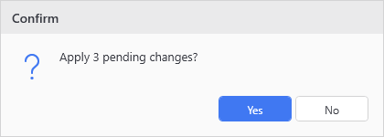
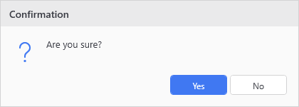
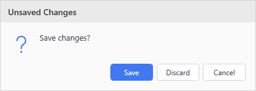
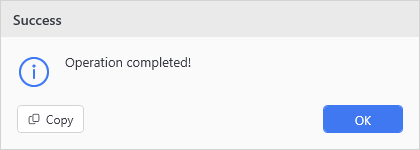
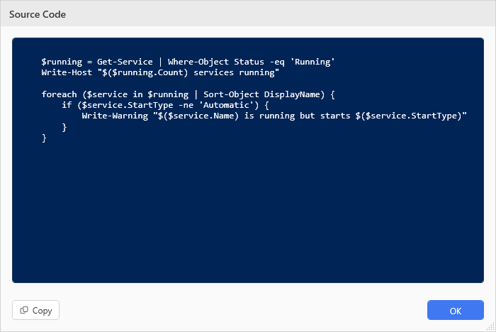

# Show-UiMessageDialog

<p align="center"></p>

## SYNOPSIS
Displays a themed message dialog with customizable buttons and icons.

## SYNTAX

```
Show-UiMessageDialog [[-Title] <String>] [-Message] <String> [[-Buttons] <String>] [[-Icon] <String>]
 [[-ThemeColors] <Object>] [-PowerShell] [[-CustomButtons] <Object>]
 [<CommonParameters>]
```

## DESCRIPTION
Shows a custom WPF dialog that respects the current theme. Replaces standard MessageBox. A message taller than the screen scrolls inside the dialog, which stays away from the taskbar with its buttons in view.

## EXAMPLES

### EXAMPLE 1
```
Show-UiMessageDialog -Title 'Confirmation' -Message 'Are you sure?' -Buttons YesNo -Icon Question
```

<p align="center"></p>

### EXAMPLE 2
```
$answer = Show-UiMessageDialog -Title 'Unsaved Changes' -Message 'Save changes?' -Icon Question -CustomButtons {
    New-UiDialogButton 'Save' -Accent -Default
    New-UiDialogButton 'Discard'
    New-UiDialogButton 'Cancel' -Cancel
}
```

<p align="center"></p>

### EXAMPLE 3
```
$result = Show-UiMessageDialog -Title 'Success' -Message 'Operation completed!' -Buttons OK -Icon Info
```

<p align="center"></p>

### EXAMPLE 4
```
Show-UiMessageDialog -Title 'Source Code' -Message $scriptBlock.ToString() -PowerShell
```

<p align="center"></p>

### EXAMPLE 5
```
# Legacy hashtable form, still supported
$buttons = @(
    @{ Label = 'Save'; Value = 'Save'; IsAccent = $true; IsDefault = $true }
    @{ Label = 'Discard'; Value = 'Discard' }
    @{ Label = 'Cancel'; Value = 'Cancel'; IsCancel = $true }
)
Show-UiMessageDialog -Title 'Unsaved Changes' -Message 'Save changes?' -CustomButtons $buttons -Icon Question
```

<p align="center"></p>

## PARAMETERS

### -Title
Dialog window title.

<details><summary>Type: String (optional)</summary>

```yaml
Type: String
Parameter Sets: (All)
Aliases:

Required: False
Position: 1
Default value: Message
Accept pipeline input: False
Accept wildcard characters: False
```

</details>

### -Message
Message text to display.

<details><summary>Type: String (required)</summary>

```yaml
Type: String
Parameter Sets: (All)
Aliases:

Required: True
Position: 2
Default value: None
Accept pipeline input: False
Accept wildcard characters: False
```

</details>

### -Buttons
Button configuration: OK, OKCancel, YesNo, or YesNoCancel.

<details><summary>Type: String (optional)</summary>

```yaml
Type: String
Parameter Sets: (All)
Aliases:

Required: False
Position: 3
Default value: OK
Accept pipeline input: False
Accept wildcard characters: False
```

</details>

### -Icon
Icon type: Info, Warning, Error, Question, or None.

<details><summary>Type: String (optional)</summary>

```yaml
Type: String
Parameter Sets: (All)
Aliases:

Required: False
Position: 4
Default value: Info
Accept pipeline input: False
Accept wildcard characters: False
```

</details>

### -ThemeColors
Override theme colors for this dialog. Pass a colors hashtable directly.

<details><summary>Type: Object (optional)</summary>

```yaml
Type: Object
Parameter Sets: (All)
Aliases:

Required: False
Position: 5
Default value: None
Accept pipeline input: False
Accept wildcard characters: False
```

</details>

### -PowerShell
When used, displays the message in a PowerShell console-styled code viewer. Uses Consolas font, blue background (#012456), white text, and makes the dialog larger (700x500) and resizable with horizontal/vertical scrollbars. For source code and command snippets.

<details><summary>Type: SwitchParameter (optional)</summary>

```yaml
Type: SwitchParameter
Parameter Sets: (All)
Aliases:

Required: False
Position: Named
Default value: False
Accept pipeline input: False
Accept wildcard characters: False
```

</details>

### -CustomButtons
Custom buttons, rendered left to right in declaration order. Pass a { New-UiDialogButton ... } definition block, an array of New-UiDialogButton output, or the legacy hashtable array where each hashtable has:
- Label: The button text (required)
- Value: The value returned when clicked (required)
- IsDefault: If true, Enter activates this button (optional)
- IsAccent: If true, button uses accent color (optional)
- IsCancel: If true, Esc activates this button (optional)

When provided, the -Buttons parameter is ignored.

<details><summary>Type: Object (optional)</summary>

```yaml
Type: Object
Parameter Sets: (All)
Aliases:

Required: False
Position: 6
Default value: None
Accept pipeline input: False
Accept wildcard characters: False
```

</details>

### CommonParameters
This cmdlet supports the common parameters: -Debug, -ErrorAction, -ErrorVariable, -InformationAction, -InformationVariable, -OutVariable, -OutBuffer, -PipelineVariable, -Verbose, -WarningAction, and -WarningVariable. For more information, see [about_CommonParameters](http://go.microsoft.com/fwlink/?LinkID=113216).

## INPUTS

## OUTPUTS

## NOTES

## RELATED LINKS
