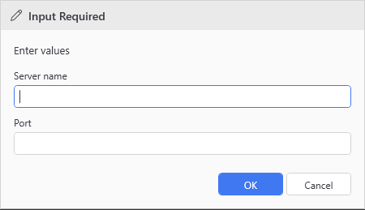

# Show-UiPromptDialog

## SYNOPSIS
Shows a multi-field prompt dialog.

## SYNTAX

```
Show-UiPromptDialog [[-Caption] <String>] [[-Message] <String>]
 [[-Descriptions] <System.Collections.ObjectModel.Collection`1[System.Management.Automation.Host.FieldDescription]>]
 [<CommonParameters>]
```

## DESCRIPTION
Displays a themed dialog with dynamically generated input fields based on FieldDescription collection. Used to intercept $Host.UI.Prompt() calls.

## EXAMPLES

### EXAMPLE 1
```
Show-UiPromptDialog -Caption "Input Required" -Message "Enter values" -Descriptions $fields
```

<p align="center"></p>

## PARAMETERS

### -Caption
The caption/title of the dialog.

<details><summary>Type: String (optional)</summary>

```yaml
Type: String
Parameter Sets: (All)
Aliases:

Required: False
Position: 1
Default value: None
Accept pipeline input: False
Accept wildcard characters: False
```

</details>

### -Message
The message to display.

<details><summary>Type: String (optional)</summary>

```yaml
Type: String
Parameter Sets: (All)
Aliases:

Required: False
Position: 2
Default value: None
Accept pipeline input: False
Accept wildcard characters: False
```

</details>

### -Descriptions
Collection of FieldDescription objects defining fields to display.

<details><summary>Type: System.Collections.ObjectModel.Collection`1[System.Management.Automation.Host.FieldDescription] (optional)</summary>

```yaml
Type: System.Collections.ObjectModel.Collection`1[System.Management.Automation.Host.FieldDescription]
Parameter Sets: (All)
Aliases:

Required: False
Position: 3
Default value: None
Accept pipeline input: False
Accept wildcard characters: False
```

</details>

### CommonParameters
This cmdlet supports the common parameters: -Debug, -ErrorAction, -ErrorVariable, -InformationAction, -InformationVariable, -OutVariable, -OutBuffer, -PipelineVariable, -Verbose, -WarningAction, and -WarningVariable. For more information, see [about_CommonParameters](http://go.microsoft.com/fwlink/?LinkID=113216).

## INPUTS

## OUTPUTS

## NOTES

## RELATED LINKS
