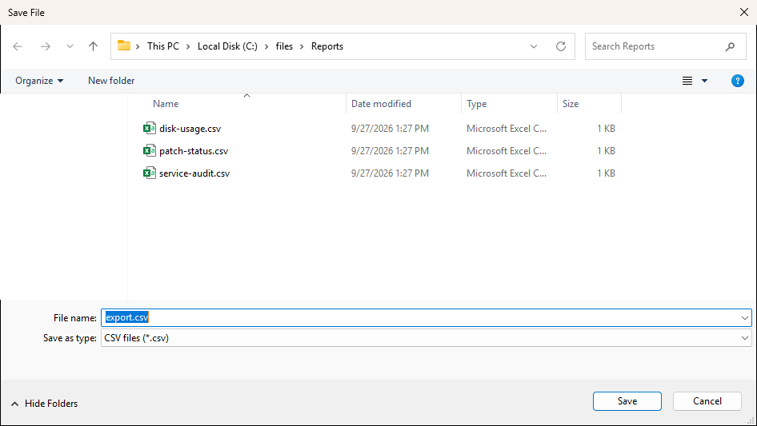

# Show-UiSaveDialog

## SYNOPSIS
Shows a file save dialog.

## SYNTAX

```
Show-UiSaveDialog [[-Title] <String>] [[-Filter] <String>] [[-DefaultName] <String>]
 [[-InitialDirectory] <String>] [<CommonParameters>]
```

## DESCRIPTION
Show-UiFilePicker's counterpart for picking a destination, parented the same way. Returns the target path, $null on cancel. Writing the file is still your job.

## EXAMPLES

### EXAMPLE 1
```
$path = Show-UiSaveDialog -Filter 'CSV files|*.csv' -DefaultName 'export.csv'
```

<p align="center"></p>

## PARAMETERS

### -Title
Dialog title.

<details><summary>Type: String (optional)</summary>

```yaml
Type: String
Parameter Sets: (All)
Aliases:

Required: False
Position: 1
Default value: Save File
Accept pipeline input: False
Accept wildcard characters: False
```

</details>

### -Filter
File type filter.

<details><summary>Type: String (optional)</summary>

```yaml
Type: String
Parameter Sets: (All)
Aliases:

Required: False
Position: 2
Default value: All files|*.*
Accept pipeline input: False
Accept wildcard characters: False
```

</details>

### -DefaultName
Default file name.

<details><summary>Type: String (optional)</summary>

```yaml
Type: String
Parameter Sets: (All)
Aliases:

Required: False
Position: 3
Default value: None
Accept pipeline input: False
Accept wildcard characters: False
```

</details>

### -InitialDirectory
Starting folder path when the dialog opens.

<details><summary>Type: String (optional)</summary>

```yaml
Type: String
Parameter Sets: (All)
Aliases:

Required: False
Position: 4
Default value: None
Accept pipeline input: False
Accept wildcard characters: False
```

</details>

### CommonParameters
This cmdlet supports the common parameters: -Debug, -ErrorAction, -ErrorVariable, -InformationAction, -InformationVariable, -OutVariable, -OutBuffer, -PipelineVariable, -Verbose, -WarningAction, and -WarningVariable. For more information, see [about_CommonParameters](http://go.microsoft.com/fwlink/?LinkID=113216).

## INPUTS

## OUTPUTS

## NOTES

## RELATED LINKS
