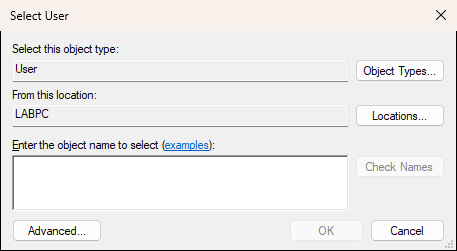
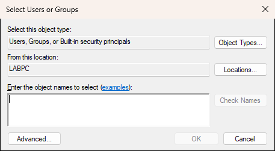

# Show-WindowsObjectPicker

## SYNOPSIS
Shows the native Windows Object Picker dialog.

## SYNTAX

```
Show-WindowsObjectPicker [-ObjectType] <String[]> [-MultiSelect] [[-ParentWindow] <Window>]
 [<CommonParameters>]
```

## DESCRIPTION
Wraps the Windows DSObjectPicker COM component to display the standard "Select Users, Computers, or Groups" dialog. Computer selection requires domain membership.

## EXAMPLES

### EXAMPLE 1
```
Show-WindowsObjectPicker -ObjectType User
# Opens the user picker, returns an object with Name, Domain, Type, UPN
```

<p align="center"></p>

### EXAMPLE 2
```
Show-WindowsObjectPicker -ObjectType User, Group -MultiSelect
# Opens picker for users and groups with multi-select
```

<p align="center"></p>

### EXAMPLE 3
```
Show-WindowsObjectPicker -ObjectType Computer -MultiSelect
# Opens computer picker with multi-select on a domain-joined machine
```

## PARAMETERS

### -ObjectType
The type(s) of object to select. Can be one or more of: Computer, User, Group. Use array to allow multiple types, e.g., @('User', 'Group')

<details><summary>Type: String[] (required)</summary>

```yaml
Type: String[]
Parameter Sets: (All)
Aliases:

Required: True
Position: 1
Default value: None
Accept pipeline input: False
Accept wildcard characters: False
```

</details>

### -MultiSelect
Allow selecting multiple objects. Returns array when enabled.

<details><summary>Type: SwitchParameter (optional)</summary>

```yaml
Type: SwitchParameter
Parameter Sets: (All)
Aliases:

Required: False
Position: Named
Default value: False
Accept pipeline input: False
Accept wildcard characters: False
```

</details>

### -ParentWindow
Optional WPF window to use as the dialog parent.

<details><summary>Type: Window (optional)</summary>

```yaml
Type: Window
Parameter Sets: (All)
Aliases:

Required: False
Position: 2
Default value: None
Accept pipeline input: False
Accept wildcard characters: False
```

</details>

### CommonParameters
This cmdlet supports the common parameters: -Debug, -ErrorAction, -ErrorVariable, -InformationAction, -InformationVariable, -OutVariable, -OutBuffer, -PipelineVariable, -Verbose, -WarningAction, and -WarningVariable. For more information, see [about_CommonParameters](http://go.microsoft.com/fwlink/?LinkID=113216).

## INPUTS

## OUTPUTS

## NOTES

## RELATED LINKS
