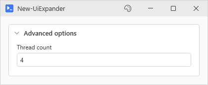
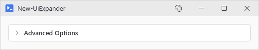
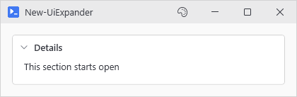

# New-UiExpander

<p align="center"></p>

## SYNOPSIS
Creates a collapsible expander section with a header and content area.

## SYNTAX

```
New-UiExpander [-Header] <String> [-Content] <ScriptBlock> [-IsExpanded] [[-Variable] <String>]
 [[-EnabledWhen] <Object>] [-ClearIfDisabled] [[-WPFProperties] <Hashtable>]
 [<CommonParameters>]
```

## DESCRIPTION
Creates a theme-aware collapsible section. Click the header to toggle visibility of the content. Built from primitives for proper dark theme support.

## EXAMPLES

### EXAMPLE 1
```
New-UiExpander -Header 'Advanced Options' -Content {
    New-UiToggle -Label 'Enable logging' -Variable 'enableLog'
    New-UiToggle -Label 'Verbose mode' -Variable 'verbose'
}
```

<p align="center"></p>

### EXAMPLE 2
```
New-UiExpander -Header 'Details' -IsExpanded -Content {
    New-UiLabel -Text 'This section starts open'
}
```

<p align="center"></p>

## PARAMETERS

### -Header
The text displayed in the expander header.

<details><summary>Type: String (required)</summary>

```yaml
Type: String
Parameter Sets: (All)
Aliases:

Required: True
Position: 1
Default value: None
Accept pipeline input: False
Accept wildcard characters: False
```

</details>

### -Content
Scriptblock containing the UI elements to show when expanded.

<details><summary>Type: ScriptBlock (required)</summary>

```yaml
Type: ScriptBlock
Parameter Sets: (All)
Aliases:

Required: True
Position: 2
Default value: None
Accept pipeline input: False
Accept wildcard characters: False
```

</details>

### -IsExpanded
Start with the expander open. Default is collapsed.

<details><summary>Type: SwitchParameter (optional)</summary>

```yaml
Type: SwitchParameter
Parameter Sets: (All)
Aliases:

Required: False
Position: Named
Default value: False
Accept pipeline input: False
Accept wildcard characters: False
```

</details>

### -Variable
Variable name for accessing this control in button actions.

<details><summary>Type: String (optional)</summary>

```yaml
Type: String
Parameter Sets: (All)
Aliases:

Required: False
Position: 3
Default value: None
Accept pipeline input: False
Accept wildcard characters: False
```

</details>

### -EnabledWhen
Conditional enabling based on another control's state. Accepts either:
- A control proxy (e.g., $toggleControl) - enables when that control is truthy
- A scriptblock (e.g., { $toggle -and $userName }) - enables when expression is true

Truthy values: CheckBox=checked, TextBox=non-empty, ComboBox=has selection.

<details><summary>Type: Object (optional)</summary>

```yaml
Type: Object
Parameter Sets: (All)
Aliases:

Required: False
Position: 4
Default value: None
Accept pipeline input: False
Accept wildcard characters: False
```

</details>

### -ClearIfDisabled
Accepted alongside -EnabledWhen for consistency, but an expander has nothing to clear: disabling leaves it exactly as it was.

<details><summary>Type: SwitchParameter (optional)</summary>

```yaml
Type: SwitchParameter
Parameter Sets: (All)
Aliases:

Required: False
Position: Named
Default value: False
Accept pipeline input: False
Accept wildcard characters: False
```

</details>

### -WPFProperties
Hashtable of additional WPF properties to set on the control.

<details><summary>Type: Hashtable (optional)</summary>

```yaml
Type: Hashtable
Parameter Sets: (All)
Aliases:

Required: False
Position: 5
Default value: None
Accept pipeline input: False
Accept wildcard characters: False
```

</details>

### CommonParameters
This cmdlet supports the common parameters: -Debug, -ErrorAction, -ErrorVariable, -InformationAction, -InformationVariable, -OutVariable, -OutBuffer, -PipelineVariable, -Verbose, -WarningAction, and -WarningVariable. For more information, see [about_CommonParameters](http://go.microsoft.com/fwlink/?LinkID=113216).

## INPUTS

## OUTPUTS

## NOTES

## RELATED LINKS
