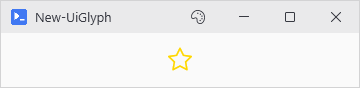
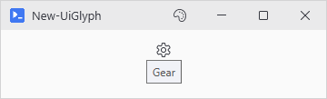
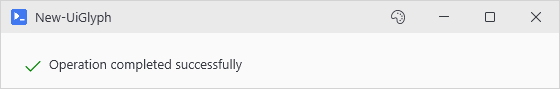

# New-UiGlyph

## SYNOPSIS
Creates a glyph icon from the active icon font.

## SYNTAX

```
New-UiGlyph [-Name] <String> [[-Size] <Double>] [[-Color] <String>] [-ShowTooltip]
 [[-WPFProperties] <Hashtable>] [<CommonParameters>]
```

## DESCRIPTION
Displays an icon from the built-in icon library with optional tooltip showing the glyph name.

## EXAMPLES

### EXAMPLE 1
```
New-UiGlyph -Name 'Star' -Size 24 -Color 'Gold'
```

<p align="center"></p>

### EXAMPLE 2
```
New-UiGlyph -Name 'Gear' -ShowTooltip
```

<p align="center"></p>

### EXAMPLE 3
```
New-UiPanel -Orientation Horizontal -Content {
    New-UiGlyph -Name 'CircleCheck' -Color 'Green' -Size 20
    New-UiLabel -Text 'Operation completed successfully'
}
```

<p align="center"></p>

## PARAMETERS

### -Name
The name of the glyph to display (e.g., 'Star', 'Heart', 'Gear'). Use Show-UiGlyphBrowser to see all available glyphs.

<details><summary>Type: String (required)</summary>

```yaml
Type: String
Parameter Sets: (All)
Aliases:

Required: True
Position: 1
Default value: None
Accept pipeline input: False
Accept wildcard characters: False
```

</details>

### -Size
Font size for the glyph. Default is 16.

<details><summary>Type: Double (optional)</summary>

```yaml
Type: Double
Parameter Sets: (All)
Aliases:

Required: False
Position: 2
Default value: 16
Accept pipeline input: False
Accept wildcard characters: False
```

</details>

### -Color
Color for the glyph. Can be a color name ('Red'), hex ('#FF0000'), or theme key ('Accent'). Defaults to the current theme's ControlFg color.

<details><summary>Type: String (optional)</summary>

```yaml
Type: String
Parameter Sets: (All)
Aliases:

Required: False
Position: 3
Default value: None
Accept pipeline input: False
Accept wildcard characters: False
```

</details>

### -ShowTooltip
If specified, shows the glyph name as a tooltip on hover.

<details><summary>Type: SwitchParameter (optional)</summary>

```yaml
Type: SwitchParameter
Parameter Sets: (All)
Aliases:

Required: False
Position: Named
Default value: False
Accept pipeline input: False
Accept wildcard characters: False
```

</details>

### -WPFProperties
Hashtable of additional WPF properties to set on the control.

<details><summary>Type: Hashtable (optional)</summary>

```yaml
Type: Hashtable
Parameter Sets: (All)
Aliases:

Required: False
Position: 4
Default value: None
Accept pipeline input: False
Accept wildcard characters: False
```

</details>

### CommonParameters
This cmdlet supports the common parameters: -Debug, -ErrorAction, -ErrorVariable, -InformationAction, -InformationVariable, -OutVariable, -OutBuffer, -PipelineVariable, -Verbose, -WarningAction, and -WarningVariable. For more information, see [about_CommonParameters](http://go.microsoft.com/fwlink/?LinkID=113216).

## INPUTS

## OUTPUTS

## NOTES

## RELATED LINKS
