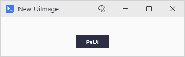

# New-UiImage

## SYNOPSIS
Displays an image from file or base64.

## SYNTAX

### Path (Default)
```
New-UiImage -Path <String> [-Width <Int32>] [-Height <Int32>] [-WPFProperties <Hashtable>]
 [<CommonParameters>]
```

### Base64
```
New-UiImage -Base64 <String> [-Width <Int32>] [-Height <Int32>] [-WPFProperties <Hashtable>]
 [<CommonParameters>]
```

## DESCRIPTION
Shows an image from a file path or a base64 string. Aspect ratio is always preserved: give one dimension and the other follows, give both and the image fits inside the box.

## EXAMPLES

### EXAMPLE 1
```
New-UiImage -Path 'C:\Photos\logo.png' -Width 200
```

<p align="center"></p>

### EXAMPLE 2
```
New-UiImage -Base64 $encodedString -Width 64 -Height 64
```

<p align="center"></p>

## PARAMETERS

### -Path
File path to the image.

<details><summary>Type: String (required)</summary>

```yaml
Type: String
Parameter Sets: Path
Aliases:

Required: True
Position: Named
Default value: None
Accept pipeline input: False
Accept wildcard characters: False
```

</details>

### -Base64
Base64 encoded image data.

<details><summary>Type: String (required)</summary>

```yaml
Type: String
Parameter Sets: Base64
Aliases:

Required: True
Position: Named
Default value: None
Accept pipeline input: False
Accept wildcard characters: False
```

</details>

### -Width
Image width (maintains aspect ratio).

<details><summary>Type: Int32 (optional)</summary>

```yaml
Type: Int32
Parameter Sets: (All)
Aliases:

Required: False
Position: Named
Default value: 0
Accept pipeline input: False
Accept wildcard characters: False
```

</details>

### -Height
Image height in pixels. With Width also set, the image fits the box without stretching.

<details><summary>Type: Int32 (optional)</summary>

```yaml
Type: Int32
Parameter Sets: (All)
Aliases:

Required: False
Position: Named
Default value: 0
Accept pipeline input: False
Accept wildcard characters: False
```

</details>

### -WPFProperties
Hashtable of additional WPF properties to set on the control. Allows setting any valid WPF property not explicitly exposed as a parameter. Bad values warn and get skipped. A property name that does not exist on the control is skipped silently (-Verbose shows it). Nothing stops execution. Supports attached properties using dot notation (e.g., "Grid.Row").

<details><summary>Type: Hashtable (optional)</summary>

```yaml
Type: Hashtable
Parameter Sets: (All)
Aliases:

Required: False
Position: Named
Default value: None
Accept pipeline input: False
Accept wildcard characters: False
```

</details>

### CommonParameters
This cmdlet supports the common parameters: -Debug, -ErrorAction, -ErrorVariable, -InformationAction, -InformationVariable, -OutVariable, -OutBuffer, -PipelineVariable, -Verbose, -WarningAction, and -WarningVariable. For more information, see [about_CommonParameters](http://go.microsoft.com/fwlink/?LinkID=113216).

## INPUTS

## OUTPUTS

## NOTES

## RELATED LINKS
