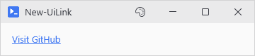
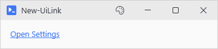

# New-UiLink

## SYNOPSIS
Creates a clickable hyperlink that opens a URL or runs a custom action.

## SYNTAX

```
New-UiLink [[-Text] <String>] [[-Url] <String>] [[-Action] <ScriptBlock>] [-NoUnderline]
 [[-WPFProperties] <Hashtable>] [<CommonParameters>]
```

## DESCRIPTION
Creates a TextBlock styled as a hyperlink with underline and accent color. By default opens the URL in the system browser. Use -Action for custom behavior.

## EXAMPLES

### EXAMPLE 1
```
New-UiLink -Url 'https://github.com' -Text 'Visit GitHub'
```

<p align="center"></p>

### EXAMPLE 2
```
New-UiLink -Text 'Open Settings' -Action { Show-SettingsDialog }
```

<p align="center"></p>

## PARAMETERS

### -Text
The display text for the link. Defaults to the URL if not specified.

<details><summary>Type: String (optional)</summary>

```yaml
Type: String
Parameter Sets: (All)
Aliases:

Required: False
Position: 1
Default value: None
Accept pipeline input: False
Accept wildcard characters: False
```

</details>

### -Url
The URL to open when clicked. Opens in the default browser; http and https only, anything else is blocked with a warning.

<details><summary>Type: String (optional)</summary>

```yaml
Type: String
Parameter Sets: (All)
Aliases:

Required: False
Position: 2
Default value: None
Accept pipeline input: False
Accept wildcard characters: False
```

</details>

### -Action
Custom scriptblock to run instead of opening a URL. Overrides -Url behavior.

<details><summary>Type: ScriptBlock (optional)</summary>

```yaml
Type: ScriptBlock
Parameter Sets: (All)
Aliases:

Required: False
Position: 3
Default value: None
Accept pipeline input: False
Accept wildcard characters: False
```

</details>

### -NoUnderline
Removes the underline decoration from the link text.

<details><summary>Type: SwitchParameter (optional)</summary>

```yaml
Type: SwitchParameter
Parameter Sets: (All)
Aliases:

Required: False
Position: Named
Default value: False
Accept pipeline input: False
Accept wildcard characters: False
```

</details>

### -WPFProperties
Hashtable of additional WPF properties to set on the control.

<details><summary>Type: Hashtable (optional)</summary>

```yaml
Type: Hashtable
Parameter Sets: (All)
Aliases:

Required: False
Position: 4
Default value: None
Accept pipeline input: False
Accept wildcard characters: False
```

</details>

### CommonParameters
This cmdlet supports the common parameters: -Debug, -ErrorAction, -ErrorVariable, -InformationAction, -InformationVariable, -OutVariable, -OutBuffer, -PipelineVariable, -Verbose, -WarningAction, and -WarningVariable. For more information, see [about_CommonParameters](http://go.microsoft.com/fwlink/?LinkID=113216).

## INPUTS

## OUTPUTS

## NOTES

## RELATED LINKS
