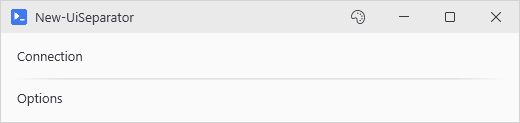

# New-UiSeparator

<p align="center"></p>

## SYNOPSIS
Adds a horizontal line separator with a gradient fade.

## SYNTAX

```
New-UiSeparator [[-Style] <String>] [[-Height] <Int32>] [[-TopMargin] <Int32>] [[-BottomMargin] <Int32>]
 [-FullWidth] [[-WPFProperties] <Hashtable>] [<CommonParameters>]
```

## DESCRIPTION
Draws a line between groups of controls. The default Fade style keeps it from reading like a 1998 hr tag. Solid is the only hard line - Accent is the same fade in the accent color.

## EXAMPLES

### EXAMPLE 1
```
New-UiSeparator
```

<p align="center"></p>

### EXAMPLE 2
```
New-UiSeparator -Style Accent
```

<p align="center"></p>

### EXAMPLE 3
```
New-UiSeparator -Style Solid
```

<p align="center"></p>

## PARAMETERS

### -Style
Visual style of the separator:
- Fade (default): Gradient that fades from transparent at edges to visible in center
- Solid: Simple solid line
- Accent: Uses accent color with fade effect

<details><summary>Type: String (optional)</summary>

```yaml
Type: String
Parameter Sets: (All)
Aliases:

Required: False
Position: 1
Default value: Fade
Accept pipeline input: False
Accept wildcard characters: False
```

</details>

### -Height
Line thickness in pixels. Defaults to 1.

<details><summary>Type: Int32 (optional)</summary>

```yaml
Type: Int32
Parameter Sets: (All)
Aliases:

Required: False
Position: 2
Default value: 1
Accept pipeline input: False
Accept wildcard characters: False
```

</details>

### -TopMargin
Space above the separator in pixels.

<details><summary>Type: Int32 (optional)</summary>

```yaml
Type: Int32
Parameter Sets: (All)
Aliases:

Required: False
Position: 3
Default value: 8
Accept pipeline input: False
Accept wildcard characters: False
```

</details>

### -BottomMargin
Space below the separator in pixels.

<details><summary>Type: Int32 (optional)</summary>

```yaml
Type: Int32
Parameter Sets: (All)
Aliases:

Required: False
Position: 4
Default value: 8
Accept pipeline input: False
Accept wildcard characters: False
```

</details>

### -FullWidth
Forces the separator to take full width in WrapPanel layouts.

<details><summary>Type: SwitchParameter (optional)</summary>

```yaml
Type: SwitchParameter
Parameter Sets: (All)
Aliases:

Required: False
Position: Named
Default value: False
Accept pipeline input: False
Accept wildcard characters: False
```

</details>

### -WPFProperties
Hashtable of additional WPF properties to set on the control.

<details><summary>Type: Hashtable (optional)</summary>

```yaml
Type: Hashtable
Parameter Sets: (All)
Aliases:

Required: False
Position: 5
Default value: None
Accept pipeline input: False
Accept wildcard characters: False
```

</details>

### CommonParameters
This cmdlet supports the common parameters: -Debug, -ErrorAction, -ErrorVariable, -InformationAction, -InformationVariable, -OutVariable, -OutBuffer, -PipelineVariable, -Verbose, -WarningAction, and -WarningVariable. For more information, see [about_CommonParameters](http://go.microsoft.com/fwlink/?LinkID=113216).

## INPUTS

## OUTPUTS

## NOTES

## RELATED LINKS
