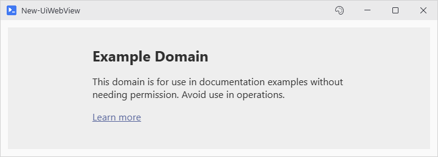
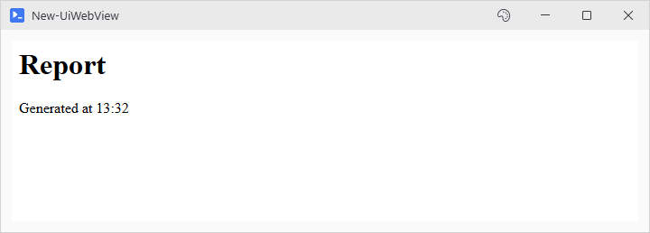

# New-UiWebView

## SYNOPSIS
Creates an embedded WebView2 browser control.

## SYNTAX

### Uri (Default)
```
New-UiWebView [[-Uri] <String>] [-Variable <String>] [-OnNavigated <ScriptBlock>] [-OnNavigating <ScriptBlock>]
 [-EnableScripts] [-EnableDevTools] [-EnableDownloads] [-Height <Int32>] [-MinHeight <Int32>]
 [-WPFProperties <Hashtable>] [<CommonParameters>]
```

### Html
```
New-UiWebView -Html <String> [-Variable <String>] [-OnNavigated <ScriptBlock>] [-OnNavigating <ScriptBlock>]
 [-EnableScripts] [-EnableDevTools] [-EnableDownloads] [-Height <Int32>] [-MinHeight <Int32>]
 [-WPFProperties <Hashtable>] [<CommonParameters>]
```

## DESCRIPTION
Embeds a Chromium browser via Microsoft Edge WebView2, for OAuth sign-ins, HTML reports, vendor dashboards inside a PsUi window.

Requires the WebView2 runtime to be installed on the system. If missing, displays an error message with installation instructions.

The view sits in a slot of fixed height and is trimmed to whatever part of that slot is on screen, so scrolling past it never draws the browser over its neighbours. Window size is left to the calling script.

## EXAMPLES

### EXAMPLE 1
```
New-UiWebView -Uri "https://example.com" -Variable "browser"
```

<p align="center"></p>

### EXAMPLE 2
```
$stamp = Get-Date -Format 'HH:mm'
New-UiWebView -Html ('<h1>Report</h1><p>Generated at ' + $stamp + '</p>')
```

<p align="center"></p>

### EXAMPLE 3
```
New-UiWebView -Uri $authUrl -OnNavigated {
    param($url)
    if ($url -match 'code=([^&]+)') {
        Set-UiCapturedVariable -Name 'authCode' -Value $Matches[1]
        Close-UiWindow
    }
}
# OAuth callback capture. With New-UiWindow -ExportOnClose, $authCode comes back to the script
```

## PARAMETERS

### -Uri
URL to load in the browser. Mutually exclusive with -Html.

<details><summary>Type: String (optional)</summary>

```yaml
Type: String
Parameter Sets: Uri
Aliases:

Required: False
Position: 1
Default value: None
Accept pipeline input: False
Accept wildcard characters: False
```

</details>

### -Html
Raw HTML content to render. Mutually exclusive with -Uri.

<details><summary>Type: String (required)</summary>

```yaml
Type: String
Parameter Sets: Html
Aliases:

Required: True
Position: Named
Default value: None
Accept pipeline input: False
Accept wildcard characters: False
```

</details>

### -Variable
Variable name to register the control for later access.

<details><summary>Type: String (optional)</summary>

```yaml
Type: String
Parameter Sets: (All)
Aliases:

Required: False
Position: Named
Default value: None
Accept pipeline input: False
Accept wildcard characters: False
```

</details>

### -OnNavigated
ScriptBlock to execute when navigation completes. Receives the URL as $args\[0]. Useful for OAuth callback detection.

<details><summary>Type: ScriptBlock (optional)</summary>

```yaml
Type: ScriptBlock
Parameter Sets: (All)
Aliases:

Required: False
Position: Named
Default value: None
Accept pipeline input: False
Accept wildcard characters: False
```

</details>

### -OnNavigating
ScriptBlock to execute before navigation starts. Receives the URL as $args\[0]. Return $false to cancel navigation. A throw in the block cancels it too.

<details><summary>Type: ScriptBlock (optional)</summary>

```yaml
Type: ScriptBlock
Parameter Sets: (All)
Aliases:

Required: False
Position: Named
Default value: None
Accept pipeline input: False
Accept wildcard characters: False
```

</details>

### -EnableScripts
Enable JavaScript execution. Disabled by default for security.

<details><summary>Type: SwitchParameter (optional)</summary>

```yaml
Type: SwitchParameter
Parameter Sets: (All)
Aliases:

Required: False
Position: Named
Default value: False
Accept pipeline input: False
Accept wildcard characters: False
```

</details>

### -EnableDevTools
Allow F12 developer tools. Disabled by default.

<details><summary>Type: SwitchParameter (optional)</summary>

```yaml
Type: SwitchParameter
Parameter Sets: (All)
Aliases:

Required: False
Position: Named
Default value: False
Accept pipeline input: False
Accept wildcard characters: False
```

</details>

### -EnableDownloads
Allow file downloads. Disabled by default.

<details><summary>Type: SwitchParameter (optional)</summary>

```yaml
Type: SwitchParameter
Parameter Sets: (All)
Aliases:

Required: False
Position: Named
Default value: False
Accept pipeline input: False
Accept wildcard characters: False
```

</details>

### -Height
Fixed height in pixels. Left out, the view pins to -MinHeight instead.

<details><summary>Type: Int32 (optional)</summary>

```yaml
Type: Int32
Parameter Sets: (All)
Aliases:

Required: False
Position: Named
Default value: 0
Accept pipeline input: False
Accept wildcard characters: False
```

</details>

### -MinHeight
Minimum height in pixels. Default is 200.

<details><summary>Type: Int32 (optional)</summary>

```yaml
Type: Int32
Parameter Sets: (All)
Aliases:

Required: False
Position: Named
Default value: 200
Accept pipeline input: False
Accept wildcard characters: False
```

</details>

### -WPFProperties
Hashtable of additional WPF properties. The keys that place the control in its parent (Margin, HorizontalAlignment, VerticalAlignment, Visibility, Width, MinWidth, MaxWidth, and attached values such as 'Grid.Row') apply to the element holding the view. Every other key, Tag and ZoomFactor alike, applies to the browser control. Height, MinHeight and MaxHeight are refused with a warning, because -Height and -MinHeight size the view.

<details><summary>Type: Hashtable (optional)</summary>

```yaml
Type: Hashtable
Parameter Sets: (All)
Aliases:

Required: False
Position: Named
Default value: None
Accept pipeline input: False
Accept wildcard characters: False
```

</details>

### CommonParameters
This cmdlet supports the common parameters: -Debug, -ErrorAction, -ErrorVariable, -InformationAction, -InformationVariable, -OutVariable, -OutBuffer, -PipelineVariable, -Verbose, -WarningAction, and -WarningVariable. For more information, see [about_CommonParameters](http://go.microsoft.com/fwlink/?LinkID=113216).

## INPUTS

## OUTPUTS

## NOTES

## RELATED LINKS
