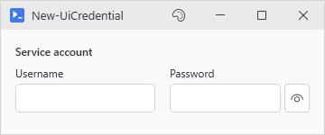
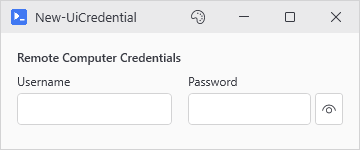
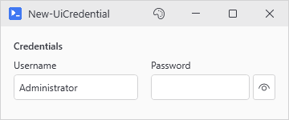
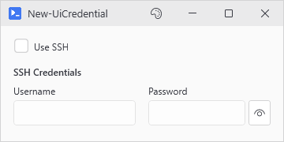
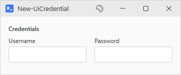

# New-UiCredential

<p align="center"></p>

## SYNOPSIS
Creates a credential input consisting of username and password fields.

## SYNTAX

```
New-UiCredential [-Variable] <String> [[-Label] <String>] [[-UserLabel] <String>] [[-PasswordLabel] <String>]
 [[-DefaultUsername] <String>] [-NoPeek] [[-EnabledWhen] <Object>] [-ClearIfDisabled]
 [[-SubmitButton] <String>] [[-WPFProperties] <Hashtable>]
 [<CommonParameters>]
```

## DESCRIPTION
Creates a pair of input fields for capturing credentials. The username field is a standard text input, while the password field is masked and carries the same eye button as New-UiInput -Password (hold to reveal, -NoPeek turns it off). In -Action blocks, the hydrated variable contains a PSCredential object.

## EXAMPLES

### EXAMPLE 1
```
New-UiCredential -Variable 'creds' -Label 'Remote Computer Credentials'
# In -Action: $creds contains PSCredential
```

<p align="center"></p>

### EXAMPLE 2
```
New-UiCredential -Variable 'adminCreds' -DefaultUsername 'Administrator'
```

<p align="center"></p>

### EXAMPLE 3
```
New-UiCredential -Variable 'sshCreds' -Label 'SSH Credentials' -EnabledWhen 'useSSH'
# Enabled only when the 'useSSH' toggle is checked
```

<p align="center"></p>

### EXAMPLE 4
```
New-UiCredential -Variable 'kioskCreds' -NoPeek
# No reveal button - for tools that run on a screen other people watch
```

<p align="center"></p>

## PARAMETERS

### -Variable
The variable name to register. The hydrated variable contains PSCredential.

<details><summary>Type: String (required)</summary>

```yaml
Type: String
Parameter Sets: (All)
Aliases:

Required: True
Position: 1
Default value: None
Accept pipeline input: False
Accept wildcard characters: False
```

</details>

### -Label
Optional label displayed above the credential fields. Defaults to "Credentials".

<details><summary>Type: String (optional)</summary>

```yaml
Type: String
Parameter Sets: (All)
Aliases:

Required: False
Position: 2
Default value: Credentials
Accept pipeline input: False
Accept wildcard characters: False
```

</details>

### -UserLabel
Label for the username field. Defaults to "Username".

<details><summary>Type: String (optional)</summary>

```yaml
Type: String
Parameter Sets: (All)
Aliases:

Required: False
Position: 3
Default value: Username
Accept pipeline input: False
Accept wildcard characters: False
```

</details>

### -PasswordLabel
Label for the password field. Defaults to "Password".

<details><summary>Type: String (optional)</summary>

```yaml
Type: String
Parameter Sets: (All)
Aliases:

Required: False
Position: 4
Default value: Password
Accept pipeline input: False
Accept wildcard characters: False
```

</details>

### -DefaultUsername
Default value for the username field.

<details><summary>Type: String (optional)</summary>

```yaml
Type: String
Parameter Sets: (All)
Aliases:

Required: False
Position: 5
Default value: None
Accept pipeline input: False
Accept wildcard characters: False
```

</details>

### -NoPeek
Hide the peek button on the password field. By default an eye icon next to the field reveals the password while held.

<details><summary>Type: SwitchParameter (optional)</summary>

```yaml
Type: SwitchParameter
Parameter Sets: (All)
Aliases:

Required: False
Position: Named
Default value: False
Accept pipeline input: False
Accept wildcard characters: False
```

</details>

### -EnabledWhen
Conditional enabling based on another control's state. Accepts either:
- A variable name string (e.g., 'evalVCSA') - enables when that control is truthy
- A scriptblock (e.g., { $evalPhoton -or $evalAlma }) - enables when expression is true

Truthy values: CheckBox=checked, TextBox=non-empty, ComboBox=has selection.

<details><summary>Type: Object (optional)</summary>

```yaml
Type: Object
Parameter Sets: (All)
Aliases:

Required: False
Position: 6
Default value: None
Accept pipeline input: False
Accept wildcard characters: False
```

</details>

### -ClearIfDisabled
Accepted alongside -EnabledWhen, but the clear currently never fires. The credential fields keep their values when disabled either way.

<details><summary>Type: SwitchParameter (optional)</summary>

```yaml
Type: SwitchParameter
Parameter Sets: (All)
Aliases:

Required: False
Position: Named
Default value: False
Accept pipeline input: False
Accept wildcard characters: False
```

</details>

### -SubmitButton
Name of a registered button to trigger when Enter is pressed in the password field. The button must be created with -Variable to register it for lookup. Works with both New-UiButton and New-UiActionCard buttons.

<details><summary>Type: String (optional)</summary>

```yaml
Type: String
Parameter Sets: (All)
Aliases:

Required: False
Position: 7
Default value: None
Accept pipeline input: False
Accept wildcard characters: False
```

</details>

### -WPFProperties
Hashtable of additional WPF properties to apply to the container.

<details><summary>Type: Hashtable (optional)</summary>

```yaml
Type: Hashtable
Parameter Sets: (All)
Aliases:

Required: False
Position: 8
Default value: None
Accept pipeline input: False
Accept wildcard characters: False
```

</details>

### CommonParameters
This cmdlet supports the common parameters: -Debug, -ErrorAction, -ErrorVariable, -InformationAction, -InformationVariable, -OutVariable, -OutBuffer, -PipelineVariable, -Verbose, -WarningAction, and -WarningVariable. For more information, see [about_CommonParameters](http://go.microsoft.com/fwlink/?LinkID=113216).

## INPUTS

## OUTPUTS

## NOTES

## RELATED LINKS
