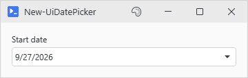
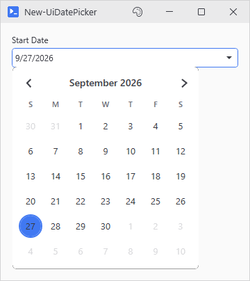
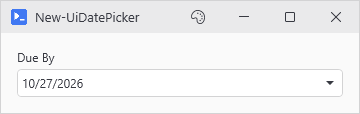

# New-UiDatePicker

<p align="center"></p>

## SYNOPSIS
Creates a date picker control.

## SYNTAX

```
New-UiDatePicker [-Variable] <String> [[-Label] <String>] [[-Default] <DateTime>] [-FullWidth]
 [[-EnabledWhen] <Object>] [-ClearIfDisabled] [[-WPFProperties] <Hashtable>]
 [<CommonParameters>]
```

## DESCRIPTION
Labeled date picker with a calendar dropdown, themed to match the rest of the window. The selected date is available in actions through -Variable as a DateTime.

## EXAMPLES

### EXAMPLE 1
```
New-UiDatePicker -Variable 'startDate' -Label 'Start Date'
```

<p align="center"></p>

### EXAMPLE 2
```
New-UiDatePicker -Variable 'dueDate' -Label 'Due By' -Default (Get-Date).AddDays(30)
```

<p align="center"></p>

## PARAMETERS

### -Variable
Variable name to store the date.

<details><summary>Type: String (required)</summary>

```yaml
Type: String
Parameter Sets: (All)
Aliases:

Required: True
Position: 1
Default value: None
Accept pipeline input: False
Accept wildcard characters: False
```

</details>

### -Label
Label text.

<details><summary>Type: String (optional)</summary>

```yaml
Type: String
Parameter Sets: (All)
Aliases:

Required: False
Position: 2
Default value: None
Accept pipeline input: False
Accept wildcard characters: False
```

</details>

### -Default
Initial date value.

<details><summary>Type: DateTime (optional)</summary>

```yaml
Type: DateTime
Parameter Sets: (All)
Aliases:

Required: False
Position: 3
Default value: [datetime]::Today
Accept pipeline input: False
Accept wildcard characters: False
```

</details>

### -FullWidth
Stretches the control to fill available width instead of fixed sizing.

<details><summary>Type: SwitchParameter (optional)</summary>

```yaml
Type: SwitchParameter
Parameter Sets: (All)
Aliases:

Required: False
Position: Named
Default value: False
Accept pipeline input: False
Accept wildcard characters: False
```

</details>

### -EnabledWhen
Conditional enabling based on another control's state. Accepts either:
- A control proxy (e.g., $toggleControl) - enables when that control is truthy
- A scriptblock (e.g., { $toggle -and $userName }) - enables when expression is true

Truthy values: CheckBox=checked, TextBox=non-empty, ComboBox=has selection.

<details><summary>Type: Object (optional)</summary>

```yaml
Type: Object
Parameter Sets: (All)
Aliases:

Required: False
Position: 4
Default value: None
Accept pipeline input: False
Accept wildcard characters: False
```

</details>

### -ClearIfDisabled
When used with -EnabledWhen, clears the selected date when the control becomes disabled.

<details><summary>Type: SwitchParameter (optional)</summary>

```yaml
Type: SwitchParameter
Parameter Sets: (All)
Aliases:

Required: False
Position: Named
Default value: False
Accept pipeline input: False
Accept wildcard characters: False
```

</details>

### -WPFProperties
Hashtable of additional WPF properties to set on the control. Allows setting any valid WPF property not explicitly exposed as a parameter. Bad values warn and get skipped. A property name that does not exist on the control is skipped silently (-Verbose shows it). Nothing stops execution. Supports attached properties using dot notation (e.g., "Grid.Row").

<details><summary>Type: Hashtable (optional)</summary>

```yaml
Type: Hashtable
Parameter Sets: (All)
Aliases:

Required: False
Position: 5
Default value: None
Accept pipeline input: False
Accept wildcard characters: False
```

</details>

### CommonParameters
This cmdlet supports the common parameters: -Debug, -ErrorAction, -ErrorVariable, -InformationAction, -InformationVariable, -OutVariable, -OutBuffer, -PipelineVariable, -Verbose, -WarningAction, and -WarningVariable. For more information, see [about_CommonParameters](http://go.microsoft.com/fwlink/?LinkID=113216).

## INPUTS

## OUTPUTS

## NOTES

## RELATED LINKS
