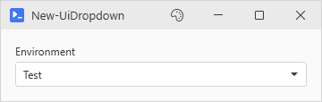
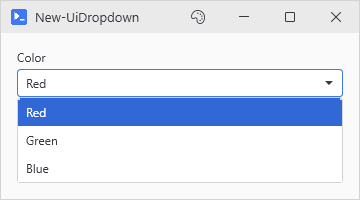
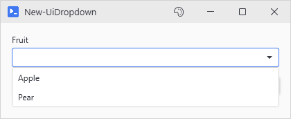
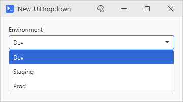

# New-UiDropdown

<p align="center"></p>

## SYNOPSIS
Creates a dropdown selection control.

## SYNTAX

```
New-UiDropdown [-Label] <String> [-Variable] <String> [[-Items] <String[]>] [[-Default] <String>]
 [-CaptureScrollWheel] [-FullWidth] [[-EnabledWhen] <Object>] [-ClearIfDisabled] [[-OnChange] <ScriptBlock>]
 [[-WPFProperties] <Hashtable>] [[-ItemsSource] <Object>] [-NoBind] [[-ScrollWheel] <String>]
 [<CommonParameters>]
```

## DESCRIPTION
Creates a labeled ComboBox for selecting from a list of items.

## EXAMPLES

### EXAMPLE 1
```
New-UiDropdown -Label "Color" -Variable "color" -Items @('Red','Green','Blue') -WPFProperties @{ ToolTip = "Pick a color" }
```

<p align="center"></p>

### EXAMPLE 2
```
# Choices that fill in later. $fruits is the threadsafe list after the call.
$fruits = [System.Collections.Generic.List[object]]::new()
New-UiDropdown -Label "Fruit" -Variable "fruit" -ItemsSource $fruits
New-UiButton -Text "Load" -Action { 'Apple', 'Pear' | ForEach-Object { $fruits.Add($_) } }
```

<p align="center"></p>

### EXAMPLE 3
```
New-UiDropdown -Label "Environment" -Variable "env" -Items @('Dev','Staging','Prod') -OnChange {
    param($selected)
    Write-Host "Switched to: $selected"
}
```

<p align="center"></p>

## PARAMETERS

### -Label
Label text displayed above the dropdown.

<details><summary>Type: String (required)</summary>

```yaml
Type: String
Parameter Sets: (All)
Aliases:

Required: True
Position: 1
Default value: None
Accept pipeline input: False
Accept wildcard characters: False
```

</details>

### -Variable
Variable name to store selection.

<details><summary>Type: String (required)</summary>

```yaml
Type: String
Parameter Sets: (All)
Aliases:

Required: True
Position: 2
Default value: None
Accept pipeline input: False
Accept wildcard characters: False
```

</details>

### -Items
Array of selectable items. Mutually exclusive with ItemsSource.

<details><summary>Type: String[] (optional)</summary>

```yaml
Type: String[]
Parameter Sets: (All)
Aliases:

Required: False
Position: 3
Default value: None
Accept pipeline input: False
Accept wildcard characters: False
```

</details>

### -Default
Initially selected item. Matched against the choices without regard to source, whether they came from -Items or a prefilled -ItemsSource. A source that fills after the window is built stays unselected, since selecting mid feed would fire -OnChange and flip -EnabledWhen while the feed is still running.

<details><summary>Type: String (optional)</summary>

```yaml
Type: String
Parameter Sets: (All)
Aliases:

Required: False
Position: 4
Default value: None
Accept pipeline input: False
Accept wildcard characters: False
```

</details>

### -CaptureScrollWheel
Same as -ScrollWheel Capture.

<details><summary>Type: SwitchParameter (optional)</summary>

```yaml
Type: SwitchParameter
Parameter Sets: (All)
Aliases:

Required: False
Position: Named
Default value: False
Accept pipeline input: False
Accept wildcard characters: False
```

</details>

### -FullWidth
Forces the control to take full width in WrapPanel layouts.

<details><summary>Type: SwitchParameter (optional)</summary>

```yaml
Type: SwitchParameter
Parameter Sets: (All)
Aliases:

Required: False
Position: Named
Default value: False
Accept pipeline input: False
Accept wildcard characters: False
```

</details>

### -EnabledWhen
Conditional enabling based on another control's state. Accepts either:
- A control proxy (e.g., $toggleControl) - enables when that control is truthy
- A scriptblock (e.g., { $toggle -and $userName }) - enables when expression is true

Truthy values: CheckBox=checked, TextBox=non-empty, ComboBox=has selection.

<details><summary>Type: Object (optional)</summary>

```yaml
Type: Object
Parameter Sets: (All)
Aliases:

Required: False
Position: 5
Default value: None
Accept pipeline input: False
Accept wildcard characters: False
```

</details>

### -ClearIfDisabled
When used with -EnabledWhen, resets the dropdown selection when it becomes disabled.

<details><summary>Type: SwitchParameter (optional)</summary>

```yaml
Type: SwitchParameter
Parameter Sets: (All)
Aliases:

Required: False
Position: Named
Default value: False
Accept pipeline input: False
Accept wildcard characters: False
```

</details>

### -OnChange
ScriptBlock to execute when the selection changes. Receives the new selection value as the first parameter.

<details><summary>Type: ScriptBlock (optional)</summary>

```yaml
Type: ScriptBlock
Parameter Sets: (All)
Aliases:

Required: False
Position: 6
Default value: None
Accept pipeline input: False
Accept wildcard characters: False
```

</details>

### -WPFProperties
Hashtable of additional WPF properties to set on the control. Allows setting any valid WPF property not explicitly exposed as a parameter. Bad values warn and get skipped. A property name that does not exist on the control is skipped silently (-Verbose shows it). Nothing stops execution. Supports attached properties using dot notation (e.g., "Grid.Row").

<details><summary>Type: Hashtable (optional)</summary>

```yaml
Type: Hashtable
Parameter Sets: (All)
Aliases:

Required: False
Position: 7
Default value: None
Accept pipeline input: False
Accept wildcard characters: False
```

</details>

### -ItemsSource
A collection to show as the choices, for choices that change at runtime. Anything that isn't already a PsUi threadsafe collection gets wrapped in one, and the variable is repointed at the wrap so $choices.Add() from a background action shows up. The wrap is no longer the type passed in, so .AddRange(), .Sort() and -is \[ArrayList] stop working. A \[ref] has its .Value repointed instead. Items display through ToString(), so keep them strings. -NoBind skips the repoint.

<details><summary>Type: Object (optional)</summary>

```yaml
Type: Object
Parameter Sets: (All)
Aliases:

Required: False
Position: 8
Default value: None
Accept pipeline input: False
Accept wildcard characters: False
```

</details>

### -NoBind
Skip the repoint. The dropdown still shows the wrap, the original keeps its own identity, and the two only stay in step while the mirror holds.

<details><summary>Type: SwitchParameter (optional)</summary>

```yaml
Type: SwitchParameter
Parameter Sets: (All)
Aliases:

Required: False
Position: Named
Default value: False
Accept pipeline input: False
Accept wildcard characters: False
```

</details>

### -ScrollWheel
Says what gets the scrollwheel while the cursor is over a closed dropdown. Page, the default, scrolls the page under the cursor. Capture steps the selection instead, whether or not the dropdown has been clicked. An open dropdown list scrolls itself either way.

<details><summary>Type: String (optional)</summary>

```yaml
Type: String
Parameter Sets: (All)
Aliases:

Required: False
Position: 9
Default value: Page
Accept pipeline input: False
Accept wildcard characters: False
```

</details>

### CommonParameters
This cmdlet supports the common parameters: -Debug, -ErrorAction, -ErrorVariable, -InformationAction, -InformationVariable, -OutVariable, -OutBuffer, -PipelineVariable, -Verbose, -WarningAction, and -WarningVariable. For more information, see [about_CommonParameters](http://go.microsoft.com/fwlink/?LinkID=113216).

## INPUTS

## OUTPUTS

## NOTES

## RELATED LINKS
