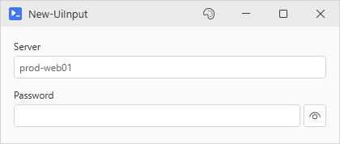
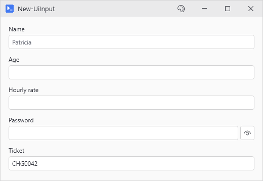
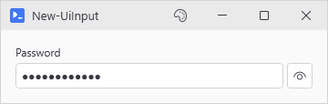
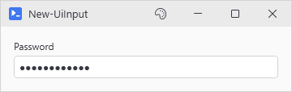
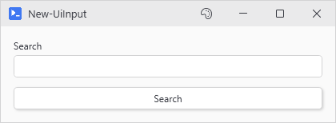
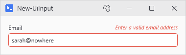
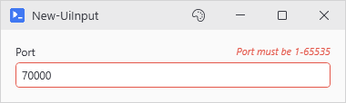
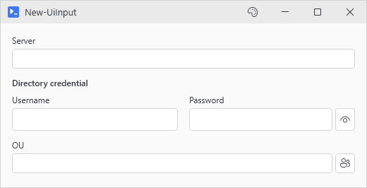

# New-UiInput

<p align="center"></p>

## SYNOPSIS
Creates a labeled text input field.

## SYNTAX

```
New-UiInput [-Label] <String> [-Variable] <String> [[-Default] <String>] [[-InputType] <String>] [-Password]
 [-Secure] [-NoPeek] [-Required] [[-Validate] <ScriptBlock>] [[-ValidatePattern] <String>]
 [[-ErrorMessage] <String>] [-ValidateOnChange] [[-Placeholder] <String>] [-FullWidth]
 [[-HelperButton] <String>] [[-HelperOptions] <Hashtable>] [[-EnabledWhen] <Object>] [-ClearIfDisabled]
 [-ReadOnly] [[-SubmitButton] <String>] [[-WPFProperties] <Hashtable>]
 [<CommonParameters>]
```

## DESCRIPTION
Creates a TextBox or PasswordBox with a label above it. When -Secure or -Password is used, input is masked and the hydrated variable contains a SecureString instead of plain text.

## EXAMPLES

### EXAMPLE 1
```
# The common flavors in one form
New-UiInput -Label 'Name' -Variable 'name' -Placeholder 'Patricia'
New-UiInput -Label 'Age' -Variable 'age' -InputType Int
New-UiInput -Label 'Hourly rate' -Variable 'rate' -InputType Double
New-UiInput -Label 'Password' -Variable 'pass' -Secure
New-UiInput -Label 'Ticket' -Variable 'ticket' -Default 'CHG0042' -ReadOnly
```

<p align="center"></p>

### EXAMPLE 2
```
New-UiInput -Label "Password" -Variable "userPassword" -Secure
# Password field with peek button; $userPassword contains SecureString
```

<p align="center"></p>

### EXAMPLE 3
```
New-UiInput -Label "Password" -Variable "userPassword" -Password -NoPeek
# Password field without peek button
```

<p align="center"></p>

### EXAMPLE 4
```
New-UiInput -Label "Search" -Variable "searchTerm" -SubmitButton "searchBtn"
New-UiButton -Text "Search" -Variable "searchBtn" -Action { Write-Host "Searching for $searchTerm" }
# Pressing Enter in the input triggers the Search button
```

<p align="center"></p>

### EXAMPLE 5
```
New-UiInput -Label "Email" -Variable "userEmail" -ValidatePattern '^[\w.+-]+@[\w.-]+\.\w+$' -ErrorMessage 'Enter a valid email address'
# Shows red border and error text if email format is wrong
```

<p align="center"></p>

### EXAMPLE 6
```
New-UiInput -Label "Port" -Variable "portNum" -InputType Int -Validate { param($val) [int]$val -ge 1 -and [int]$val -le 65535 } -ErrorMessage 'Port must be 1-65535'
# Custom validation with scriptblock
```

<p align="center"></p>

### EXAMPLE 7
```
New-UiInput -Label "Server" -Variable "dcServer"
New-UiCredential -Label "Directory credential" -Variable "dirCreds"
New-UiInput -Label "OU" -Variable "targetOU" -HelperButton OUPicker -HelperOptions @{ Server = 'dcServer'; Credential = 'dirCreds' }
# Picker reads both controls at click time. A Server without a Credential entry pops a credential dialog first.
```

<p align="center"></p>

## PARAMETERS

### -Label
Label shown above the input.

<details><summary>Type: String (required)</summary>

```yaml
Type: String
Parameter Sets: (All)
Aliases:

Required: True
Position: 1
Default value: None
Accept pipeline input: False
Accept wildcard characters: False
```

</details>

### -Variable
Variable name to store the value.

<details><summary>Type: String (required)</summary>

```yaml
Type: String
Parameter Sets: (All)
Aliases:

Required: True
Position: 2
Default value: None
Accept pipeline input: False
Accept wildcard characters: False
```

</details>

### -Default
Initial value.

<details><summary>Type: String (optional)</summary>

```yaml
Type: String
Parameter Sets: (All)
Aliases:

Required: False
Position: 3
Default value: None
Accept pipeline input: False
Accept wildcard characters: False
```

</details>

### -InputType
Type of input validation to apply. Restricts character entry based on type:
- String: No restrictions (default)
- Int: Only digits and optional leading minus sign
- Double: Digits, single decimal point, and optional leading minus sign
- Email: Blocks whitespace on typing and paste. Pair with -ValidatePattern for the real format check.
- Phone: Digits, spaces, dashes, parentheses, and plus sign
- Alphanumeric: Only letters and numbers
- Path: Valid file path characters

<details><summary>Type: String (optional)</summary>

```yaml
Type: String
Parameter Sets: (All)
Aliases:

Required: False
Position: 4
Default value: String
Accept pipeline input: False
Accept wildcard characters: False
```

</details>

### -Password
Mask input as password. Hydrated variable contains SecureString. By default, includes a peek button (eye icon) to reveal password while held.

<details><summary>Type: SwitchParameter (optional)</summary>

```yaml
Type: SwitchParameter
Parameter Sets: (All)
Aliases:

Required: False
Position: Named
Default value: False
Accept pipeline input: False
Accept wildcard characters: False
```

</details>

### -Secure
Alias for -Password. Mask input; hydrated variable contains SecureString.

<details><summary>Type: SwitchParameter (optional)</summary>

```yaml
Type: SwitchParameter
Parameter Sets: (All)
Aliases:

Required: False
Position: Named
Default value: False
Accept pipeline input: False
Accept wildcard characters: False
```

</details>

### -NoPeek
Hide the peek button on password fields. By default, password fields show an eye icon that reveals the password while held. Use this to disable it. Only valid with -Password or -Secure.

<details><summary>Type: SwitchParameter (optional)</summary>

```yaml
Type: SwitchParameter
Parameter Sets: (All)
Aliases:

Required: False
Position: Named
Default value: False
Accept pipeline input: False
Accept wildcard characters: False
```

</details>

### -Required
Mark the field as required with an asterisk.

<details><summary>Type: SwitchParameter (optional)</summary>

```yaml
Type: SwitchParameter
Parameter Sets: (All)
Aliases:

Required: False
Position: Named
Default value: False
Accept pipeline input: False
Accept wildcard characters: False
```

</details>

### -Validate
ScriptBlock for custom validation when given the input value as $args\[0]. Return $true if valid, $false or throw if not. -ErrorMessage sets the message shown. Without it, an error the block wrote before failing shows in the field.

<details><summary>Type: ScriptBlock (optional)</summary>

```yaml
Type: ScriptBlock
Parameter Sets: (All)
Aliases:

Required: False
Position: 5
Default value: None
Accept pipeline input: False
Accept wildcard characters: False
```

</details>

### -ValidatePattern
Regex pattern the input must match. Shows error if input doesn't match. For simple pattern validation, prefer this over -Validate.

<details><summary>Type: String (optional)</summary>

```yaml
Type: String
Parameter Sets: (All)
Aliases:

Required: False
Position: 6
Default value: None
Accept pipeline input: False
Accept wildcard characters: False
```

</details>

### -ErrorMessage
Custom error message shown when validation fails. Defaults to "Invalid input" for -Validate or "Doesn't match required format" for -ValidatePattern.

<details><summary>Type: String (optional)</summary>

```yaml
Type: String
Parameter Sets: (All)
Aliases:

Required: False
Position: 7
Default value: None
Accept pipeline input: False
Accept wildcard characters: False
```

</details>

### -ValidateOnChange
Validate on each keystroke instead of only when focus leaves the control. Can feel aggressive; use sparingly for fields needing immediate feedback.

<details><summary>Type: SwitchParameter (optional)</summary>

```yaml
Type: SwitchParameter
Parameter Sets: (All)
Aliases:

Required: False
Position: Named
Default value: False
Accept pipeline input: False
Accept wildcard characters: False
```

</details>

### -Placeholder
Placeholder/watermark text shown when textbox is empty.

<details><summary>Type: String (optional)</summary>

```yaml
Type: String
Parameter Sets: (All)
Aliases:

Required: False
Position: 8
Default value: None
Accept pipeline input: False
Accept wildcard characters: False
```

</details>

### -FullWidth
Stretches the control to fill available width instead of fixed sizing.

<details><summary>Type: SwitchParameter (optional)</summary>

```yaml
Type: SwitchParameter
Parameter Sets: (All)
Aliases:

Required: False
Position: Named
Default value: False
Accept pipeline input: False
Accept wildcard characters: False
```

</details>

### -HelperButton
Adds a picker button next to the input. One of None, FilePicker, FolderPicker, AdvancedFolderPicker, ComputerPicker, UserPicker, GroupPicker, UserGroupPicker, or OUPicker.

<details><summary>Type: String (optional)</summary>

```yaml
Type: String
Parameter Sets: (All)
Aliases:

Required: False
Position: 9
Default value: None
Accept pipeline input: False
Accept wildcard characters: False
```

</details>

### -HelperOptions
Hashtable that is inevitably splatted into the underlying Show-* picker at click time. Any param the picker takes is fair game. String values get looked up against registered control variables first; on a match, the live control value wins. Otherwise the string is a literal. Credential controls unwrap to \[PSCredential] automatically. Common keys: Server, Credential, Root (OUPicker); InitialDirectory, Filter, Title (File/Folder pickers).

Pass the control name as a string ('dcServer'), not the bareword ($dcServer). Variable hydration only fires inside -Action blocks, so $dcServer is $null at the moment this hashtable is built.

<details><summary>Type: Hashtable (optional)</summary>

```yaml
Type: Hashtable
Parameter Sets: (All)
Aliases:

Required: False
Position: 10
Default value: None
Accept pipeline input: False
Accept wildcard characters: False
```

</details>

### -EnabledWhen
Conditional enabling based on another control's state. Accepts either:
- A control proxy (e.g., $toggleControl) - enables when that control is truthy
- A scriptblock (e.g., { $toggle -and $userName }) - enables when expression is true

Truthy values: CheckBox=checked, TextBox=non-empty, ComboBox=has selection.

<details><summary>Type: Object (optional)</summary>

```yaml
Type: Object
Parameter Sets: (All)
Aliases:

Required: False
Position: 11
Default value: None
Accept pipeline input: False
Accept wildcard characters: False
```

</details>

### -ClearIfDisabled
When used with -EnabledWhen, clears the input value when the control becomes disabled. By default, values are preserved when disabled.

<details><summary>Type: SwitchParameter (optional)</summary>

```yaml
Type: SwitchParameter
Parameter Sets: (All)
Aliases:

Required: False
Position: Named
Default value: False
Accept pipeline input: False
Accept wildcard characters: False
```

</details>

### -ReadOnly
Makes the input read-only. Users can select and copy text but not edit it. Useful for displaying status or computed values that can be updated via Set-UiValue.

<details><summary>Type: SwitchParameter (optional)</summary>

```yaml
Type: SwitchParameter
Parameter Sets: (All)
Aliases:

Required: False
Position: Named
Default value: False
Accept pipeline input: False
Accept wildcard characters: False
```

</details>

### -SubmitButton
Name of a registered button to trigger when Enter is pressed in this input. The button must be created with -Variable to register it for lookup. Works with both New-UiButton and New-UiActionCard buttons.

<details><summary>Type: String (optional)</summary>

```yaml
Type: String
Parameter Sets: (All)
Aliases:

Required: False
Position: 12
Default value: None
Accept pipeline input: False
Accept wildcard characters: False
```

</details>

### -WPFProperties
Hashtable of additional WPF properties to set on the control. Allows setting any valid WPF property not explicitly exposed as a parameter. Bad values warn and get skipped. A property name that does not exist on the control is skipped silently (-Verbose shows it). Nothing stops execution. Supports attached properties using dot notation (e.g., "Grid.Row").

<details><summary>Type: Hashtable (optional)</summary>

```yaml
Type: Hashtable
Parameter Sets: (All)
Aliases:

Required: False
Position: 13
Default value: None
Accept pipeline input: False
Accept wildcard characters: False
```

</details>

### CommonParameters
This cmdlet supports the common parameters: -Debug, -ErrorAction, -ErrorVariable, -InformationAction, -InformationVariable, -OutVariable, -OutBuffer, -PipelineVariable, -Verbose, -WarningAction, and -WarningVariable. For more information, see [about_CommonParameters](http://go.microsoft.com/fwlink/?LinkID=113216).

## INPUTS

## OUTPUTS

## NOTES

## RELATED LINKS
