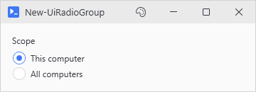
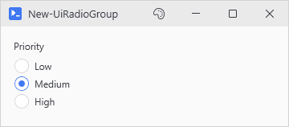
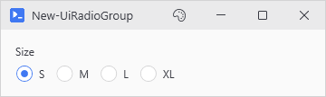

# New-UiRadioGroup

<p align="center"></p>

## SYNOPSIS
Creates a group of mutually exclusive radio button options.

## SYNTAX

```
New-UiRadioGroup [-Label] <String> [-Variable] <String> [-Items] <String[]> [[-Default] <String>]
 [[-Orientation] <String>] [-FullWidth] [[-EnabledWhen] <Object>] [-ClearIfDisabled]
 [[-WPFProperties] <Hashtable>] [<CommonParameters>]
```

## DESCRIPTION
Creates a labeled panel containing radio buttons where only one option can be selected at a time. The selected value is available as a hydrated variable in -Action blocks.

## EXAMPLES

### EXAMPLE 1
```
New-UiRadioGroup -Label "Priority" -Variable "priority" -Items @('Low', 'Medium', 'High') -Default 'Medium'
```

<p align="center"></p>

### EXAMPLE 2
```
New-UiRadioGroup -Label "Size" -Variable "size" -Items @('S', 'M', 'L', 'XL') -Orientation Horizontal
```

<p align="center"></p>

## PARAMETERS

### -Label
Label text displayed above the radio button group.

<details><summary>Type: String (required)</summary>

```yaml
Type: String
Parameter Sets: (All)
Aliases:

Required: True
Position: 1
Default value: None
Accept pipeline input: False
Accept wildcard characters: False
```

</details>

### -Variable
Variable name to store the selected value.

<details><summary>Type: String (required)</summary>

```yaml
Type: String
Parameter Sets: (All)
Aliases:

Required: True
Position: 2
Default value: None
Accept pipeline input: False
Accept wildcard characters: False
```

</details>

### -Items
Array of option labels for the radio buttons.

<details><summary>Type: String[] (required)</summary>

```yaml
Type: String[]
Parameter Sets: (All)
Aliases:

Required: True
Position: 3
Default value: None
Accept pipeline input: False
Accept wildcard characters: False
```

</details>

### -Default
Initially selected option. If not specified, the first item is selected.

<details><summary>Type: String (optional)</summary>

```yaml
Type: String
Parameter Sets: (All)
Aliases:

Required: False
Position: 4
Default value: None
Accept pipeline input: False
Accept wildcard characters: False
```

</details>

### -Orientation
Layout orientation for the radio buttons. 'Vertical' (default) or 'Horizontal'.

<details><summary>Type: String (optional)</summary>

```yaml
Type: String
Parameter Sets: (All)
Aliases:

Required: False
Position: 5
Default value: Vertical
Accept pipeline input: False
Accept wildcard characters: False
```

</details>

### -FullWidth
Stretches the control to fill available width instead of fixed sizing.

<details><summary>Type: SwitchParameter (optional)</summary>

```yaml
Type: SwitchParameter
Parameter Sets: (All)
Aliases:

Required: False
Position: Named
Default value: False
Accept pipeline input: False
Accept wildcard characters: False
```

</details>

### -EnabledWhen
Conditional enabling based on another control's state. Accepts either:
- A control proxy (e.g., $toggleControl) - enables when that control is truthy
- A scriptblock (e.g., { $toggle -and $userName }) - enables when expression is true

Truthy values: CheckBox=checked, TextBox=non-empty, ComboBox=has selection.

<details><summary>Type: Object (optional)</summary>

```yaml
Type: Object
Parameter Sets: (All)
Aliases:

Required: False
Position: 6
Default value: None
Accept pipeline input: False
Accept wildcard characters: False
```

</details>

### -ClearIfDisabled
Accepted alongside -EnabledWhen, but radio groups keep their selection when disabled on purpose.

<details><summary>Type: SwitchParameter (optional)</summary>

```yaml
Type: SwitchParameter
Parameter Sets: (All)
Aliases:

Required: False
Position: Named
Default value: False
Accept pipeline input: False
Accept wildcard characters: False
```

</details>

### -WPFProperties
Hashtable of additional WPF properties to set on the container control.

<details><summary>Type: Hashtable (optional)</summary>

```yaml
Type: Hashtable
Parameter Sets: (All)
Aliases:

Required: False
Position: 7
Default value: None
Accept pipeline input: False
Accept wildcard characters: False
```

</details>

### CommonParameters
This cmdlet supports the common parameters: -Debug, -ErrorAction, -ErrorVariable, -InformationAction, -InformationVariable, -OutVariable, -OutBuffer, -PipelineVariable, -Verbose, -WarningAction, and -WarningVariable. For more information, see [about_CommonParameters](http://go.microsoft.com/fwlink/?LinkID=113216).

## INPUTS

## OUTPUTS

## NOTES

## RELATED LINKS
