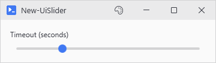
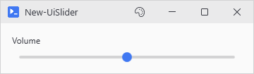
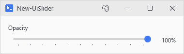
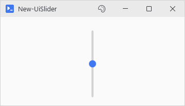

# New-UiSlider

<p align="center"></p>

## SYNOPSIS
Creates a slider control for numeric value selection.

## SYNTAX

### Horizontal (Default)
```
New-UiSlider -Variable <String> [-Label <String>] [-Minimum <Double>] [-Maximum <Double>] [-Default <Double>]
 [-TickFrequency <Double>] [-IsSnapToTick] [-ShowValueLabel] [-ValueLabelFormat <String>] [-MaxWidth <Int32>]
 [-FullWidth] [-EnabledWhen <Object>] [-ClearIfDisabled] [-WPFProperties <Hashtable>]
 [<CommonParameters>]
```

### Vertical
```
New-UiSlider -Variable <String> [-Label <String>] [-Minimum <Double>] [-Maximum <Double>] [-Default <Double>]
 [-TickFrequency <Double>] [-IsSnapToTick] [-ShowValueLabel] [-ValueLabelFormat <String>] [-Vertical]
 [-Height <Int32>] [-MaxHeight <Int32>] [-FullWidth] [-EnabledWhen <Object>] [-ClearIfDisabled]
 [-WPFProperties <Hashtable>] [<CommonParameters>]
```

## DESCRIPTION
Renders a horizontal or vertical slider with optional tick marks and a live value label. -IsSnapToTick makes the thumb land on ticks. The label takes a format string (percentage, decimal) and -EnabledWhen gates the control like any other input.

## EXAMPLES

### EXAMPLE 1
```
New-UiSlider -Variable "volume" -Label "Volume" -Minimum 0 -Maximum 100 -Default 50
```

<p align="center"></p>

### EXAMPLE 2
```
New-UiSlider -Variable "opacity" -Label "Opacity" -Minimum 0 -Maximum 1 -Default 1 -TickFrequency 0.1 -ShowValueLabel -ValueLabelFormat "{0:P0}"
```

<p align="center"></p>

### EXAMPLE 3
```
New-UiSlider -Variable "level" -Vertical -Height 150 -Minimum 0 -Maximum 10 -Default 5
```

<p align="center"></p>

## PARAMETERS

### -Variable
Variable name to store the slider value.

<details><summary>Type: String (required)</summary>

```yaml
Type: String
Parameter Sets: (All)
Aliases:

Required: True
Position: Named
Default value: None
Accept pipeline input: False
Accept wildcard characters: False
```

</details>

### -Label
Label text displayed above the slider.

<details><summary>Type: String (optional)</summary>

```yaml
Type: String
Parameter Sets: (All)
Aliases:

Required: False
Position: Named
Default value: None
Accept pipeline input: False
Accept wildcard characters: False
```

</details>

### -Minimum
Minimum value (default: 0).

<details><summary>Type: Double (optional)</summary>

```yaml
Type: Double
Parameter Sets: (All)
Aliases:

Required: False
Position: Named
Default value: 0
Accept pipeline input: False
Accept wildcard characters: False
```

</details>

### -Maximum
Maximum value (default: 100).

<details><summary>Type: Double (optional)</summary>

```yaml
Type: Double
Parameter Sets: (All)
Aliases:

Required: False
Position: Named
Default value: 100
Accept pipeline input: False
Accept wildcard characters: False
```

</details>

### -Default
Initial value (default: 50).

<details><summary>Type: Double (optional)</summary>

```yaml
Type: Double
Parameter Sets: (All)
Aliases:

Required: False
Position: Named
Default value: 50
Accept pipeline input: False
Accept wildcard characters: False
```

</details>

### -TickFrequency
Interval between tick marks. Set to 0 to hide ticks.

<details><summary>Type: Double (optional)</summary>

```yaml
Type: Double
Parameter Sets: (All)
Aliases:

Required: False
Position: Named
Default value: 0
Accept pipeline input: False
Accept wildcard characters: False
```

</details>

### -IsSnapToTick
Snaps the thumb to tick values. Does nothing unless -TickFrequency is above 0.

<details><summary>Type: SwitchParameter (optional)</summary>

```yaml
Type: SwitchParameter
Parameter Sets: (All)
Aliases:

Required: False
Position: Named
Default value: False
Accept pipeline input: False
Accept wildcard characters: False
```

</details>

### -ShowValueLabel
If true, displays the current value next to the slider.

<details><summary>Type: SwitchParameter (optional)</summary>

```yaml
Type: SwitchParameter
Parameter Sets: (All)
Aliases:

Required: False
Position: Named
Default value: False
Accept pipeline input: False
Accept wildcard characters: False
```

</details>

### -ValueLabelFormat
Format string for the value label (e.g., "{0:N0}" for integers, "{0:P0}" for percentage).

<details><summary>Type: String (optional)</summary>

```yaml
Type: String
Parameter Sets: (All)
Aliases:

Required: False
Position: Named
Default value: {0:N0}
Accept pipeline input: False
Accept wildcard characters: False
```

</details>

### -Vertical
If true, creates a vertical slider instead of horizontal.

<details><summary>Type: SwitchParameter (required)</summary>

```yaml
Type: SwitchParameter
Parameter Sets: Vertical
Aliases:

Required: True
Position: Named
Default value: False
Accept pipeline input: False
Accept wildcard characters: False
```

</details>

### -Height
Height of vertical slider (default: 100). Only valid with -Vertical.

<details><summary>Type: Int32 (optional)</summary>

```yaml
Type: Int32
Parameter Sets: Vertical
Aliases:

Required: False
Position: Named
Default value: 100
Accept pipeline input: False
Accept wildcard characters: False
```

</details>

### -MaxHeight
Maximum height for vertical slider. Only valid with -Vertical.

<details><summary>Type: Int32 (optional)</summary>

```yaml
Type: Int32
Parameter Sets: Vertical
Aliases:

Required: False
Position: Named
Default value: 0
Accept pipeline input: False
Accept wildcard characters: False
```

</details>

### -MaxWidth
Maximum width for horizontal slider. Only valid without -Vertical.

<details><summary>Type: Int32 (optional)</summary>

```yaml
Type: Int32
Parameter Sets: Horizontal
Aliases:

Required: False
Position: Named
Default value: 0
Accept pipeline input: False
Accept wildcard characters: False
```

</details>

### -FullWidth
If true, expands to fill available width.

<details><summary>Type: SwitchParameter (optional)</summary>

```yaml
Type: SwitchParameter
Parameter Sets: (All)
Aliases:

Required: False
Position: Named
Default value: False
Accept pipeline input: False
Accept wildcard characters: False
```

</details>

### -EnabledWhen
Conditional enabling based on another control's state. Accepts either:
- A control proxy (e.g., $toggleControl) - enables when that control is truthy
- A scriptblock (e.g., { $toggle -and $userName }) - enables when expression is true

Truthy values: CheckBox=checked, TextBox=non-empty, ComboBox=has selection.

<details><summary>Type: Object (optional)</summary>

```yaml
Type: Object
Parameter Sets: (All)
Aliases:

Required: False
Position: Named
Default value: None
Accept pipeline input: False
Accept wildcard characters: False
```

</details>

### -ClearIfDisabled
When used with -EnabledWhen, resets the slider to its Minimum when the control becomes disabled.

<details><summary>Type: SwitchParameter (optional)</summary>

```yaml
Type: SwitchParameter
Parameter Sets: (All)
Aliases:

Required: False
Position: Named
Default value: False
Accept pipeline input: False
Accept wildcard characters: False
```

</details>

### -WPFProperties
Hashtable of additional WPF properties to set on the control.

<details><summary>Type: Hashtable (optional)</summary>

```yaml
Type: Hashtable
Parameter Sets: (All)
Aliases:

Required: False
Position: Named
Default value: None
Accept pipeline input: False
Accept wildcard characters: False
```

</details>

### CommonParameters
This cmdlet supports the common parameters: -Debug, -ErrorAction, -ErrorVariable, -InformationAction, -InformationVariable, -OutVariable, -OutBuffer, -PipelineVariable, -Verbose, -WarningAction, and -WarningVariable. For more information, see [about_CommonParameters](http://go.microsoft.com/fwlink/?LinkID=113216).

## INPUTS

## OUTPUTS

## NOTES

## RELATED LINKS
