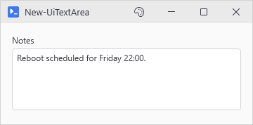
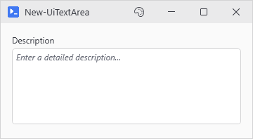
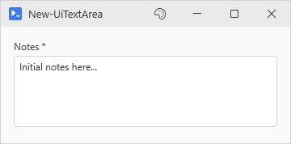

# New-UiTextArea

<p align="center"></p>

## SYNOPSIS
Creates a multi-line text input control.

## SYNTAX

```
New-UiTextArea [-Label] <String> [-Variable] <String> [[-Default] <String>] [[-Rows] <Int32>]
 [[-Placeholder] <String>] [-Required] [-ReadOnly] [[-MaxLength] <Int32>] [-FullWidth]
 [[-EnabledWhen] <Object>] [-ClearIfDisabled] [[-WPFProperties] <Hashtable>]
 [<CommonParameters>]
```

## DESCRIPTION
Creates a TextBox for multi-line entry. A vertical scrollbar appears when the text overflows.

## EXAMPLES

### EXAMPLE 1
```
New-UiTextArea -Label "Description" -Variable "description" -Rows 5 -Placeholder "Enter a detailed description..."
```

<p align="center"></p>

### EXAMPLE 2
```
New-UiTextArea -Label "Notes" -Variable "notes" -Default "Initial notes here..." -Required
```

<p align="center"></p>

## PARAMETERS

### -Label
Label text displayed above the text area.

<details><summary>Type: String (required)</summary>

```yaml
Type: String
Parameter Sets: (All)
Aliases:

Required: True
Position: 1
Default value: None
Accept pipeline input: False
Accept wildcard characters: False
```

</details>

### -Variable
Variable name to store the text value.

<details><summary>Type: String (required)</summary>

```yaml
Type: String
Parameter Sets: (All)
Aliases:

Required: True
Position: 2
Default value: None
Accept pipeline input: False
Accept wildcard characters: False
```

</details>

### -Default
Initial text content.

<details><summary>Type: String (optional)</summary>

```yaml
Type: String
Parameter Sets: (All)
Aliases:

Required: False
Position: 3
Default value: None
Accept pipeline input: False
Accept wildcard characters: False
```

</details>

### -Rows
Number of visible text rows (controls height). Default is 4.

<details><summary>Type: Int32 (optional)</summary>

```yaml
Type: Int32
Parameter Sets: (All)
Aliases:

Required: False
Position: 4
Default value: 4
Accept pipeline input: False
Accept wildcard characters: False
```

</details>

### -Placeholder
Placeholder/watermark text shown when the text area is empty.

<details><summary>Type: String (optional)</summary>

```yaml
Type: String
Parameter Sets: (All)
Aliases:

Required: False
Position: 5
Default value: None
Accept pipeline input: False
Accept wildcard characters: False
```

</details>

### -Required
Mark the field as required with an asterisk.

<details><summary>Type: SwitchParameter (optional)</summary>

```yaml
Type: SwitchParameter
Parameter Sets: (All)
Aliases:

Required: False
Position: Named
Default value: False
Accept pipeline input: False
Accept wildcard characters: False
```

</details>

### -ReadOnly
Makes the text area read-only. Users can select and copy text but not edit it.

<details><summary>Type: SwitchParameter (optional)</summary>

```yaml
Type: SwitchParameter
Parameter Sets: (All)
Aliases:

Required: False
Position: Named
Default value: False
Accept pipeline input: False
Accept wildcard characters: False
```

</details>

### -MaxLength
Maximum number of characters allowed.

<details><summary>Type: Int32 (optional)</summary>

```yaml
Type: Int32
Parameter Sets: (All)
Aliases:

Required: False
Position: 6
Default value: 0
Accept pipeline input: False
Accept wildcard characters: False
```

</details>

### -FullWidth
Stretches the control to fill available width instead of fixed sizing.

<details><summary>Type: SwitchParameter (optional)</summary>

```yaml
Type: SwitchParameter
Parameter Sets: (All)
Aliases:

Required: False
Position: Named
Default value: False
Accept pipeline input: False
Accept wildcard characters: False
```

</details>

### -EnabledWhen
Conditional enabling based on another control's state. Accepts either:
- A control proxy (e.g., $toggleControl) - enables when that control is truthy
- A scriptblock (e.g., { $toggle -and $userName }) - enables when expression is true

Truthy values: CheckBox=checked, TextBox=non-empty, ComboBox=has selection.

<details><summary>Type: Object (optional)</summary>

```yaml
Type: Object
Parameter Sets: (All)
Aliases:

Required: False
Position: 7
Default value: None
Accept pipeline input: False
Accept wildcard characters: False
```

</details>

### -ClearIfDisabled
When used with -EnabledWhen, clears the text when the control becomes disabled.

<details><summary>Type: SwitchParameter (optional)</summary>

```yaml
Type: SwitchParameter
Parameter Sets: (All)
Aliases:

Required: False
Position: Named
Default value: False
Accept pipeline input: False
Accept wildcard characters: False
```

</details>

### -WPFProperties
Hashtable of additional WPF properties to set on the control.

<details><summary>Type: Hashtable (optional)</summary>

```yaml
Type: Hashtable
Parameter Sets: (All)
Aliases:

Required: False
Position: 8
Default value: None
Accept pipeline input: False
Accept wildcard characters: False
```

</details>

### CommonParameters
This cmdlet supports the common parameters: -Debug, -ErrorAction, -ErrorVariable, -InformationAction, -InformationVariable, -OutVariable, -OutBuffer, -PipelineVariable, -Verbose, -WarningAction, and -WarningVariable. For more information, see [about_CommonParameters](http://go.microsoft.com/fwlink/?LinkID=113216).

## INPUTS

## OUTPUTS

## NOTES

## RELATED LINKS
