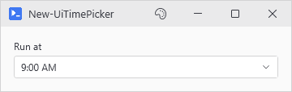
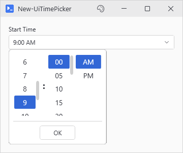
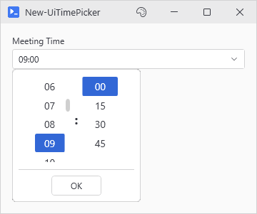
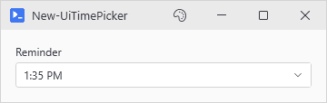

# New-UiTimePicker

<p align="center"></p>

## SYNOPSIS
Creates a time picker control for selecting hours and minutes.

## SYNTAX

```
New-UiTimePicker [-Label] <String> [-Variable] <String> [[-Default] <Object>] [-Use24Hour]
 [[-MinuteInterval] <Int32>] [-FullWidth] [[-EnabledWhen] <Object>] [-ClearIfDisabled]
 [[-WPFProperties] <Hashtable>] [<CommonParameters>]
```

## DESCRIPTION
Creates a labeled time picker with a dropdown popup containing scrollable hour/minute/AM-PM columns. Styled to match the DatePicker control with theme support.

## EXAMPLES

### EXAMPLE 1
```
New-UiTimePicker -Label "Start Time" -Variable "startTime" -Default "09:00"
```

<p align="center"></p>

### EXAMPLE 2
```
New-UiTimePicker -Label "Meeting Time" -Variable "meetingTime" -Use24Hour -MinuteInterval 15
```

<p align="center"></p>

### EXAMPLE 3
```
New-UiTimePicker -Label "Reminder" -Variable "reminder" -Default (Get-Date).TimeOfDay
```

<p align="center"></p>

## PARAMETERS

### -Label
Label text displayed above the time picker.

<details><summary>Type: String (required)</summary>

```yaml
Type: String
Parameter Sets: (All)
Aliases:

Required: True
Position: 1
Default value: None
Accept pipeline input: False
Accept wildcard characters: False
```

</details>

### -Variable
Variable name to store the selected time value.

<details><summary>Type: String (required)</summary>

```yaml
Type: String
Parameter Sets: (All)
Aliases:

Required: True
Position: 2
Default value: None
Accept pipeline input: False
Accept wildcard characters: False
```

</details>

### -Default
Initial time value. Can be a TimeSpan, DateTime, or string like "14:30" or "2:30 PM".

<details><summary>Type: Object (optional)</summary>

```yaml
Type: Object
Parameter Sets: (All)
Aliases:

Required: False
Position: 3
Default value: None
Accept pipeline input: False
Accept wildcard characters: False
```

</details>

### -Use24Hour
Use 24-hour format instead of 12-hour with AM/PM.

<details><summary>Type: SwitchParameter (optional)</summary>

```yaml
Type: SwitchParameter
Parameter Sets: (All)
Aliases:

Required: False
Position: Named
Default value: False
Accept pipeline input: False
Accept wildcard characters: False
```

</details>

### -MinuteInterval
Interval for minute selection (1, 5, 10, 15, 30). Default is 5.

<details><summary>Type: Int32 (optional)</summary>

```yaml
Type: Int32
Parameter Sets: (All)
Aliases:

Required: False
Position: 4
Default value: 5
Accept pipeline input: False
Accept wildcard characters: False
```

</details>

### -FullWidth
Stretches the control to fill available width instead of fixed sizing.

<details><summary>Type: SwitchParameter (optional)</summary>

```yaml
Type: SwitchParameter
Parameter Sets: (All)
Aliases:

Required: False
Position: Named
Default value: False
Accept pipeline input: False
Accept wildcard characters: False
```

</details>

### -EnabledWhen
Conditional enabling based on another control's state. Accepts either:
- A control proxy (e.g., $toggleControl) - enables when that control is truthy
- A scriptblock (e.g., { $toggle -and $userName }) - enables when expression is true

Truthy values: CheckBox=checked, TextBox=non-empty, ComboBox=has selection.

<details><summary>Type: Object (optional)</summary>

```yaml
Type: Object
Parameter Sets: (All)
Aliases:

Required: False
Position: 5
Default value: None
Accept pipeline input: False
Accept wildcard characters: False
```

</details>

### -ClearIfDisabled
Accepted alongside -EnabledWhen, but the time picker keeps its selected time when it becomes disabled.

<details><summary>Type: SwitchParameter (optional)</summary>

```yaml
Type: SwitchParameter
Parameter Sets: (All)
Aliases:

Required: False
Position: Named
Default value: False
Accept pipeline input: False
Accept wildcard characters: False
```

</details>

### -WPFProperties
Hashtable of additional WPF properties to set on the control.

<details><summary>Type: Hashtable (optional)</summary>

```yaml
Type: Hashtable
Parameter Sets: (All)
Aliases:

Required: False
Position: 6
Default value: None
Accept pipeline input: False
Accept wildcard characters: False
```

</details>

### CommonParameters
This cmdlet supports the common parameters: -Debug, -ErrorAction, -ErrorVariable, -InformationAction, -InformationVariable, -OutVariable, -OutBuffer, -PipelineVariable, -Verbose, -WarningAction, and -WarningVariable. For more information, see [about_CommonParameters](http://go.microsoft.com/fwlink/?LinkID=113216).

## INPUTS

## OUTPUTS

## NOTES

## RELATED LINKS
