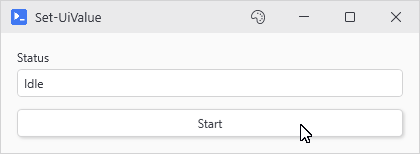
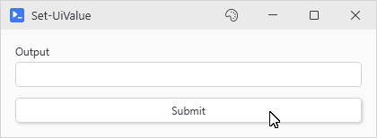

# Set-UiValue

## SYNOPSIS
Sets the value of a UI control by its variable name.

## SYNTAX

```
Set-UiValue [-Variable] <String> [-Value] <Object> [<CommonParameters>]
```

## DESCRIPTION
Sets a registered control's value from any action, async or -NoAsync. A value the control can't take (such as a string for a slider) skips it and writes an error indicating the control. The action continues unless it runs under -ErrorAction Stop.

## EXAMPLES

### EXAMPLE 1
```
Set-UiValue -Variable 'status' -Value 'Processing...'
```

Updates the control registered as 'status' to display 'Processing...'.

<p align="center"></p>

### EXAMPLE 2
```
New-UiButton -Text 'Submit' -NoAsync -Action {
    Set-UiValue -Variable 'output' -Value "Submitted at $(Get-Date)"
}
```

Button action that updates a control synchronously on the UI thread.

<p align="center"></p>

## PARAMETERS

### -Variable
The variable name of the control to update. This matches the -Variable parameter used when creating the control.

<details><summary>Type: String (required)</summary>

```yaml
Type: String
Parameter Sets: (All)
Aliases:

Required: True
Position: 1
Default value: None
Accept pipeline input: False
Accept wildcard characters: False
```

</details>

### -Value
The value to set on the control. Type conversion is attempted automatically.

<details><summary>Type: Object (required)</summary>

```yaml
Type: Object
Parameter Sets: (All)
Aliases:

Required: True
Position: 2
Default value: None
Accept pipeline input: False
Accept wildcard characters: False
```

</details>

### CommonParameters
This cmdlet supports the common parameters: -Debug, -ErrorAction, -ErrorVariable, -InformationAction, -InformationVariable, -OutVariable, -OutBuffer, -PipelineVariable, -Verbose, -WarningAction, and -WarningVariable. For more information, see [about_CommonParameters](http://go.microsoft.com/fwlink/?LinkID=113216).

## INPUTS

## OUTPUTS

## NOTES

## RELATED LINKS
