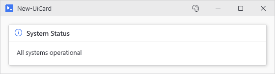
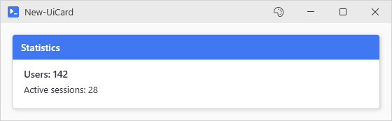
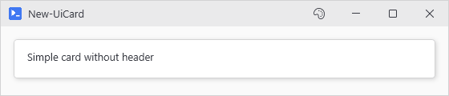

# New-UiCard

## SYNOPSIS
Creates a bordered card container with optional header.

## SYNTAX

```
New-UiCard [[-Header] <String>] [-Content] <ScriptBlock> [-Accent] [[-HeaderBackground] <String>]
 [[-MinWidth] <Int32>] [[-MinHeight] <Int32>] [-FullWidth] [-Stretch] [[-WPFProperties] <Hashtable>]
 [-Icon <String>] [<CommonParameters>]
```

## DESCRIPTION
Creates a styled card container with optional header, icon, and accent color. Dashboard tiles and summary boxes, mostly.

## EXAMPLES

### EXAMPLE 1
```
New-UiCard -Header "System Status" -Icon "Info" -Content {
    New-UiLabel -Text "All systems operational" -Style Body
}
```

<p align="center"></p>

### EXAMPLE 2
```
New-UiCard -Header "Statistics" -Accent -Content {
    New-UiLabel -Text "Users: 142" -Style SubHeader
    New-UiLabel -Text "Active sessions: 28" -Style Body
}
```

<p align="center"></p>

### EXAMPLE 3
```
New-UiCard -Content {
    New-UiLabel -Text "Simple card without header" -Style Body
}
```

<p align="center"></p>

## PARAMETERS

### -Header
Optional header text displayed at the top of the card.

<details><summary>Type: String (optional)</summary>

```yaml
Type: String
Parameter Sets: (All)
Aliases:

Required: False
Position: 1
Default value: None
Accept pipeline input: False
Accept wildcard characters: False
```

</details>

### -Content
ScriptBlock containing the card's content controls.

<details><summary>Type: ScriptBlock (required)</summary>

```yaml
Type: ScriptBlock
Parameter Sets: (All)
Aliases:

Required: True
Position: 2
Default value: None
Accept pipeline input: False
Accept wildcard characters: False
```

</details>

### -Accent
Use the theme's accent color for the card header.

<details><summary>Type: SwitchParameter (optional)</summary>

```yaml
Type: SwitchParameter
Parameter Sets: (All)
Aliases:

Required: False
Position: Named
Default value: False
Accept pipeline input: False
Accept wildcard characters: False
```

</details>

### -HeaderBackground
Custom background color for the header (hex color like '#0078D4').

<details><summary>Type: String (optional)</summary>

```yaml
Type: String
Parameter Sets: (All)
Aliases:

Required: False
Position: 3
Default value: None
Accept pipeline input: False
Accept wildcard characters: False
```

</details>

### -MinWidth
Minimum width of the card. Default is 200.

<details><summary>Type: Int32 (optional)</summary>

```yaml
Type: Int32
Parameter Sets: (All)
Aliases:

Required: False
Position: 4
Default value: 200
Accept pipeline input: False
Accept wildcard characters: False
```

</details>

### -MinHeight
Minimum height of the card.

<details><summary>Type: Int32 (optional)</summary>

```yaml
Type: Int32
Parameter Sets: (All)
Aliases:

Required: False
Position: 5
Default value: 0
Accept pipeline input: False
Accept wildcard characters: False
```

</details>

### -FullWidth
When present, the card expands to fill the full width of its container.

<details><summary>Type: SwitchParameter (optional)</summary>

```yaml
Type: SwitchParameter
Parameter Sets: (All)
Aliases:

Required: False
Position: Named
Default value: False
Accept pipeline input: False
Accept wildcard characters: False
```

</details>

### -Stretch
When present, the card participates in the responsive column system. Cards resize with window width, two per row.

<details><summary>Type: SwitchParameter (optional)</summary>

```yaml
Type: SwitchParameter
Parameter Sets: (All)
Aliases:

Required: False
Position: Named
Default value: False
Accept pipeline input: False
Accept wildcard characters: False
```

</details>

### -WPFProperties
Hashtable of additional WPF properties to set on the control.

<details><summary>Type: Hashtable (optional)</summary>

```yaml
Type: Hashtable
Parameter Sets: (All)
Aliases:

Required: False
Position: 6
Default value: None
Accept pipeline input: False
Accept wildcard characters: False
```

</details>

### -Icon
Optional icon name to display in the header. Use Show-UiGlyphBrowser to browse names.

<details><summary>Type: String (optional)</summary>

```yaml
Type: String
Parameter Sets: (All)
Aliases:

Required: False
Position: Named
Default value: None
Accept pipeline input: False
Accept wildcard characters: False
```

</details>

### CommonParameters
This cmdlet supports the common parameters: -Debug, -ErrorAction, -ErrorVariable, -InformationAction, -InformationVariable, -OutVariable, -OutBuffer, -PipelineVariable, -Verbose, -WarningAction, and -WarningVariable. For more information, see [about_CommonParameters](http://go.microsoft.com/fwlink/?LinkID=113216).

## INPUTS

## OUTPUTS

## NOTES

## RELATED LINKS
