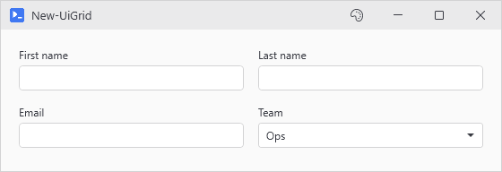
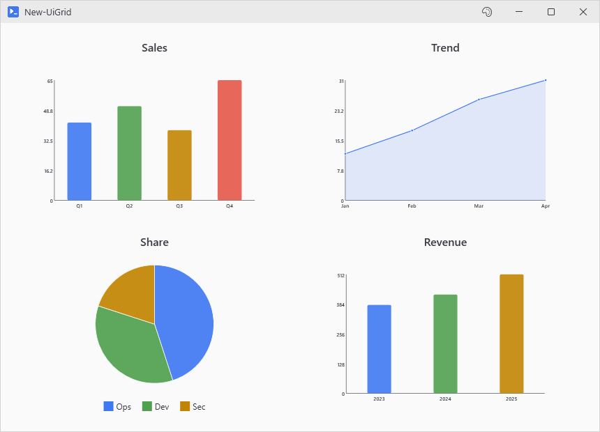
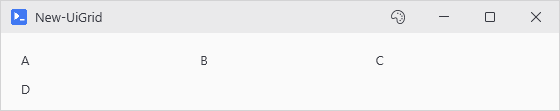
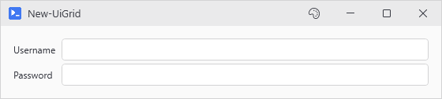
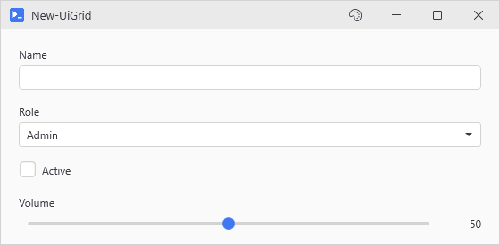
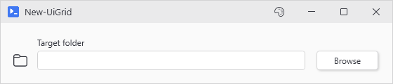
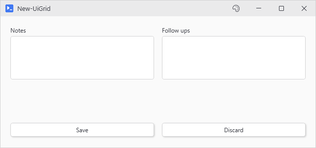

# New-UiGrid

<p align="center"></p>

## SYNOPSIS
Creates a Grid layout container with simplified column/row management.

## SYNTAX

```
New-UiGrid [[-Columns] <Object>] [[-Rows] <Object>] [-Content] <ScriptBlock> [-AutoLayout] [-FormLayout]
 [[-RowSpacing] <Int32>] [[-ColumnSpacing] <Int32>] [-FullWidth] [-Fill] [[-WPFProperties] <Hashtable>]
 [<CommonParameters>]
```

## DESCRIPTION
Provides a declarative Grid control that auto-flows children into cells. Column sizing uses the short syntax below. FormLayout unwraps label+control pairs into two columns. AutoLayout stacks one control per row.

Controls beside a labeled input line up with its box, so a Browse button sits level with the field it fills.

## EXAMPLES

### EXAMPLE 1
```
New-UiGrid -Columns 2 -Rows '*,*' -Fill -Content {
    New-UiChart -Type Bar -Data $sales -Title "Sales"
    New-UiChart -Type Line -Data $trend -Title "Trend"
    New-UiChart -Type Pie -Data $share -Title "Share"
    New-UiChart -Type Bar -Data $revenue -Title "Revenue"
}
# Dashboard: 4 equal cells that fill the tab
```

<p align="center"></p>

### EXAMPLE 2
```
New-UiGrid -Columns 3 -Content {
    New-UiLabel -Text "A"
    New-UiLabel -Text "B"
    New-UiLabel -Text "C"
    New-UiLabel -Text "D"  # Wraps to row 1, col 0
}
```

<p align="center"></p>

### EXAMPLE 3
```
New-UiGrid -FormLayout -Content {
    New-UiInput -Label "Username" -Variable "user"
    New-UiInput -Label "Password" -Variable "pass"
}
# Creates a clean 2-column form with labels auto-sized on the left
```

<p align="center"></p>

### EXAMPLE 4
```
New-UiGrid -AutoLayout -Content {
    New-UiInput -Label "Name" -Variable "name"
    New-UiDropdown -Label "Role" -Variable "role" -Items @('Admin', 'User')
    New-UiToggle -Label "Active" -Variable "active"
    New-UiSlider -Label "Volume" -Variable "vol" -ShowValueLabel
}
# Each control gets its own row, labels handled internally
```

<p align="center"></p>

### EXAMPLE 5
```
New-UiGrid -Columns 'Auto, *, 100' -Content {
    New-UiGlyph -Name 'Folder' -Size 20
    New-UiInput -Label 'Target folder' -Variable targetFolder
    New-UiButton -Text 'Browse' -NoAsync -Action {
        $picked = Show-UiFolderPicker -Title 'Target folder'
        if ($picked) { Set-UiValue -Variable 'targetFolder' -Value $picked }
    }
}
# The picker is a dialog, hence -NoAsync. Set-UiValue drops the pick into the box.
```

<p align="center"></p>

### EXAMPLE 6
```
# Star row takes the leftover height, Auto row hugs the buttons at the bottom
New-UiGrid -Columns 2 -Rows '*, Auto' -Fill -Content {
    New-UiTextArea -Label 'Notes' -Variable 'notes'
    New-UiTextArea -Label 'Follow ups' -Variable 'followUps'
    New-UiButton -Text 'Save' -Action { }
    New-UiButton -Text 'Discard' -Action { }
}
```

<p align="center"></p>

## PARAMETERS

### -Columns
Column definitions in flexible formats:
- Integer: Number of equal-width columns (e.g., 3)
- String: Comma-separated definitions (e.g., 'Auto,*' or 'Auto, *, 100')
- Array: Array of definitions (e.g., `@('Auto', '*', '2*', '100')`)

Valid definitions: 'Auto', `'*'` (star), `'2*'` (weighted star), or number (fixed pixels).

<details><summary>Type: Object (optional)</summary>

```yaml
Type: Object
Parameter Sets: (All)
Aliases:

Required: False
Position: 1
Default value: 2
Accept pipeline input: False
Accept wildcard characters: False
```

</details>

### -Rows
Row definitions in same flexible formats as Columns. If omitted, rows are created automatically as needed.

<details><summary>Type: Object (optional)</summary>

```yaml
Type: Object
Parameter Sets: (All)
Aliases:

Required: False
Position: 2
Default value: None
Accept pipeline input: False
Accept wildcard characters: False
```

</details>

### -Content
ScriptBlock containing child controls.

<details><summary>Type: ScriptBlock (required)</summary>

```yaml
Type: ScriptBlock
Parameter Sets: (All)
Aliases:

Required: True
Position: 3
Default value: None
Accept pipeline input: False
Accept wildcard characters: False
```

</details>

### -AutoLayout
Simple single-column layout where each control gets its own row. Does not unwrap label+control pairs - controls handle their own labels. This is the recommended layout for mixed control types (inputs, toggles, sliders).

<details><summary>Type: SwitchParameter (optional)</summary>

```yaml
Type: SwitchParameter
Parameter Sets: (All)
Aliases:

Required: False
Position: Named
Default value: False
Accept pipeline input: False
Accept wildcard characters: False
```

</details>

### -FormLayout
Optimized for label+control pairs. Automatically uses a 2-column layout with auto-width labels on the left and stretching controls on the right. Does not handle controls with complex internal labels cleanly.

<details><summary>Type: SwitchParameter (optional)</summary>

```yaml
Type: SwitchParameter
Parameter Sets: (All)
Aliases:

Required: False
Position: Named
Default value: False
Accept pipeline input: False
Accept wildcard characters: False
```

</details>

### -RowSpacing
Vertical spacing between rows in pixels. Default is 4.

<details><summary>Type: Int32 (optional)</summary>

```yaml
Type: Int32
Parameter Sets: (All)
Aliases:

Required: False
Position: 4
Default value: 4
Accept pipeline input: False
Accept wildcard characters: False
```

</details>

### -ColumnSpacing
Horizontal spacing between columns in pixels. Default is 8.

<details><summary>Type: Int32 (optional)</summary>

```yaml
Type: Int32
Parameter Sets: (All)
Aliases:

Required: False
Position: 5
Default value: 8
Accept pipeline input: False
Accept wildcard characters: False
```

</details>

### -FullWidth
Stretches the grid to fill available width.

<details><summary>Type: SwitchParameter (optional)</summary>

```yaml
Type: SwitchParameter
Parameter Sets: (All)
Aliases:

Required: False
Position: Named
Default value: False
Accept pipeline input: False
Accept wildcard characters: False
```

</details>

### -Fill
Makes the grid fill the parent's remaining vertical space. Use this when star sized rows need to divide height evenly (e.g. dashboard grids). Height comes from the outer ScrollViewer's viewport, minus this grid's offset and the heights of the siblings below it. -FillParent is the legacy alias.

<details><summary>Type: SwitchParameter (optional)</summary>

```yaml
Type: SwitchParameter
Parameter Sets: (All)
Aliases: FillParent

Required: False
Position: Named
Default value: False
Accept pipeline input: False
Accept wildcard characters: False
```

</details>

### -WPFProperties
Hashtable of additional WPF properties to set on the Grid.

<details><summary>Type: Hashtable (optional)</summary>

```yaml
Type: Hashtable
Parameter Sets: (All)
Aliases:

Required: False
Position: 6
Default value: None
Accept pipeline input: False
Accept wildcard characters: False
```

</details>

### CommonParameters
This cmdlet supports the common parameters: -Debug, -ErrorAction, -ErrorVariable, -InformationAction, -InformationVariable, -OutVariable, -OutBuffer, -PipelineVariable, -Verbose, -WarningAction, and -WarningVariable. For more information, see [about_CommonParameters](http://go.microsoft.com/fwlink/?LinkID=113216).

## INPUTS

## OUTPUTS

## NOTES

## RELATED LINKS
