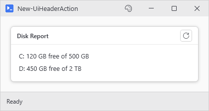
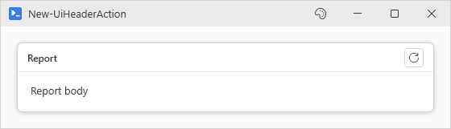

# New-UiHeaderAction

<p align="center"></p>

## SYNOPSIS
Defines the header button for New-UiPanel -HeaderAction.

## SYNTAX

```
New-UiHeaderAction [-Action] <ScriptBlock> [-Tooltip <String>]
 [-Icon <String>] [<CommonParameters>]
```

## DESCRIPTION
Builder for the -HeaderAction parameter: a small icon button on the right edge of a panel header. Emits a definition object only - it does not add anything to the window.

Equivalent to the @{ Icon; Tooltip; Action } hashtable, which -HeaderAction still accepts.

## EXAMPLES

### EXAMPLE 1
```
New-UiPanel -Header 'Report' -HeaderAction (
    New-UiHeaderAction -Icon Refresh -Tooltip 'Reload the report' -Action { Write-Status 'Reloading...' }
) -Content {
    New-UiLabel -Text 'Report body'
}
```

<p align="center"></p>

### EXAMPLE 2
```
# Legacy hashtable form, still supported
New-UiPanel -Header 'Report' -HeaderAction @{
    Icon    = 'Refresh'
    Tooltip = 'Reload the report'
    Action  = { Write-Status 'Reloading...' }
} -Content {
    New-UiLabel -Text 'Report body'
}
```

<p align="center"></p>

## PARAMETERS

### -Action
Scriptblock run when the header button is clicked.

<details><summary>Type: ScriptBlock (required)</summary>

```yaml
Type: ScriptBlock
Parameter Sets: (All)
Aliases:

Required: True
Position: 1
Default value: None
Accept pipeline input: False
Accept wildcard characters: False
```

</details>

### -Tooltip
Hover text on the button.

<details><summary>Type: String (optional)</summary>

```yaml
Type: String
Parameter Sets: (All)
Aliases:

Required: False
Position: Named
Default value: None
Accept pipeline input: False
Accept wildcard characters: False
```

</details>

### -Icon
Icon name for the button glyph. Defaults to Info when omitted. Tab completion lists the valid names.

<details><summary>Type: String (optional)</summary>

```yaml
Type: String
Parameter Sets: (All)
Aliases:

Required: False
Position: Named
Default value: None
Accept pipeline input: False
Accept wildcard characters: False
```

</details>

### CommonParameters
This cmdlet supports the common parameters: -Debug, -ErrorAction, -ErrorVariable, -InformationAction, -InformationVariable, -OutVariable, -OutBuffer, -PipelineVariable, -Verbose, -WarningAction, and -WarningVariable. For more information, see [about_CommonParameters](http://go.microsoft.com/fwlink/?LinkID=113216).

## INPUTS

## OUTPUTS

## NOTES

## RELATED LINKS
